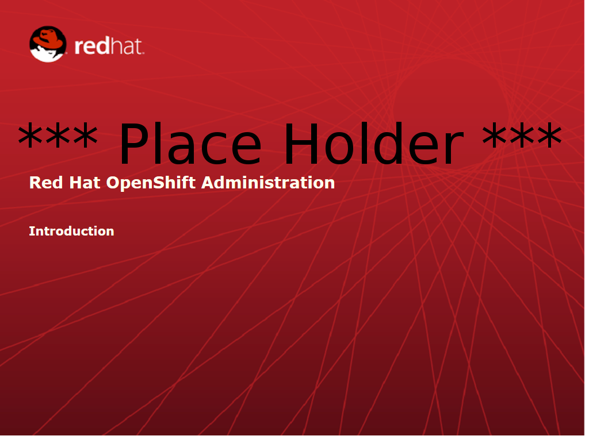

:data-uri:
:numbered!:

= Introduction to Course and Learning Environment

== Introduction

ifdef::showScript[]

=== Transcript

Welcome to OpenShift Fastrax course. By Red Hat's Global Enablement Team

endif::showScript[]

== Course Goals

* Learner will have an in-depth understanding of the benefits of OSE3.0
* Learner will be able to spot and qualify use cases fitting the use of OSE3.0
* Learner will be able to explain OSE3.0 positioning in the competitive landscape
* Learner will be familiar with the technical architecture of OSE3.0
* Learner will be able to perform a 10 minute demonstration of the use of OSE3.0

ifdef::showScript[]

=== Transcript

The goal of this course is to provide the learner with capabilities to spot, qualify and position Red Hat's OpenShift v3 
 and be able to perform a 10 minute demonstration of OpenShift's capabilities

endif::showScript[]

== Course Overview

Welcome to Red Hat OpenShift Enterprise 3.0 Training.
In this course we will cover the following topics:

* Module 01 - Introduction to Course and Learning Environment
* Module 02 - OpenShift Enterprise 3.0 Overview  
* Module 03 - OpenShift Enterprise 3.0 Architecture
* Module 04 - OpenShift Enterprise 3.0 Basic Application Deployment
* Module 05 - OpenShift Enterprise 3.0 Basic Application Management
* Module 06 - How to Demonstrate OpenShift Enterprise 3.0 Capabilities
* Module 07 - Useful Resources 

ifdef::showScript[]

=== Transcript

Welcome to Red Hat OpenShift Enterprise 3.0 Training.
In this course we will cover the following topics:

* Introduction to Course and Learning Environment
** We will learn how to connect to our deployed environment 
* OpenShift Enterprise 3.0 Overview  
** We will start with an overview of the OpenShift product family, the PaaS landscape and the use cases for OpenShift Enterprise 3.0
* OpenShift Enterprise 3.0 Architecture
** We will review the different components in OpenShift 3.0 and their connections.  
* OpenShift Enterprise 3.0 Basic Application Deployment
** We will review the process for deploying a new application on OpenShift
* OpenShift Enterprise 3.0 Basic Application Management
** We will learn how application management is performed in the OpenShift environment.
* How to Demonstrate OpenShift Enterprise 3.0 Capabilities
** We will provide and review 2 scripted demonstrations of OpenShift 3.0 that you could deliver after finishing this course.
* Useful Resources 
** We will list and describe useful resources for the OpenShift beginner

endif::showScript[]

== Assumptions

* You want to learn how to use OpenShift v3.
* You know how to use Red Hat Enterprise Linux 7.
* You can read and modify some form of code.
* You have a workstation you can use for this training.
* You have an SSH client installed on your workstation.

ifdef::showscript[] 

=== Transcript

* If you are taking this course, the assumption is that you want to learn how to use OpenShift Enterprise. 
* It is also assumed that you can write some form of code, and you have a workstation with an SSH client installed.

endif::showscript[]

== Class Environment

* Class related content found at : https://www.opentlc.com/classes/ose_fastrax
* In order to perform the labs and demosntrations in this class you will provisioned the following virtual machines:
** *Broker host* – You will be provisioned a VMs that serve as the broker for the OpenShift Enterprise environment.
** *Node hosts* – You will be provisioned two VMs that serve as the nodes of the OpenShift Enterprise environment.
** *oselab host* – For repositories, files, SSH "Jumpbox" and other services
* Red Hat Enterprise Linux 7.1 is preinstalled and configured for deployment.
* You will receive connection details via email after provisioning the environment.

ifdef::showscript[] 

=== Transcript

* The class uses a central cloud-based environment.
* You will be provisioned three virtual machines for the OpenShift Enterprise environment: a broker host, a node host, and an admin host for repositories, files, and other services.
* Red Hat Enterprise Linux is preinstalled and configured for deployment.
* You should have received connection details via email after provisioning the environment.

endif::showscript[]

== Connection Details

=== Broker Hosts:
[options="header,footer",width="50"]
|=======================
||Broker00|Broker01
|Internal IP|192.168.0.100|192.168.0.101
|External IP|Provided*|Provided*
|DNS Name|broker00-*GUID*.oslab.rhpds.opentlc.com|broker01-*GUID*.oslab.rhpds.opentlc.com
|Credentials|root / r3dh4t1!|root / r3dh4t1!
|=======================

=== Node Hosts:
[options="header,footer",width="50"]
|=======================
||Node00|Node01
|Internal IP|192.168.0.200|192.168.0.201
|External IP|Provided*|Provided*
|DNS Name|node00-*GUID*.oslab.rhpds.opentlc.com|node01-*GUID*.oslab.rhpds.opentlc.com
|Credentials|root / r3dh4t1!|root / r3dh4t1!
|=======================

=== Administration and Support Hosts:
[options="header,footer",width="20"]
|=======================
||oselab
|Internal IP|192.168.0.200
|External IP|Provided*
|DNS Name|oselab-*GUID*.oslab.rhpds.opentlc.com
|Credentials|OpenTLC Credentials
|=======================

* External IPs are provided by the lab provisioning *email that will be sent to you after you provision the lab from labs.opentlc.com*.
* The text *GUID* is a 4 character generated unique identifier assigned to your lab environment.  You will *find your GUID at the top of the lab provisioning email.*
* You can only *SSH* into your Administration VM directly *using your OPENTLC SSO credentials and SSH key (do not use root)*.  
** From there you can use this system as a jump box to SSH to the other internal lab hosts.  See the above lab instructions as to which username and password is required per internal host.

ifdef::showscript[] 

=== Transcript

These tables show the connection details you will use when setting up and using the lab environment.
This information is repeated in the labs where required.

endif::showscript[]

