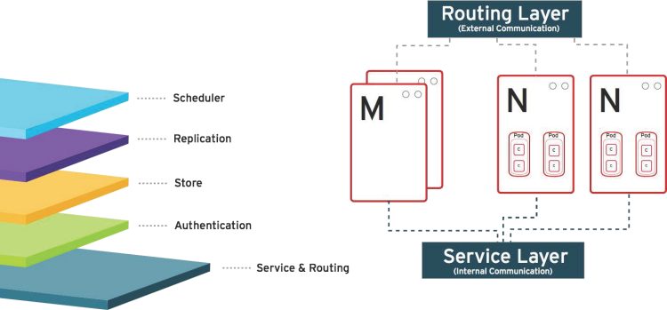
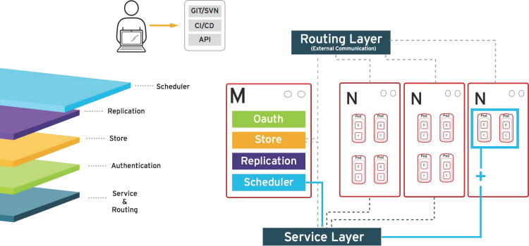
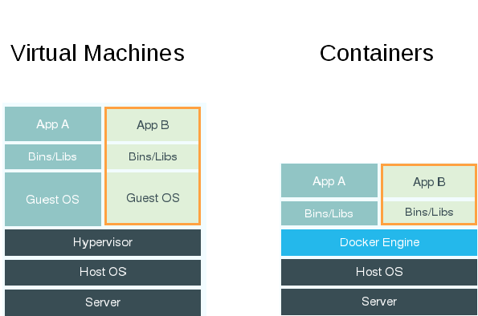
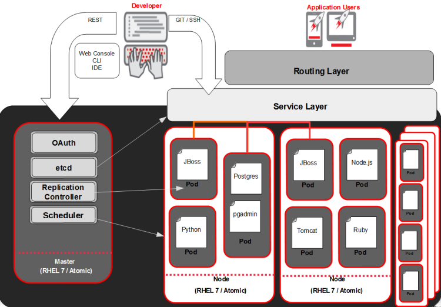
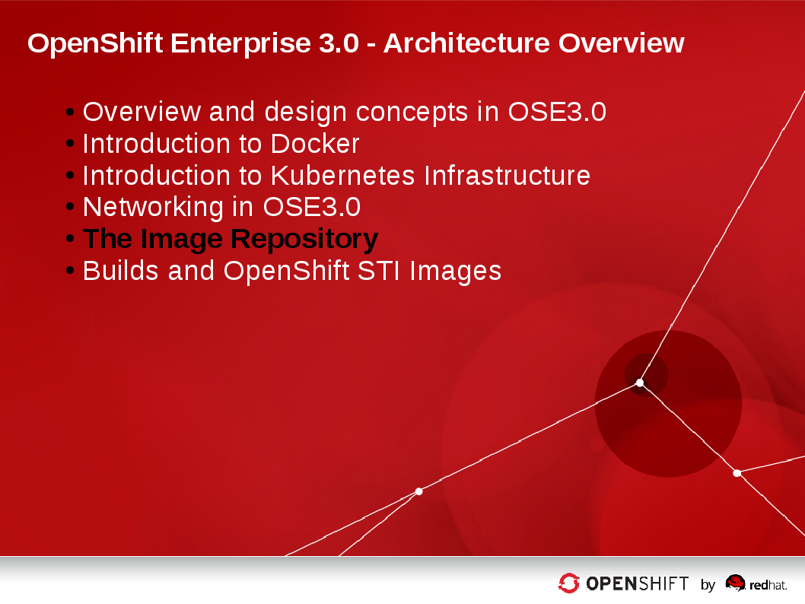
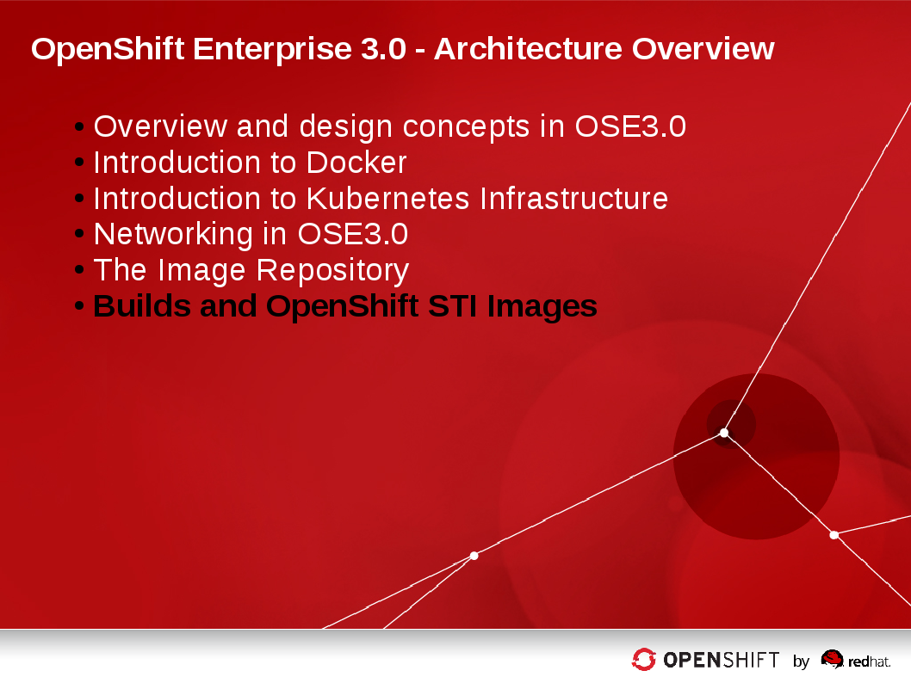

:data-uri:
:numbered!:

= OpenShift Enterprise 3.0 Overview

== Introduction

image::images/Chapter03_Title.png[width=852,height=672]

ifdef::showScript[]

=== Transcript

Welcome to Module 3 of OpenShift Fastrax Training by Red Hat's Global Enablement Team.

endif::showScript[]

== Module Agenda

* Overview and design concepts in OSE3.0 
* Introduction to Docker
* Introduction to Kubernetes Infrastructure 
* Networking in OSE3.0
* The Image Registry 
* Builds and OpenShift STI Images

ifdef::showScript[]

=== Transcript

* In this Module we will cover the following topics
** Overview and design concepts in OSE3.0 
** Introduction to Docker
** Introduction to Kubernetes Infrastructure 
** Networking in OSE3.0
** The Image Registry 
** Builds and OpenShift STI Images

endif::showScript[]

== Module Progress

== Overview and design concepts in OSE3.0

=== What is OpenShift?

* OpenShift is a Platform as a Service (PaaS)
** Provides development environments on-demand (self-service)
** Provides a range of languages, frameworks, runtimes and databases (polyglot)
** Automates application lifecycle management (build, deploy, retire)
** Enables collaboration between developers on projects and components
** Uses industry standards

ifdef::showScript[]

=== Transcript

* OpenShift is a Platform as a Service (PaaS)
** Provides development environments on-demand (self-service)
** Provides a range of languages, frameworks, runtimes and databases (polyglot)
** Automates application lifecycle management (build, deploy, retire)
** Enables collaboration between developers on projects and components
** Uses industry standards

endif::showScript[]

== Overview and design concepts in OSE3.0

=== OpenShift v3 Stack

* Standard containers API
* Container-optimized OS
* Web-scale orchestration
* Expanded choice of services
* Enhanced user experience
* Community driven innovation
* Industry standard PaaS stack

image::images/OpenShiftStack.png[width=426*1.5,height=336*1.5]

ifdef::showScript[]

=== Transcript

* Standard containers API
* Container-optimized OS
* Web-scale orchestration
* Expanded choice of services
* Enhanced user experience
* Community driven innovation
* Industry standard PaaS stack

endif::showScript[]

== Overview and design concepts in OSE3.0

=== How It Works

* Containers run languages/framework middleware, database and other runtimes.
* Pods run one or more containers as a single unit.  Each pod has an IP and mapped storage volumes.
* Nodes are Linux container hosts that run Pods assigned by the Master.
* Master provides API, service orchestration, scheduling/placement, maintains state and manages Pods & Services.

image::images/OpenShiftV3Arch.png[width=426*1.5,height=336*1.5]

ifdef::showScript[]

=== Transcript

* Containers run lang/framework middleware, database & other runtimes.
* Pods run one or more containers as a single unit.  Each pod has an IP and mapped storage volumes.
* Nodes are Linux container hosts that run Pods assigned by the Master.
* Master provides API, service orchestration, scheduling/placement, maintains state and manages Pods & Services.
	

endif::showScript[]

== Overview and design concepts in OSE3.0

=== Establishing Standards Around...

* Red Hat works with the open source community to drive standards for containerization.
** Isolation with Linux Containers
*** Isolating applications on host operating system
*** Security
*** Portability across host systems
** Container Format with Docker
*** Interface for communications, configuration, data persistence, provisioning
*** Content agnostic
*** Infrastructure
*** agnostic
** Orchestration with Kubernetes
*** Orchestrate containers at scale
*** Define application topologies
*** Handle container networking
*** Manage container state
*** Schedule across hosts
** Registry and Container Discovery
*** Easily find and consume trusted container images
*** Federate consumption libraries
*** Promote consistency and reuse

ifdef::showScript[]

=== Transcript

* Red Hat works with the open source community to drive standards for containerization.
** Isolation with Linux Containers
** Container Format with Docker
** Orchestration with Kubernetes
** Registry and Container Discovery

endif::showScript[]

== Overview and design concepts in OSE3.0

=== Important Projects Used in OpenShift

* Kubernetes - link:http://kubernetes.io/[http://kubernetes.io/]
** Orchestrate containers at massive scale
** Kubernetes manages and orchestrates Docker containers across clusters of nodes.
* Docker - link:http://docker.com or https://github.com/docker/docker[http://docker.com or https://github.com/docker/docker]
** Docker is an open-source project that automates the deployment of applications inside software containers, by providing an additional layer of abstraction and automation of operating-system-level virtualization on Linux
** Docker provides the abstraction for packaging and creating lightweight containers.
* Etcd -  link:https://github.com/coreos/etcd[https://github.com/coreos/etcd]
** A highly-available key value store for shared configuration and service discovery
** Etcd is the persistent data store for information about the OpenShift environment

* OpenShift adds source code management, builds, and deployments for developers, and managing and promoting images at scale as they flow through your system, application management at scale, and team and user tracking for organizing a large developer organization.
image::images/ImportantProjects.png[width=426*1.5,height=336*1.5]

ifdef::showScript[]

=== Transcript

* Red Hat OpenShift v3 comprises several key Open Source projects, most notable are: 
* Kubernetes, for orchestration, Docker for packaging containers and EtcD (Pronounced: "atsy-di) as a persistent data store for state and configuration information on OpenShift.

endif::showScript[]

== Overview and design concepts in OSE3.0

=== OpenShift Model

* *The Master*:  This component is responsible for managing the state of the system, ensuring that all containers that should be running, are running, and that other requests are serviced.
** OpenShift provides a REST endpoint for interacting with the system. 
** All tools speak directly to the REST APIs (CLI, web console, IDE plugins, etc).
** Multiple masters work together to provide high availability at the management layer
* *A Node*:  Nodes act as agents to control containers, based on the desired state defined by the Master.
** Deployments may have several nodes.
** Nodes may be organized into many different topologies to suit the availability requirements of the workloads (for example: region & zone, rack & power strip, etc).

image::images/OpenShiftV3ArchFull.png[width=426*1.5,height=336*1.5]

ifdef::showScript[]

=== Transcript

* In OpenShift, Hosts are classified into two separate, yet equally important groups. 
** The master, or master*s* who provide and API endpoint, management and synchronization between the components,
** and the nodes who act as an agent to control containers, based on the desired state defined by the Master.

endif::showScript[]

== Overview and design concepts in OSE3.0

=== Example OpenShift 3.0 Workflow

* Example OpenShift 3.0 Workflow

* A simplified way of looking at the OpenShift workflow would be: 
* Users/Automation make calls to the REST API (using the Web Console, Command line, any other method) to change the state of the system.
* Periodically OpenShift reads the user’s desired state and then try to bring the other parts of the system into sync.

* Scenario : OpenShift v3 client can predict a spike in traffic before a specific event (Holiday/Fight/Race/Sports day of any kind) and want to spin up more pods of a specific service/application.

*** For example, lets assume the application is configured to have 3 running pods and the user wants to change that to 6 running pods.
*** User decides to pre-emptively "scale up" to 6 app instances.
**** User makes a call using the Web Console, Command line any other method to state that "this app should have 6 instances"
*** The data store gets updated with the new information (desired scale = 6)
**** On the next sync loop, the Replication Controllers (Will be explained later) actual/current scale (3) doesn't match desired scale (6) 
*** OpenShift causes 3 more instances (pods) to be scheduled and placed for deployment.

* The OpenShift controllers are performing the "business logic" of the system - taking user actions and transforming them into reality.
* How builds are run and launched can be customized independent of how images are managed, or how deployments happen.

ifdef::showScript[]

=== Transcript

* Follow this workflow to get a better understanding of a typical workflow in OpenShift, This example is a simple one and is used only to illustrate the general process in OpenShift and doesn't cover each and every process in the system.

endif::showScript[]

== Overview and design concepts in OSE3.0

=== How it Works - Service and Routing

* The Service and Routing layer takes care of internal and external requests from the applications running on OpenShift.
** A service will provide a list of IPs for the pods it represents.
** The routering layer would direct traffic from the outside world to the correct Pod's IP and port. 

ifdef::showScript[]

=== Transcript

* The Service and Routing layer takes care of internal and external requests from the applications running on OpenShift.
** A service will provide a list of IPs for the pods it represents.
** The routering layer would direct traffic from the outside world to the correct Pod's IP and port. 

endif::showScript[]

== Overview and design concepts in OSE3.0

=== How it Works - Authentication

* OpenShift v3 supports a number of mechanisms for authentication. 
** The simplest use case for our testing purposes is htpasswd-based authentication.
* The Authentication layer provides framework for collaboration and quota management.
image::images/02Authentication.png[width=426*1.5,height=336*1.5]

ifdef::showScript[]

=== Transcript

* OpenShift v3 supports a number of mechanisms for authentication. 
** The simplest use case for our testing purposes is htpasswd-based authentication.
* The Authentication layer provides framework for collaboration and quota management. 

endif::showScript[]

== Overview and design concepts in OSE3.0

=== How it Works - Store

* Store Layer holds the state, desired state and configuration information in the environment.

image::images/03Store.png[width=426*1.5,height=336*1.5]

ifdef::showScript[]

=== Transcript

* Store Layer holds the state, desired state and configuration information in the environment.
 

endif::showScript[]

== Overview and design concepts in OSE3.0

=== How it Works - Replication

* The Replication Layer and Replication Controller's (RC) role is to make sure that the number of instances/pods defined in the "Store layer" actually exist.
** The Replication controller will instantiate/tear down pods according to the desired state defined.

image::images/04Replication.png[width=426*1.5,height=336*1.5]

ifdef::showScript[]

* The Replication Layer and Replication Controller's (RC) role is to make sure that the number of instances/pods defined in the "Store layer" actually exist.
** The Replication controller will instantiate/tear down pods according to the desired state defined.

endif::showScript[]

== Overview and design concepts in OSE3.0

=== How it Works - Scheduler

* The "scheduler" is essentially the OpenShift master. 
** Any time a pod needs to be created (instantiated) somewhere, the master needs to figure out where to do this. 
** This is called "scheduling". 

ifdef::showScript[]

=== Transcript

The "scheduler" is essentially the OpenShift master. Any time a pod needs to be created (instantiated) somewhere, the master needs to figure out where to do this. This is called "scheduling". 

endif::showScript[]

== Module Progress

image::images/Chapter03_Section02.png[width=852,height=672]

== Introduction to Docker

=== Docker - Introduction

* Docker is an open platform for developers and sysadmins to build, ship, and run distributed applications.
* Docker main support components are:
** Docker Engine, a portable, lightweight runtime and packaging tool.
** Docker Hub, a cloud service for sharing applications and automating workflows.
* Benefits of Docker:
** Multi-version packaging format and isolation
** Simplified container API (Docker libcontainer)
** Easy to create (Dockerfile)
** Atomic deployment (Docker images)
** Large ecosystem (Docker Hub)

ifdef::showScript[]

=== Transcript

Docker is an open platform for developers and sysadmins to build, ship, and run distributed applications, The main components are the Docker Engine and the Docker hub.

endif::showScript[]

== Introduction to Docker

=== Docker - How are containers different to a virtual machine?

* Virtual Machines - Each virtualized application includes not only the application - which may be only 10s of MB - and the necessary binaries and libraries, but also an entire guest operating system - which may weigh 10s of GB.
* Container (Docker) - The Docker Engine container comprises just the application and its dependencies. It runs as an isolated process in userspace on the host operating system, sharing the kernel with other containers. Thus, it enjoys the resource isolation and allocation benefits of VMs but is much more portable and efficient.

ifdef::showScript[]

=== Transcript

Note the differences between Virtual Machines and Containers, Many people like to bundle them together but there are very important differences. 

endif::showScript[]

== Introduction to Docker

=== Docker Components

* The Docker daemon -  Runs on a host machine. The user does not directly interact with the daemon, but instead through the Docker client.
** The Docker client - The primary user interface to Docker. It accepts commands from the user and communicates back and forth with a Docker daemon.
** Docker images - A Docker image is a read-only template. For example, an image could contain an Red Hat Enterprise Linux 7 operating system with Apache and your web application installed.
** Docker registries - Holds images. These are public or private stores from which you upload or download images.
** Docker containers - Holds everything that is needed for an application to run. Each container is created from a Docker image. Docker containers can be run, started, stopped, moved, and deleted. Each container is an isolated and secure application platform.

* With Docker you can:
** Build Docker images that hold your applications.
** Create Docker containers from those Docker images to run your applications.
** Share and reuse those Docker images via Docker Hub or your own registry.

ifdef::showScript[]

=== Transcript

* The Docker daemon -  Runs on a host machine. The user does not directly interact with the daemon, but instead through the Docker client.
** The Docker client - The primary user interface to Docker. It accepts commands from the user and communicates back and forth with a Docker daemon.
** Docker images - A Docker image is a read-only template. For example, an image could contain an Red Hat Enterprise Linux 7 operating system with Apache and your web application installed.
** Docker registries - Holds images. These are public or private stores from which you upload or download images.
** Docker containers - Holds everything that is needed for an application to run. Each container is created from a Docker image. Docker containers can be run, started, stopped, moved, and deleted. Each container is an isolated and secure application platform.

* With Docker you can:
** Build Docker images that hold your applications.
** Create Docker containers from those Docker images to run your applications.
** Share and reuse those Docker images via Docker Hub or your own registry.

endif::showScript[]

== Introduction to Docker

=== Docker Capabilities

// ISSUE : Introduction to Docker, Slide "Docker Capabilities", do we want to say what it can't do?

* With Docker you can:
** Build Docker images that hold your applications.
** Create Docker containers from those Docker images to run your applications.
** Share and reuse those Docker images via Docker Hub or your own registry.

ifdef::showScript[]

=== Transcript

* With Docker you can:
** Build Docker images that hold your applications.
** Create Docker containers from those Docker images to run your applications.
** Share and reuse those Docker images via Docker Hub or your own registry.

endif::showScript[]

== Introduction to Docker

=== How does a Docker Image work?

* Docker images are read-only templates from which Docker containers are launched.
* Each image consists of a series of layers. Docker makes use of union file systems to combine these layers into a single image.
* Union file systems allow files and directories of separate file systems, known as branches, to be transparently overlaid, forming a single coherent file system.
* When you change a Docker image—for example, update an application to a new version— a new layer gets built.
* You don't need to distribute a whole new image, just the update.

ifdef::showScript[]

=== Transcript

* Docker images are read-only templates from which Docker containers are launched.
* Each image consists of a series of layers. Docker makes use of union file systems to combine these layers into a single image.
* Union file systems allow files and directories of separate file systems, known as branches, to be transparently overlaid, forming a single coherent file system.
* When you change a Docker image—for example, update an application to a new version— a new layer gets built.
* You don't need to distribute a whole new image, just the update.

endif::showScript[]

== Module Progress

image::images/Chapter03_Section03.png[width=852,height=672]

== Introduction to Kubernetes Infrastructure

=== Introduction

* Source : link:https://github.com/googlecloudplatform/kubernetes[https://github.com/googlecloudplatform/kubernetes]
* Kubernetes is an open source system for managing containerized applications across multiple hosts, providing basic mechanisms for deployment, maintenance, and scaling of applications.
* Kubernetes is:
** lean: lightweight, simple, accessible
** portable: public, private, hybrid, multi cloud
** extensible: modular, pluggable, hookable, composable
** self-healing: auto-placement, auto-restart, auto-replication
* Kubernetes builds upon a decade and a half of experience at Google running production workloads at scale, combined with best-of-breed ideas and practices from the community.

ifdef::showScript[]

=== Transcript

* Source : link:https://github.com/googlecloudplatform/kubernetes[https://github.com/googlecloudplatform/kubernetes]
* Kubernetes is an open source system for managing containerized applications across multiple hosts, providing basic mechanisms for deployment, maintenance, and scaling of applications.
* Kubernetes is:
** lean: lightweight, simple, accessible
** portable: public, private, hybrid, multi cloud
** extensible: modular, pluggable, hookable, composable
** self-healing: auto-placement, auto-restart, auto-replication
* Kubernetes builds upon a decade and a half of experience at Google running production workloads at scale, combined with best-of-breed ideas and practices from the community.

endif::showScript[]

== Introduction to Kubernetes Infrastructure

=== Concepts

* Nodes - are the compute resources on top of which your containers are built.
* Pods  - are a colocated group of containers with shared storage volumes.
** Smallest deployable units that can be created, scheduled, and managed with Kubernetes.
* Replication controllers - manage the lifecycle of pods. They ensure that a specified number of pods are running at any given time, by creating or killing pods as required.
* Services - provide a single, stable name and address for a set of pods. They act as basic load balancers.
* Labels - are used to organize and select groups of objects based on key:value pairs.

ifdef::showScript[]

=== Transcript

* Nodes - are the compute resources on top of which your containers are built.
* Pods  - are a colocated group of containers with shared storage volumes.
** Smallest deployable units that can be created, scheduled, and managed with Kubernetes.
* Replication controllers - manage the lifecycle of pods. They ensure that a specified number of pods are running at any given time, by creating or killing pods as required.
* Services - provide a single, stable name and address for a set of pods. They act as basic load balancers.
* Labels - are used to organize and select groups of objects based on key:value pairs.

endif::showScript[]

== Introduction to Kubernetes Infrastructure

=== Pods

* A pod (as in a pod of whales or pea pod)
** corresponds to a colocated group of applications running with a shared context.
** Within that context the applications may also have individual cgroup isolations applied.
* A pod models an application-specific "logical host" in a containerized environment.
** It may contain one or more applications which are relatively tightly coupled -- in a pre-container world, they would have executed on the same physical or virtual host.
** For example, a Pod could contain an Web Server and a “file puller/syncer”
* In Kubernetes, rather than individual application containers, pods are the smallest deployable units that can be created, scheduled, and managed.
* In terms of Docker constructs, a pod consists of a colocated group of Docker containers with shared volumes.

ifdef::showScript[]

=== Transcript

* A pod (as in a pod of whales or pea pod)
** corresponds to a colocated group of applications running with a shared context.
** Within that context the applications may also have individual cgroup isolations applied.
* A pod models an application-specific "logical host" in a containerized environment.
** It may contain one or more applications which are relatively tightly coupled -- in a pre-container world, they would have executed on the same physical or virtual host.
** For example, a Pod could contain an Web Server and a “file puller/syncer”
* In Kubernetes, rather than individual application containers, pods are the smallest deployable units that can be created, scheduled, and managed.
* In terms of Docker constructs, a pod consists of a colocated group of Docker containers with shared volumes.

endif::showScript[]

== Module Progress

== Networking in OSE3.0
=== OpenShift Networking

* Integrated Open vSwitch based container networking
* Ability to plugin 3rd party SDN solutions
* Platform wide routing tier to route traffic to your applications
* Integrated with DNS & your existing routing & load balancing infrastructure

ifdef::showScript[]

=== Transcript

* OpenShift provides many networking capabilities based on the Integrated Open vSwitch technologies in Red Hat Enterprise Linux
** OpenShift has the ability to integrate with 3rd party SDN solutions and your existing DNS, routing and load balancing methods.

endif::showScript[]

== Networking in OSE3.0
=== OpenShift Networking - Workflow

// ISSUE : Networking in OSE3.0, Slide: OpenShift Networking - Workflow - Would be great to have an animation for this
// ISSUE : Networking in OSE3.0, Slide: OpenShift Networking - Workflow - Image is wrong "MyDomain.org" != "foodomain.com"
* Scenario: Client points their home browser to "myApp.MyDomain.org:80"
** DNS Resolves to a host running a router container
** Router container resolves and proxies the request to internal pod ip:port (I.e 10.1.2.3:8080 ) using the *openshift-sdn* Overlay Network.

image::images/NetworkScenario01.png[width=426*1.5,height=336*1.5]

ifdef::showScript[]

=== Transcript

* When a user requests a page, pointing their browser to: http://Myapp.MyDomain on port 80
** DNS will resolve that request to the IP of one of the nodes who hosts the "Routing layer"
** The Routing layer will figure out which Pod should  

endif::showScript[]

== Module Progress

== The Image Repository

=== Container Registry

* The Container/Image Registry is: 
** Fully integrated Docker v2 registry
** Authentication and access control to images
** Integrate with Red Hat Satellite container registry
** Integrate with Docker Hub and other 3rd party enterprise registries

* OpenShift utilizes any server implementing the Docker registry API as a source of images, Including:
** Canonical Docker Hub
** Private registries run by third parties
** The integrated OpenShift registry

ifdef::showScript[]

=== Transcript

* The Container or Image registry is a fully integrated docker v2 registry, it allows access to images and can be integrated into Red Hat Satellite container registry
* It is also possible to integrate the registry with third party providers to leverage innovation from the community and ISVs.

endif::showScript[]

== The Image Repository

=== Integrated OpenShift Registry

* OpenShift provides an integrated Docker registry. This allows users to automatically have a place for their builds to push the resulting images.
* Whenever a new image is pushed to the integrated registry:
** The registry notifies OpenShift about the new image.
** Passes along all the information about it, such as the namespace, name, and image metadata.
** Different pieces of OpenShift react to new images, creating new builds and deployments.

ifdef::showScript[]

=== Transcript

* OpenShift provides an integrated Docker registry. This allows users to automatically have a place for their builds to push the resulting images.
** When we create/use a new image in our environment it will be available through the OpenShift Registry.

endif::showScript[]

== The Image Repository

=== Third Party Registries

* OpenShift can make use of third-party registries to obtain: builder images, complete application images, and more. Supportability of these images and registries would fall on their respective creators.
* OpenShift can poll the other registries for changes to image repositories.
** When new images are detected, the same build and deployment reactions described above occur.

* Note : Polling is not implemented yet.

ifdef::showScript[]

=== Transcript

* OpenShift can make use of third-party registries to obtain: builder images, complete application images, and more.
** note that supportability of these images and registries would fall on their respective creators.

endif::showScript[]

== Module Progress

== Builds and OpenShift STI Images

=== What is a STI Build

* Integrated Docker registry and automated image builds
* Source code deployments leveraging *source-to-image* (STI) build automation
* Binary deployments integrated with your existing build and CI infrastructure
* Configurable deployment patterns (rolling, etc.)

image::images/DockerVsSTIBuilds.png[width=426*1.5,height=336*1.5]

ifdef::showScript[]

=== Transcript

* STI Build process is a process in which a developer points to a code repository in any of the supported frameworks and selects a "builder" image that would contain the Operating system and framework to support the code.
** OpenShift will then create an image, based on the builder image that contains the selected code

endif::showScript[]

== Builds and OpenShift STI Images

=== Why we use STI builds

* OpenShift v3 provides a developer-centric flow that focuses on turning your source code into a running application as simply as possible. 
** Source-to-Image is a project started to make it easy to take source code and combine it with an image that contains both a build and runtime environment for that source code (called a “builder image”) .
** Having a strong separation between source code (or even binary artifacts like WARs or EARs in Java) and the runtime environment in the Docker image helps migrate your code between:
***  runtime environments like Tomcat and other JEE servers, 
*** across major versions of a runtime like Ruby 1.9 and Ruby 2.0, 
*** and even across operating system versions like CentOS and Red Hat Enterprise Linux.

ifdef::showScript[]

=== Transcript

* OpenShift v3 provides a developer-centric flow that focuses on turning your source code into a running application as simply as possible. 
** Source-to-Image is a project started to make it easy to take source code and combine it with an image that contains both a build and runtime environment for that source code (called a “builder image”) .
** Having a strong separation between source code (or even binary artifacts like WARs or EARs in Java) and the runtime environment in the Docker image helps migrate your code between:
***  runtime environments like Tomcat and other JEE servers, 
*** across major versions of a runtime like Ruby 1.9 and Ruby 2.0, 
*** and even across operating system versions like CentOS and Red Hat Enterprise Linux.

endif::showScript[]

