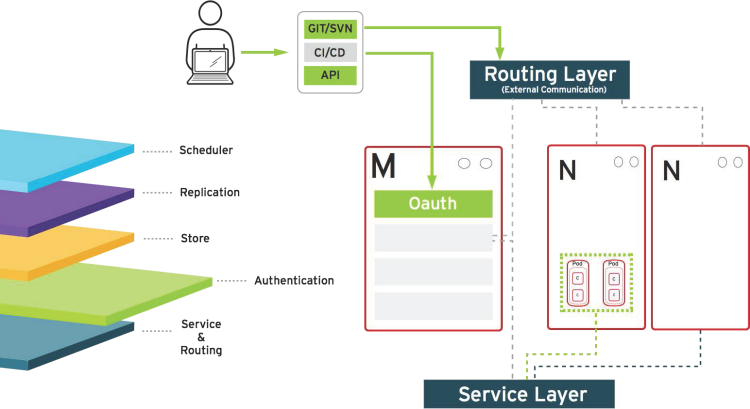
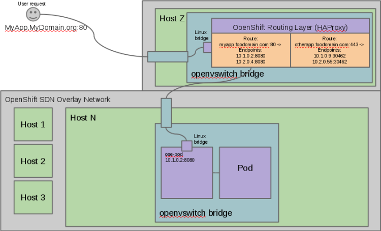

:noaudio:

ifdef::revealjs_slideshow[]

[#cover,data-background-image="image/1156524-bg_redhat.png" data-background-color="#cc0000"]
== &nbsp;
:noaudio:

[#cover-h1]
Red Hat OpenShift Enterprise Implementation

[#cover-h2]
Architecture

[#cover-logo]
image::{revealjs_cover_image}[]

endif::[]

:numbered!:

== Module Topics
:noaudio:

* Overview and design concepts in OpenShift Enterprise v3
* Introduction to Docker
* Introduction to Kubernetes infrastructure
* Networking in OpenShift Enterprise v3
* Image registry
* Builds and OpenShift S2I images

ifdef::showscript[]

=== Transcript
Welcome to Module 2 of the OpenShift Implementation course.

This module presents the following topics:

* Overview and design concepts in OpenShift Enterprise v3, including the
OpenShift stack, how OpenShift works, standards, important projects, and how the
various components work together.

* An introduction to Docker, including the difference between containers and
VMs and Docker components and capabilities.

* An introduction to Kubernetes infrastructure, covering features and concepts
with an emphasis on pods.

* An Overview of Networking in OpenShift Enterprise v3,

* The Image registry is described, including the integrated OpenShift
Enterprise registry and third-party registries.

* And the module ends with a discussion of Builds and OpenShift S2I images,
which explains what an S2I build is and why to use it.

endif::showscript[]

== What is OpenShift
:noaudio:

* OpenShift is a Platform-as-a-Service (PaaS)
* Provides development environments on demand (self service)
* Provides languages, frameworks, runtimes, and databases (polyglot)
* Automates application lifecycle management (build, deploy, retire)
* Enables collaboration between developers on projects and components
* Uses industry standards

ifdef::showscript[]

=== Transcript

We begin this module with an overview of OpenShift Enterprise design concepts.

OpenShift is a Platform-as-a-Service, or PaaS, which is based on industry
standards. OpenShift provides development environments on-demand, it offers a
range of languages, frameworks, runtimes and databases, and automates
application lifecycle management.

OpenShift enables collaboration between developers on projects and components.

endif::showscript[]

== OpenShift Enterprise v3
:noaudio:

* Standard containers API
* Container-optimized OS
* Web-scale orchestration
* Expanded services choices
* Enhanced user experience
* Community-driven innovation
* Industry-standard PaaS stack
+
image::images/OpenShiftStack.png[]

ifdef::showscript[]

=== Transcript

The OpenShift v3  stack, features the following:

* Standard containers API
* Container-optimized OS
* Web-scale orchestration
* Expanded choice of services
* Enhanced user experience
* Community-driven innovation
* And uses an industry-standard PaaS stack.

endif::showscript[]

== How OpenShift Works
:noaudio:

* *Containers* - Run languages/framework middleware, database, and other runtimes
* *Pods* - Object to define one or more *Containers* to be co-located on the
same host
* *Nodes* - Linux container hosts; run *Pods* assigned by master
* *Master* - Provides API, service orchestration, scheduling and placement,
maintains state, and manages *pods* and *services*.
+
image::images/OpenShiftV3Arch.png[]

ifdef::showscript[]

=== Transcript

Here is a simplified explanation of some of the components of OpenShift v3:
Containers run languages and frameworks, middleware components, databases, and
other runtimes. Pods run one or more containers as a single unit.
Each pod has an IP and  can be assigned persistent storage volumes.

Nodes are Linux container hosts that run pods assigned by the master.
The master provides API, service orchestration, scheduling and placement. It also maintains state and manages pods and services.

endif::showscript[]

== Containerization Standards
:noaudio:

.Isolation with Linux containers
* Isolate applications on host operating system
* Security
* Portability across host systems

.Container format with Docker
* Interface for communications, configuration, data persistence, provisioning
* Content agnostic
* Infrastructure agnostic

ifdef::showscript[]

=== Transcript
Red Hat works with the open source community to drive standards for containerization. The main areas are:

* Isolation with Linux containers - Isolating applications on the host operating system, security, and portability across host systems.

* Container format with Docker - Docker is the interface for communications, configuration, data persistence, and provisioning. It is content and infrastructure agnostic.

endif::showscript[]

== Containerization Standards
:noaudio:

.Orchestration with Kubernetes
* Orchestrate containers at scale
* Define application topologies
* Handle container networking
* Manage container state
* Schedule across hosts

ifdef::showscript[]

=== Transcript

* Orchestration with Kubernetes - Kubernetes orchestrates containers at scale;
it defines application topologies, handles part of the container networking,
manages container state, and it also schedules across hosts.

endif::showscript[]

== Containerization Standards
:noaudio:

.Registry and container discovery
* Find and consume trusted container images
* Federate consumption libraries
* Promote consistency and reuse

ifdef::showscript[]

=== Transcript

* Registry and container discovery - Red Hat promotes standards to easily find
and consume trusted container images, to federate consumption libraries, and
to promote consistency and reuse.

endif::showscript[]

== Important Projects in OpenShift
:noaudio:

* *Kubernetes* - link:http://kubernetes.io/[http://kubernetes.io/]

* *Docker* - http://docker.com or https://github.com/docker/docker

* *Etcd* - link:https://github.com/coreos/etcd[https://github.com/coreos/etcd]

+
image::images/ImportantProjects.png[]

ifdef::showscript[]

=== Transcript

OpenShift Enterprise v3 comprises several key open source projects, most notable
are Kubernetes, Docker, and EtcD.
Kubernetes orchestrates containers at massive scale and manages and orchestrates
Docker containers across clusters of nodes.

Docker is an open source project that automates the deployment of applications
inside software containers by providing an additional layer of abstraction and
automation of operating-system-level virtualization.

Docker provides the abstraction for packaging and creating lightweight
containers.

EtcD is a highly available key-value store for shared configuration and service
discovery. EtcD is the persistent data store for information about the OpenShift
environment.

OpenShift helps manage large developer organizations. OpenShift adds source code
management, builds and deployments for developers; manages and promotes images
at scale as they flow through the system, manages applications at scale, and
tracks teams and users.

endif::showscript[]

== OpenShift Model
:noaudio:

* *Masters* - Responsible for managing system state

* *Nodes* - Act as agents to control containers, based on desired state defined by master

NOTE: All members of the OpenShift environment/cluster are also members of a SDN
based overlay network.

image::images/OpenShiftV3ArchFull.png[]

ifdef::showscript[]

=== Transcript

In OpenShift, hosts are classified into two separate yet equally important
groups: masters and nodes.

Masters manage the state of the system, ensuring that all containers that should
be running are running, and that other requests are serviced.

OpenShift provides a REST endpoint for interacting with the system. All tools
speak directly to the REST APIs - CLI, web console, IDE plug-ins, etc.
Multiple masters work together to provide high availability at the management
layer.

Nodes act as agents to control containers based on the desired state defined by
the master. Nodes provide an API endpoint and they handle management and
synchronization between the components.

Deployments may have several nodes. Nodes may be organized into many different
topologies to suit the availability requirements of the workloads.

All members of the OpenShift environment/cluster are also members of a SDN
based overlay network.

endif::showscript[]

== OpenShift Workflow
:noaudio:

.Example Scenario
* An application needs to be scaled up due to increased traffic or a known
upcoming peak.
* This could be a manual API call or initiated by an external monitoring agent.

* OpenShift Workflow:
. API Call actioned (CLI, REST API, automation process)
. Data store gets new information (desired scale = 6)
. OpenShift's Replication Controllers see mismatch between current scale (3) and
desired scale (6).
. OpenShift Enterprise schedules and deploys 3 instances (pods).

ifdef::showscript[]

=== Transcript

A simplified way of looking at the OpenShift Enterprise workflow would be:

. Users or Automation make calls to the REST API (using the Web Console, Command
  line, any other method) to change the state of the system.
. OpenShift Enterprise periodically reads the user's desired state
. OpenShift Enterprise then tries to bring the other parts of the system into
sync with the desired state.

For example, consider this scenario: An OpenShift Enterprise v3 user is predicting a spike in traffic before a holiday or major sports event.
The user wants to spin up more pods of a specific service/application to accommodate the additional traffic.

Lets assume the application is currently configured with 3 running pods and the user wants to change that to 6 running pods as a pre-emptive measure.
The user then makes a call using the web console, CLI, or any other method to state that "this app should have 6 instances."

At this point the data store gets updated with the new information indicating that the desired scale is 6 running pods.
On the next sync loop, the Replication Controllers, which will be explained later, determine that the current scale of 3 running pods does not match the desired scale of 6 running pods.
This causes OpenShift Enterprise to schedule 3 more instances and place them for deployment.

As you can see, the OpenShift Enterprise controllers are performing the "business logic" of the system by taking user actions and transforming them into reality.
You can customize how builds are run and launched independently of how images are managed, or how deployments happen.

endif::showscript[]

== How it Works
:noaudio:

.Service and Routing
* Takes care of internal and external requests from the applications running on
OpenShift

+
image::images/01ServiceRouting.png[]

ifdef::showscript[]

=== Transcript

The service and routing layer takes care of internal and external requests from
and to the applications running on OpenShift.
A service provides a list of IPs for the pods it represents. The routing layer
directs traffic from the outside world to the correct pod's IP and port.

endif::showscript[]

== How it Works
:noaudio:

.Authentication
* Provides framework for collaboration and quota management
* Supports a number of mechanisms for authentication
+

ifdef::showscript[]

=== Transcript

The authentication layer provides a framework for collaboration and quota
management.
OpenShift Enterprise v3 supports a number of mechanisms for authentication.
The simplest use case for testing purposes is `htpasswd`-based authentication.

endif::showscript[]

== How it Works
:noaudio:

.Store
* Holds current state, desired state, and configuration information of the
environment
+
image::images/03Store.png[]

ifdef::showscript[]

=== Transcript

The store layer holds the current state, the desired state, and configuration
information about the environment.

endif::showscript[]

== How it Works
:noaudio:

.Replication
* Ensures number of instances/pods defined in store layer actually exist

+
image::images/04Replication.png[]

ifdef::showscript[]

=== Transcript

The replication layer and replication controller's role is to make sure that the
number of instances/pods defined in the store layer actually exist.
The replication controller instantiates (creates) or kills pods according to
the desired state definition.

endif::showscript[]

== How it Works
:noaudio:

.Scheduler
* Determines where to create new pods
* Priorities and rules for scheduler "logic" are configurable.

+
image::images/05Scheduler.png[]

ifdef::showscript[]

=== Transcript

The scheduler is essentially the OpenShift Enterprise master.
Any time a pod needs to be created somewhere, the master determines where to do
this. This is called "scheduling".

endif::showscript[]

== What is Docker
:noaudio:

* *Docker* - Open platform for developers and admins to build, ship, and run
distributed applications.

* Main support components:
** Docker Engine, a portable, lightweight runtime and packaging tool
** Docker Hub, a cloud service for sharing applications and automating workflows
* Benefits:
** Multi-version packaging format and isolation
** Simplified container API (Docker libcontainer)
** Easy to create (Dockerfile)
** Atomic deployment (Docker images)
** Large ecosystem (Docker Hub)

ifdef::showscript[]

=== Transcript

This next portion of the module provides an introduction to Docker.
Docker is an open platform for developers and system administrators to build,
ship, and run distributed applications. The main components are the Docker
 Engine and the Docker hub.
Docker Engine is a portable, lightweight runtime and packaging tool. Docker Hub
is a cloud service for sharing applications and automating workflows.

Docker has a number of benefits, as shown here. Docker images are described in
detail later.

endif::showscript[]

== How Containers Differ From VMs
:noaudio:

* *Virtual machine* - Each virtualized application includes the application, binaries, libraries, and entire guest operating system

* *Container (Docker)* - Contains just the application and its dependencies

+
image::images/VMvsContainer.png[]

ifdef::showscript[]

=== Transcript

There are differences between virtual machines and containers. Many people like
to bundle them together, but there are important differences.

Each virtualized application includes not only the application and the necessary
binaries and libraries, which may only require 10s of MBs,  but also an entire
guest operating system, which may weigh 10s of GBs.

The Docker Engine container comprises just the application and its dependencies.
It runs as an isolated process in user space on the host operating system,
sharing the kernel with other containers. Thus, it enjoys the resource isolation
and allocation benefits of VMs, but is much more portable and efficient.

endif::showscript[]

== Docker Components
:noaudio:

* *Docker daemon* - Runs on a host machine
* *Docker client* - Primary user interface to Docker
* *Docker images* - Read-only template
* *Docker registries* - Hold images
* *Docker containers* - Hold everything needed for application to run

ifdef::showscript[]

=== Transcript

The Docker daemon runs on a host machine. You do not directly interact with the
daemon. Instead, you interact through the Docker client.

The Docker client is the primary user interface to Docker. It accepts commands
from the user and communicates back and forth with a Docker daemon.

A Docker image is a read-only template. For example, an image could contain a
Red Hat Enterprise Linux 7 operating system with Apache and your web
application installed.

Docker registries hold images. Registries are public or private stores from
which you upload or download images.

Docker containers hold everything that is needed for an application to run.
Each container is created from a Docker image. Docker containers can be run,
started,
 stopped, moved, and deleted.

endif::showscript[]

== Docker Capabilities
:noaudio:

* Build Docker images that hold applications
* Create containers from images to run applications
* Share and reuse images via Docker Hub or your own registry
NOTE: In OSE3.0 we create our own "Integrated registry" to store and distribute
images created locally.

ifdef::showscript[]

=== Transcript

With Docker you can build Docker images that hold your applications and create
Docker containers from those Docker images to run your applications.
You can share and reuse those Docker images via Docker Hub or your own registry.

In OSE3.0 we create our own "Integrated registry" to store and distribute
images created locally.

endif::showscript[]

== How Does a Docker Image Work
:noaudio:

* Read-only templates from which containers are launched
* Each image consists of a series of layers
* Uses union file system
** Combines layers into single image
** Allows branches to form single file system
* When you change a Docker image, a new layer gets built

ifdef::showscript[]

=== Transcript

Docker images are read-only templates from which Docker containers are launched.
Each image consists of a series of layers.
Docker makes use of union file systems to combine these layers into a single
image.

Union file systems also allow files and directories of separate file systems,
known as branches, to be transparently overlaid to form a single coherent file
system.

When you change a Docker image,for example: when you update an application to a
new version, a new layer gets built. You do not need to distribute a whole new
image, just the update.

endif::showscript[]

== What is Kubernetes
:noaudio:

* *Kubernetes* - Open source system for managing containerized applications
across multiple hosts

* Provides basic mechanisms for deployment, maintenance, and scaling of
applications
** *Lean* - Lightweight, simple, accessible
** *Portable* - Public, private, hybrid, multi-cloud
** *Extensible* - Modular, pluggable, hookable, composable
** *Self-healing* - Autoplacement, autorestart, autoreplication

* Builds on over 1.5 decades of experience at Google
+
link:https://github.com/googlecloudplatform/kubernetes[https://github.com/googlecloudplatform/kubernetes]

ifdef::showscript[]

=== Transcript

Next we take a look at the Kubernetes infrastructure.
Kubernetes is an open source system for managing containerized applications
across multiple hosts. It provides basic mechanisms for deployment, maintenance,
and scaling of applications.

Kubernetes is lean, portable, extensible, and self-healing. Kubernetes builds
upon a decade and a half of experience at Google.

endif::showscript[]

== Kubernetes Concepts
:noaudio:

* *Nodes* - Compute resources on top of which containers are built
* *Pods*  - Colocated group of containers.
* *Replication controllers* - Manage lifecycle of pods, starting and killing
pods as required.
* *Services* - Provide a single, stable name and address for a set of pods
* *Labels* - Organize and select groups of objects based on key-value pairs

ifdef::showscript[]

=== Transcript

Nodes are the compute resources on top of which your containers are built.

Pods, used in the same context as "a pod of whales" or "peas in a pod", are a
co-located group of containers, possibly sharing persistent storage volumes.
Pods are the smallest deployable units that can be created, scheduled, and
managed with Kubernetes.

Replication controllers manage the lifecycle of pods. They ensure that a
specified number of pods are running at any given time by creating or killing
pods as required.

Services provide a single, stable name and address for a set of pods. As pods
can "come and go" the *Service* provides a "frontend" for the pods it represents.

Labels are used to organize and select groups of objects based on key-value pairs.

endif::showscript[]

== Pods
:noaudio:

* Correspond to colocated group of applications running with shared context
** May have individual cgroup isolations applied
* Models an application-specific logical host in a containerized environment
** May contain one or more applications that are relatively tightly coupled
** Example: Web server and a “file puller/syncer”
* Smallest deployable units that can be created, scheduled, and managed
* Consist of colocated group of Docker containers with shared volumes

ifdef::showscript[]

=== Transcript

A pod corresponds to a colocated group of applications running with a shared
context.  Within that context, the applications may also have individual cgroup
isolations applied. A pod models an application-specific logical host in a
containerized environment.
A pod may contain one or more applications that are relatively tightly coupled.
For example, a Pod could contain a web server and a “file puller/syncer.” In a
pre-container world, they would have executed on the same physical or virtual
host.

In Kubernetes, rather than individual application containers, pods are the
smallest deployable units that can be created, scheduled, and managed.
In terms of Docker constructs, a pod consists of a colocated group of Docker
containers.

endif::showscript[]

== OpenShift Enterprise Networking
:noaudio:

* Container networking based on integrated Open vSwitch
* Platform-wide routing tier
* Ability to plug in third-party software-defined network solutions
* Integrated with DNS and existing routing and load-balancing

ifdef::showscript[]

=== Transcript

OpenShift Enterprise provides many networking capabilities based on the
integrated Open vSwitch technologies in Red Hat Enterprise Linux.
It provides a platform-wide routing tier to route traffic to applications.
You can also integrate OpenShift Enterprise with third-party SDN solutions and
your existing DNS, routing, and load-balancing methods.

endif::showscript[]

== OSE Networking Basics
:noaudio:

* To understand the networking workflow in OSE3.0 we need to get familiar with
the following components:
** The `SDN Network` - Every host in the OSE3.0 environment/cluster is a member
of the *SDN Network*.
- Each `Pod` will have it's own IP that is routable from any member of the SDN
(By default: 10.x.x.x)
- Each `Service`, which represents one or more `pods` will have it's own IP
(By default: 172.30.x.x)

ifdef::showscript[]

=== Transcript

All hosts in the OSE environemnt, or cluster, are members of the same SDN
overlay network.

Each pod gets it's very own IP that is routable from any member of the SDN
network.
Pods come and go, so we use a *service* to represent them and provide a stable
and permanent IP for a group of pods.

endif::showscript[]

== OSE Networking Basics
:noaudio:

* On one or more of the OSE nodes will host the `Default Router`:
** The `Default Router` - A container an HA-Proxy instance used to route
(Actually "proxy") between the outside world and pods in the OSE environment.
- the *Router* binds a hostname fqdn (i.e: myapp.mydomain.org) to an
address/addresses in the OSE environment.
- The *Router* routinely gets the Pod's IPs from the *service* which represents
them.
- The *Router* routes/proxies directly to the *pods* and not through the
*service*.
* We will configure our DNS server to resolve a *wildcard* DNS entry to the node
 that hosts the `Default Router` (*Infranode00* host in our labs later on)

ifdef::showscript[]

=== Transcript

A container running an instance of HA-Proxy will be hosted on one or more of the
nodes in the OSE environment, this instance is referred to as the "Default
Router"

The Router's function is to resolve fqdn hostname requests and proxy the
connection directly to any of the pods represented by the *Service*.

A DNS entry will need to be configured in the client's DNS server, a wildcard
entry such as "*.cloudapps.companynameexample.com"

endif::showscript[]

== Networking Workflow
:noaudio:

.Scenario: Client points browser to `myApp.MyDomain.org:80`
* DNS resolves to the *host* running the *Default Router* container (This will
  be *infranode00* in our lab)
* Using `openshift-sdn` overlay network:
** *Default Router* is configured with
** Proxies request to internal pod IP:port (10.1.2.3:8080 )
+

ifdef::showscript[]

=== Transcript

Let's review the following scenario:
When a user requests a page, by pointing his or her browser to
http://Myapp.MyDomain, DNS resolves that request to the IP address of one of
the nodes that hosts the routing layer.

You would usually create a wildcard Cname record in your DNS server and point
it to the node or nodes that host the router container.

The routing layer, in this case the Router Container, then determines which pod
should get the request and acts as a proxy for the pod.

endif::showscript[]

== Container Registry
:noaudio:

* Fully integrated Docker v2 registry
* Authentication and access control to images
* Integrates with Red Hat Satellite Server container registry
* Integrates with Docker Hub and other registries

* Image source any server implementing Docker registry API:
** Canonical Docker Hub
** Private registries run by third parties
** Integrated OpenShift Enterprise registry

ifdef::showscript[]

=== Transcript

The next section of this module looks at the Image repository.

The image registry is a fully integrated Docker v2 registry.
It provides authentication and access control to images and can be integrated
into the Red Hat Satellite Server container registry.

You can also integrate the registry with third-party providers to leverage
innovation from the community and ISVs.

OpenShift Enterprise uses any server implementing the Docker registry API as a
source of images, including canonical Docker Hub, private registries run by
third parties, and the integrated OpenShift Enterprise registry.

endif::showscript[]

== Integrated Registry
:noaudio:

* Provides an integrated Docker registry
* Provides place for builds to push images

ifdef::showscript[]

=== Transcript

OpenShift Enterprise provides an integrated Docker registry. This allows users
to automatically have a place to which their builds can push the resulting
images.

Whenever a new image is pushed to the integrated registry, the registry notifies
OpenShift Enterprise about the new image and passes along image information,
such as the namespace, the name, and the image metadata.

Various pieces of OpenShift Enterprise react to the new images by creating new
builds and deployments.

endif::showscript[]

== Third-Party Registries
:noaudio:

* Provide builder images, complete application images, and more
* Supportability falls on their respective creators
* Can be polled for changes to image repositories
+
[NOTE]
Polling is not currently implemented.

ifdef::showscript[]

=== Transcript

OpenShift Enterprise can use third-party registries to obtain builder images,
complete application images, and more.

Supportability of these images and registries falls to their respective
creators.

OpenShift Enterprise can poll the other registries for changes to image
repositories.

endif::showscript[]

== What is an S2I Build
:noaudio:

* Integrated Docker registry and automated image builds
* Source code deployments leverage *source-to-image (S2I)* build automation
* Binary deployments integrate with existing build and CI infrastructure
* Configurable deployment patterns (rolling, etc.)
+
image::images/DockerVsS2IBuilds.png[]

ifdef::showscript[]

=== Transcript

In the final portion of this module, we look at builds and OpenShift S2I images.

The S2I build process is a process in which a developer points to a code
repository in any of the supported frameworks and selects a builder image that
would contain the operating system and framework to support the code. OpenShift
Enterprise then creates an image based on the builder image that contains the
selected code.

endif::showscript[]

== Why Use S2I Builds
:noaudio:

* Provides a developer-centric flow
** Focuses on turning source code into running application
** S2I project aims to combine source code with image containing a build and
runtime environment

* Strong separation between source code and runtime environment in Docker image
helps migrate code between:

** Runtime environments
** Across major versions of a runtime
** Across operating system versions

ifdef::showscript[]

=== Transcript

OpenShift Enterprise v3 provides a developer-centric flow that focuses on
turning developer's source code into a running application as simply as possible.

The Source-to-Image project was started to make it easy for developers to take
source code and combine it with an image, called a builder image.
The builder image contains both a build and runtime environment for that source
 code.

Having a strong separation between source code, or even binary artifacts, and
the runtime environment in the Docker image helps you migrate your code between:

* Runtime environments like Tomcat and other JEE servers,
* Across major versions of a runtime like Ruby 1.9 and Ruby 2.0,
* And even across operating system versions like CentOS and Red Hat Enterprise
Linux.

endif::showscript[]

== Summary
:noaudio:

* Overview and design concepts in OpenShift Enterprise v3
* Introduction to Docker
* Introduction to Kubernetes infrastructure
* Networking in OpenShift Enterprise v3
* Image registry
* Builds and OpenShift S2I images

ifdef::showscript[]

=== Transcript

This module presented the following topics:

* Overview and design concepts in OpenShift Enterprise v3, including the
OpenShift stack, how OpenShift works, standards, important projects, workflows,
and how the various components work.

* It introduced Docker, including the difference between containers and VMs,
and Docker components and capabilities.

* Next it covered Kubernetes features and concepts with an emphasis on pods.

* It covered an Overview of Networking in OpenShift Enterprise v3,

* The Image registry section described the integrated OpenShift registry and
third-party registries.

* And Builds and OpenShift S2I images were explained briefly covering what an
S2I build is and why to use it.

endif::showscript[]
