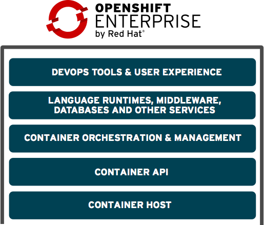

:noaudio:
== OpenShift Enterprise v3 Stack Diagram

ifdef::showscript[]

=== Transcript

The OpenShift v3  stack, features the following: 

* Standard containers API
* Container-optimized OS
* Web-scale orchestration
* Expanded choice of services
* Enhanced user experience
* Community-driven innovation
* And uses an industry-standard PaaS stack.

endif::showscript[]

