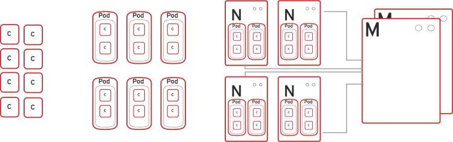

:noaudio:
== How OpenShift Works

* *Containers* - Run languages/framework middleware, database, and other runtimes
* *Pods* - Run one or more containers as single unit
* *Nodes* - Linux container hosts; run pods assigned by master
* *Master* - Provides API, service orchestration, scheduling and placement, maintains state, and manages pods and services
+

ifdef::showscript[]

=== Transcript

Here is a simplified explanation of some of the components of OpenShift v3:
Containers run languages and frameworks, middleware components, databases, and other runtimes. Pods run one or more containers as a single unit. 
Each pod has an IP and mapped storage volumes.

Nodes are Linux container hosts that run pods assigned by the master. 
The master provides API, service orchestration, scheduling and placement. It also maintains state and manages pods and services.
	

endif::showscript[]

