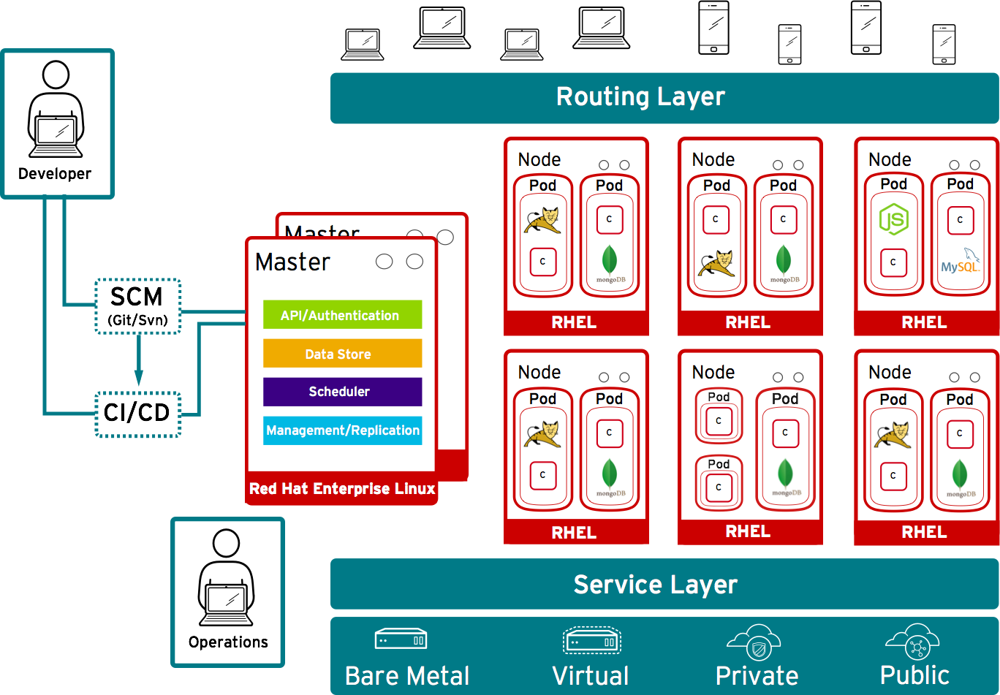

:scrollbar:
:data-uri:
== OpenShift Model

* *Masters* - Responsible for managing system state 

* *Nodes* - Act as agents to control containers, based on desired state defined by master
+

ifdef::showscript[]

=== Transcript

In OpenShift, hosts are classified into two separate yet equally important groups: masters and nodes.

Masters manage the state of the system, ensuring that all containers that should be running are running, and that other requests are serviced. 

OpenShift provides a REST endpoint for interacting with the system. All tools speak directly to the REST APIs - CLI, web console, IDE plug-ins, etc.
Multiple masters work together to provide high availability at the management layer.

Nodes act as agents to control containers based on the desired state defined by the master. Nodes provide an API endpoint and they handle management and synchronization between the components. 

Deployments may have several nodes. Nodes may be organized into many different topologies to suit the availability requirements of the workloads.

endif::showscript[]

