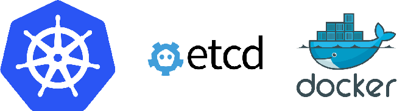

== Important Projects in OpenShift Enterprise
:noaudio:

* *Kubernetes*: http://kubernetes.io/

* *Docker*: http://docker.com or https://github.com/docker/docker

* *Etcd*: https://github.com/coreos/etcd

+

ifdef::showscript[]

=== Transcript

OpenShift Enterprise 3.0 consists of several key open source projects, most notably Kubernetes, Docker, and EtcD.

Kubernetes orchestrates containers at massive scale and manages and orchestrates
Docker containers across clusters of nodes.

Docker automates the deployment of applications
inside software containers by providing an additional layer of abstraction and
automation of operating system-level virtualization. It also provides the abstraction for packaging and creating lightweight
containers.

EtcD is a highly available key-value store for shared configuration and service
discovery. EtcD is the persistent data store for information about the OpenShift Enterprise
environment.

OpenShift Enterprise helps manage large developer organizations. It adds source code
management, builds, and deployments for developers; manages and promotes images
at scale as they flow through the system; manages applications at scale; and
tracks teams and users.

endif::showscript[]
