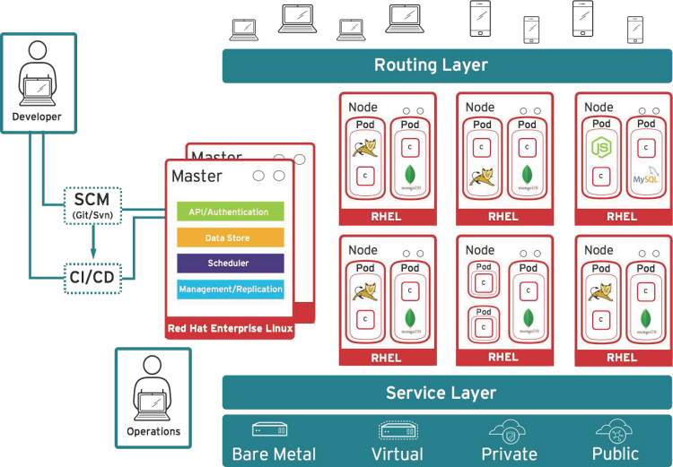

:scrollbar:
:data-uri:
== Overview and design concepts in OSE3.0

=== OpenShift Model

* *The Master*:  This component is responsible for managing the state of the system, ensuring that all containers that should be running, are running, and that other requests are serviced.
** OpenShift provides a REST endpoint for interacting with the system. 
** All tools speak directly to the REST APIs (CLI, web console, IDE plugins, etc).
** Multiple masters work together to provide high availability at the management layer
* *A Node*:  Nodes act as agents to control containers, based on the desired state defined by the Master.
** Deployments may have several nodes.
** Nodes may be organized into many different topologies to suit the availability requirements of the workloads (for example: region & zone, rack & power strip, etc).

ifdef::showScript[]

=== Transcript

* In OpenShift, Hosts are classified into two separate, yet equally important groups. 
** The master, or master*s* who provide and API endpoint, management and synchronization between the components,
** and the nodes who act as an agent to control containers, based on the desired state defined by the Master.

endif::showScript[]

