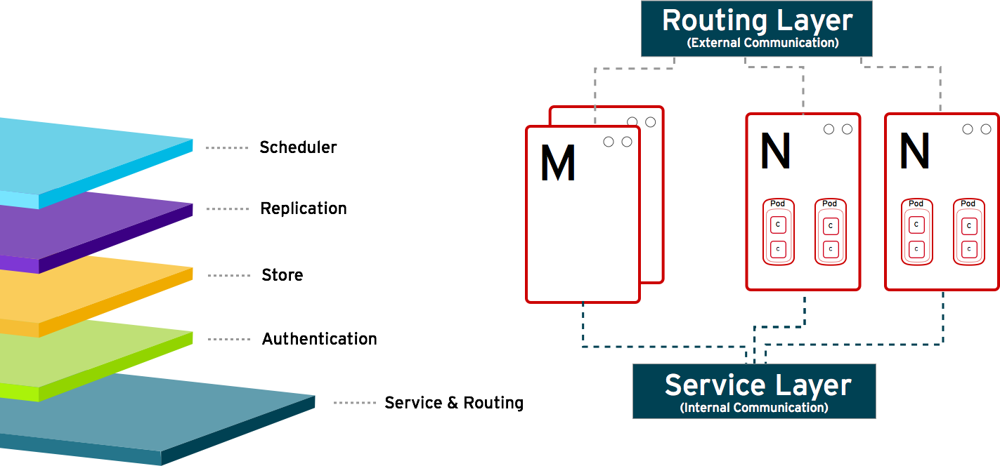

:noaudio:
== How it Works

.Service and Routing
* Takes care of internal and external requests from the applications running on OpenShift

+

ifdef::showscript[]

=== Transcript

The service and routing layer takes care of internal and external requests from and to the applications running on OpenShift. 
A service provides a list of IPs for the pods it represents. The routing layer directs traffic from the outside world to the correct pod's IP and port. 

endif::showscript[]

