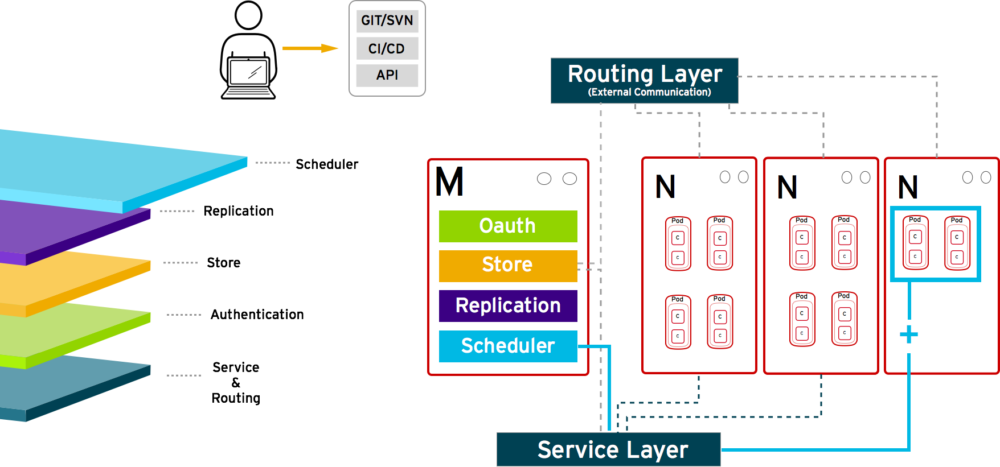

:scrollbar:
:data-uri:
== How it Works

.Scheduler
* Essentially the OpenShift Enterprise master 
* Determines where to create new pods

+

ifdef::showscript[]

=== Transcript

The scheduler is essentially the OpenShift Enterprise master. Any time a pod needs to be created somewhere, the master determines where to do this. This is called "scheduling". 

endif::showscript[]

