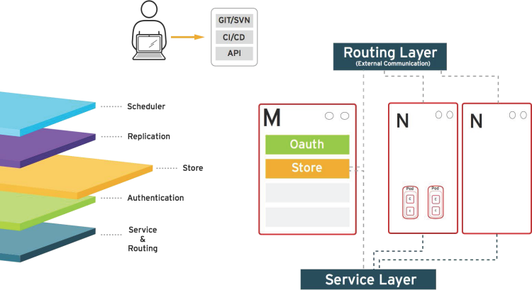

== How it Works
:noaudio:

.Store
* Holds current state, desired state, and configuration information of the
environment
+

ifdef::showscript[]

=== Transcript

The store layer holds the current state, the desired state, and configuration
information about the environment.

endif::showscript[]

