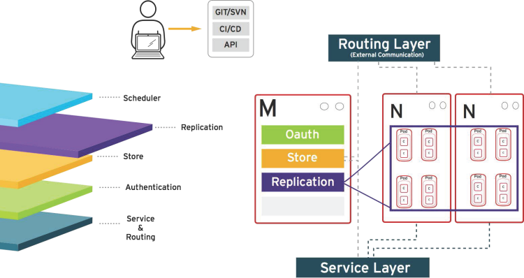

== How it Works
:noaudio:

.Replication
* Ensures number of instances/pods defined in store layer actually exist

+

ifdef::showscript[]

=== Transcript

The replication layer and replication controller's role is to make sure that the
number of instances/pods defined in the store layer actually exist.
The replication controller instantiates (creates) or kills pods according to
the desired state definition.

endif::showscript[]

