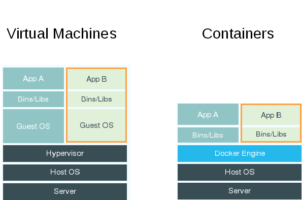

:noaudio:

== How Containers Differ From VMs

* *Virtual machine* - Each virtualized application includes the application, binaries, libraries, and entire guest operating system

* *Container (Docker)* - Contains just the application and its dependencies 

+

ifdef::showscript[]

=== Transcript

There are differences between virtual machines and containers. Many people like to bundle them together, but there are important differences. 

Each virtualized application includes not only the application and the necessary binaries and libraries, which may only require 10s of MBs,  but also an entire guest operating system, which may weigh 10s of GBs.

The Docker Engine container comprises just the application and its dependencies. It runs as an isolated process in user space on the host operating system, sharing the kernel with other containers. Thus, it enjoys the resource isolation and allocation benefits of VMs, but is much more portable and efficient.

endif::showscript[]

