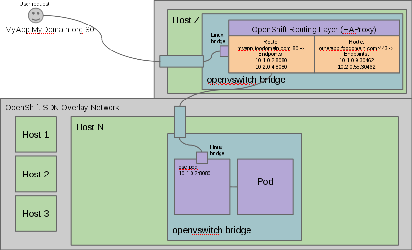

:noaudio:

== Networking Workflow

// ISSUE : Networking in OpenShift Enterprise v3, Slide: OpenShift Networking - Workflow - Would be great to have an animation for this
// ISSUE : Networking in OpenShift Enterprise v3, Slide: OpenShift Networking - Workflow - Image is wrong "MyDomain.org" != "foodomain.com"

.Scenario: Client points home browser to `myApp.MyDomain.org:80`
* DNS resolves to host running router container
* Using `openshift-sdn` overlay network:
** Router container resolves
** Proxies request to internal pod IP:port (10.1.2.3:8080 )
+

ifdef::showscript[]

=== Transcript

Let's review the following scenario:
When a user requests a page, by pointing his or her browser to http://Myapp.MyDomain on port 80, DNS resolves that request to the IP address of one of the nodes that hosts the routing layer.

You would usually create a wildcard Cname record in your DNS server and point it to the node or nodes that host the router container.

The routing layer, in this case the Router Container, then determines which pod should get the request and acts as a proxy for the pod. 

endif::showscript[]

