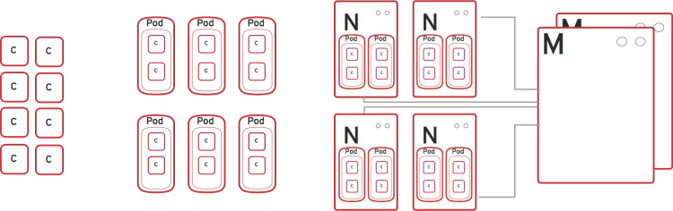

:noaudio:

ifdef::revealjs_slideshow[]

[#cover,data-background-image="image/1156524-bg_redhat.png" data-background-color="#cc0000"]

== &nbsp;
:noaudio:

[#cover-h1]
Red Hat OpenShift Container Platform Implementation

[#cover-h2]
Architecture

[#cover-logo]
image::{revealjs_cover_image}[]

endif::[]

:numbered!:
== Module Topics

* Overview and design concepts in OpenShift Enterprise by Red Hat version 3
* Introduction to Docker
* Introduction to Kubernetes infrastructure
* Networking in OpenShift Enterprise 3
* Image registry
* Builds and OpenShift Enterprise S2I images
* OpenShift Enterprise 3.1 Release Notes

ifdef::showscript[]

=== Transcript

Welcome to module two of the OpenShift Enterprise Implementation course.

This module covers the following topics:

* Overview and design concepts in OpenShift Enterprise by Red Hat version 3,
 including the OpenShift stack, how OpenShift works, standards, important
  projects, and how the
various components work together

* An introduction to Docker, including the difference between containers and
VMs and Docker components and capabilities

* An introduction to Kubernetes infrastructure, covering features and concepts.

* An overview of networking in OpenShift Enterprise 3

* A description of the image registry, including the integrated OpenShift
Enterprise registry and third-party registries

* A discussion of builds and OpenShift Enterprise S2I images, including what an
 S2I build is and reasons to use it

* A description of the new features in OpenShift Enterprise 3.1

endif::showscript[]
== What Is OpenShift Enterprise

* Platform-as-a-Service (PaaS)
* Uses industry standards
* Provides development environments on demand (self-service)
* Provides languages, frameworks, runtimes, and databases (polyglot)
* Automates application lifecycle management (build, deploy, retire)
* Enables collaboration between developers on projects and components

ifdef::showscript[]

=== Transcript

This module begins with an overview of OpenShift Enterprise design concepts.

OpenShift Enterprise is a Platform-as-a-Service, or PaaS, that is based on
 industry
standards. OpenShift Enterprise is a self-service platform, meaning that it
 provides development environments on demand. As a polyglot offering, it
  includes a range of languages, frameworks, runtimes, and databases. It also
   automates management of the entire application lifecycle: build, deploy, and
    retire.

OpenShift Enterprise enables collaboration between developers on projects and
 components.

endif::showscript[]
== OpenShift Enterprise Version 3

[.noredheader,cols="<,^"]
|======
a|* Standard containers API
* Container-optimized OS
* Web-scale orchestration
* Expanded services choices
* Enhanced user experience
* Community-driven innovation
* Industry-standard PaaS stack
|image:images/OpenShiftStack.png[width=100%]
|======

ifdef::showscript[]

=== Transcript

The OpenShift Enterprise version 3 stack features the following:

* A standard containers API
* A container-optimized OS
* Web-scale orchestration
* An expanded choice of services
* An enhanced user experience
* Community-driven innovation
* And an industry-standard PaaS stack

endif::showscript[]
== How OpenShift Enterprise Works

* *Containers*: Run languages/framework, middleware, database, and other
 runtimes
* *Pods*: Define one or more containers co-located on same host
* *Nodes*: Linux container hosts; run pods assigned by master
* *Master*:
** Provides API, service orchestration, scheduling, placement
** Maintains state
** Manages pods and services

ifdef::showscript[]

=== Transcript

Here is a simplified explanation of some of the components of OpenShift
Enterprise 3.

Containers run languages and frameworks, middleware components, databases, and
other runtimes.

Pods run one or more containers as a single unit, to be co-located on the same
host.
Each pod has an IP address and can be assigned persistent storage volumes.

Nodes are Linux container hosts that run pods assigned by the master.

The master provides an API, service orchestration, scheduling, and placement.
It also maintains state and manages pods and services.

endif::showscript[]
== Containerization Standards

.Isolation With Linux Containers
* Isolates applications on host operating system
* Provides:
** Security
** Portability across host systems

.Docker Format for Containers
* Interface for communications, configuration, data persistence, provisioning
* Content-agnostic
* Infrastructure-agnostic

ifdef::showscript[]

=== Transcript
Red Hat works with the open source community to drive standards for
containerization. The main areas are isolation with Linux containers, container
 format with Docker, orchestration with Kubernetes, and registry and container
  discovery.

Isolation with Linux containers isolates applications on the host operating
 system. This provides security and portability across host systems.

In Docker-formatted containers, Docker is the interface for communications,
 configuration, data persistence, and provisioning. Docker containers are
  content- and infrastructure-agnostic. They can handle any kind
   of content and are not tied to any particular infrastructure.

endif::showscript[]
== Containerization Standards

.Orchestration With Kubernetes
* Orchestrates containers at scale
* Defines application topologies
* Handles container networking
* Manages container state
* Schedules across hosts

ifdef::showscript[]

=== Transcript

Kubernetes manages containers in a cluster environment. It orchestrates
 containers at scale, defines application topologies, handles part of the
  container networking,
manages container state, and schedules across hosts.

endif::showscript[]
== Containerization Standards

.Registry and Container Discovery
* Finds and consumes trusted container images
* Federates consumption libraries
* Promotes consistency and reuse

ifdef::showscript[]

=== Transcript

Red Hat promotes registry and container discovery standards to easily find
and consume trusted container images and federate consumption libraries. This
 promotes consistency and reuse.

endif::showscript[]
== Important Projects in OpenShift Enterprise

* *Kubernetes*: http://kubernetes.io/

* *Docker*: http://docker.com or https://github.com/docker/docker

* *Etcd*: https://github.com/coreos/etcd

+
image::images/ImportantProjects.png[]

ifdef::showscript[]

=== Transcript

OpenShift Enterprise 3 consists of several key open source projects, most
 notably Kubernetes, Docker, and EtcD.

Kubernetes orchestrates containers at massive scale and manages and orchestrates
Docker containers across clusters of nodes.

Docker automates the deployment of applications
inside software containers by providing an additional layer of abstraction and
automation of operating system-level virtualization. It also provides the
 abstraction for packaging and creating lightweight
containers.

EtcD is a highly available key-value store for shared configuration and service
discovery. EtcD is the persistent data store for information about the OpenShift
 Enterprise environment.

OpenShift Enterprise helps manage large developer organizations. It adds source
 code management, builds, and deployments for developers; manages and promotes
  images at scale as they flow through the system; manages applications at
   scale; and tracks teams and users.

endif::showscript[]
== OpenShift Enterprise Model

* *Masters*: Responsible for managing system state
** Provide a REST endpoint for interacting with system
** Host the web console for developer access

* *Nodes*: Act as hosts to run containers, based on desired state defined by
 master

+
[NOTE]
All members of OpenShift Enterprise environment/cluster are also members of
overlay network based on software-defined network (SDN).
+
image::images/OpenShiftV3ArchFull.png[]

ifdef::showscript[]

=== Transcript

OpenShift Enterprise classifies hosts into two separate yet equally important
groups: masters and nodes.

Masters manage the state of the system, ensuring that all containers that should
be running are running and that other requests are serviced.

OpenShift Enterprise provides a REST endpoint for interacting with the system.
All tools speak directly to the REST APIs: CLI, web console, IDE plug-ins, etc.
Multiple masters can be used to provide high availability at the
management layer.

Nodes act as agents to control and host containers based on the desired state
defined by the master.

Deployments may have several nodes. You can organize nodes into many different
topologies to suit the availability requirements of the workloads.

All members of the OpenShift Enterprise environment/cluster are also members of
 an overlay network based on a software-defined network, or SDN.

endif::showscript[]
== OpenShift Enterprise Workflow

.Scenario
* Application needs to be scaled up to accommodate overall increase or upcoming
 spike in traffic
* Request could be:
** Manual API call/command line
** Initiated by external monitoring agent

* OpenShift Enterprise workflow:
. API call made (CLI, REST API, automation process)
. Data store gets new information (desired scale = 6 pods)
. Replication controllers see mismatch between current scale (3 pods) and
desired scale (6 pods)
. OpenShift Enterprise schedules and deploys 3 instances (pods)

ifdef::showscript[]

=== Transcript

Put simply, OpenShift Enterprise manages its workflow as follows:

. Users or automation make calls to the REST API (using the web console, command
   line, or any other method) to change the state of the system.
. OpenShift Enterprise periodically checks to see what system state the call
 wants.
. OpenShift Enterprise then works to bring the other parts of the system into
sync with the desired state.

For example: Say an OpenShift Enterprise 3 user predicts a spike in traffic
 before a holiday or major sports event.
The user wants to spin up more pods of a specific service/application to
 accommodate the additional traffic.

The application has three pods running, and the user wants to double that
 number, to six running pods, as a pre-emptive measure.

The user uses the web console, CLI, or other method to make a call to the master
 stating that the application should have six instances.

The Master updates the data store with the new information that the desired
 scale is six running pods.

On the next sync loop, the replication controllers determine that the current
 scale of three running pods does not match the desired scale of six running
  pods.

OpenShift Enterprise then schedules three more instances and places them for
 deployment.

endif::showscript[]
== How OpenShift Enterprise Works

.Service and Routing Layer
* Takes care of internal and external requests from the applications running on
OpenShift Enterprise
+
image::images/01ServiceRouting.png[]

ifdef::showscript[]

=== Transcript

The service and routing layer takes care of internal and external requests to
and from the applications running on OpenShift Enterprise.

The service part provides a list of IPs for the pods it represents. The routing
 part directs traffic from the outside world to the correct pod's IP and port.

endif::showscript[]
== How OpenShift Enterprise Works

.Authentication Layer
* Provides framework for collaboration and quota management
* Supports multiple mechanisms for authentication
+
image::images/02Authentication.png[]

ifdef::showscript[]

=== Transcript

The authentication layer provides a framework for collaboration and quota
management.
OpenShift Enterprise 3 supports a number of mechanisms for authentication.
The simplest use case for testing purposes is `htpasswd`-based authentication.

endif::showscript[]
== How OpenShift Enterprise Works

.Store Layer
* Holds current state, desired state, and configuration information of
 environment
* `etcd` key value store is used for this layer
+
image::images/03Store.png[]

ifdef::showscript[]

=== Transcript

The store layer holds the current state, the desired state, and configuration
information about the environment.

endif::showscript[]
== How OpenShift Enterprise Works

.Replication Layer
* Ensures number of instances/pods defined in store layer actually exists

+
image::images/04Replication.png[]

ifdef::showscript[]

=== Transcript

The replication layer contains the replication controller, whose role is to make
 sure that the number of instances/pods defined in the store layer actually
  exists.
The replication controller instantiates (creates) or kills pods according to
the desired state definition.

endif::showscript[]
== How OpenShift Enterprise Works

.Scheduler Layer
* Determines where to create new pods
* Can configure priorities and rules for scheduler logic

+
image::images/05Scheduler.png[]

ifdef::showscript[]

=== Transcript

Whenever a user decides to create a pod, the master determines where to do
this. This is called _scheduling_.

You can configure the priorities and rules for the scheduler logic.

endif::showscript[]
== What Is Docker

* Open platform for developers and administrators to build, ship, and run
distributed applications

* Main support components:
** *Docker Engine*: Portable, lightweight runtime and packaging tool
** *Docker Hub*: Cloud service for sharing applications and automating
 workflows
* Benefits:
** Multi-version packaging format and isolation
** Simplified container API (Docker `libcontainer`)
** Easy creation (Dockerfile)
** Atomic deployment (Docker images)
** Large ecosystem (Docker Hub)

ifdef::showscript[]

=== Transcript

Docker is an open platform for developers and system administrators to build,
ship, and run distributed applications. The main components are the Docker
 Engine and the Docker Hub.

The Docker Engine is a portable, lightweight runtime and packaging tool. The
 Docker Hub is a cloud service for sharing applications and automating
  workflows.

endif::showscript[]
== How Containers Differ From VMs

* *Virtual machine (VM)*: Each virtualized machine includes application,
 binaries, libraries, guest operating system

* *Container (Docker)*: Contains application, binaries, and libraries only
+
image::images/VMvsContainer.png[]

ifdef::showscript[]

=== Transcript

Many people like to bundle the concepts of virtual machines, or VMs, together
 with containers, but there are important differences between them.

A virtualized machine includes not only the application and the necessary
binaries and libraries--which may require only tens of megabytes--but also an
 entire guest operating system, which may be tens of gigabytes in size.

The Docker container does away with the guest operating system and contains only
 the application and its dependencies.
It runs as an isolated process in user space on the host operating system,
sharing the kernel with other containers. As a result, it enjoys the resource
 isolation and allocation benefits of VMs, but is much more portable and
  efficient.

endif::showscript[]
== Docker Components

* *Docker daemon*: Runs on host machine
* *Docker client*: Primary user interface to Docker
* *Docker images*: Read-only template
* *Docker registries*: Hold images
* *Docker containers*: Hold everything needed for application to run

ifdef::showscript[]

=== Transcript

The Docker daemon runs on a host machine. You do not interact directly with the
daemon when using OpenShift Enterprise.

The Docker client is the primary user interface. It accepts commands
from the user and communicates back and forth with a Docker daemon.

A Docker image is a read-only template. For example, an image could contain
Red Hat Enterprise Linux 7-compatible libraries for Apache and your web
application source code.

Docker registries hold images. Registries are public or private stores from
which you upload or download images.

Docker containers hold everything that is needed for an application to run.
Each container is created from a Docker image. You can start, run, terminate, and
 delete Docker containers.

endif::showscript[]
== Docker Capabilities

* Build Docker images that hold applications
* Create containers from images to run applications
* Share and reuse images via Docker Hub or own registry
+
[NOTE]
OpenShift Enterprise 3 uses an _integrated registry_ to store and distribute
images created locally.

ifdef::showscript[]

=== Transcript

With Docker, you can build Docker images that hold your applications and create
Docker containers from those Docker images to run your applications.
You can share and reuse those Docker images via Docker Hub or your own registry.

In OpenShift Enterprise 3, we create our own _integrated registry_ to store
 and distribute images created locally.

endif::showscript[]
== How Does a Docker Image Work

* Containers launched from read-only templates
* Image consists of series of layers
* Uses union file system
** Combines layers into single image
** Allows branches to form single file system
* Changing Docker image builds new layer
** Only update need be distributed, not entire image

ifdef::showscript[]

=== Transcript

Docker images are read-only templates from which Docker containers are launched.
Each image consists of a series of layers.
Docker uses union file systems to combine these layers into a single
image.

Union file systems let you transparently overlay files and directories of
 separate file systems,
known as branches, to form a single coherent file
system.

When you change a Docker image--for example, you update an application to a
new version--a new layer gets built. You only need to distribute the update, not
 a whole new image.

endif::showscript[]
== What Is Kubernetes

* Open source system for managing containerized applications
across multiple hosts

* Provides mechanisms for application deployment, maintenance, scaling
** *Lean*: Lightweight, simple, accessible
** *Portable*: Public, private, hybrid, multi-cloud
** *Extensible*: Modular, pluggable, hookable, composable
** *Self-healing*: Auto-placement, auto-restart, auto-replication

* Builds on more than 15 years of experience at Google
+
https://github.com/googlecloudplatform/kubernetes

ifdef::showscript[]

=== Transcript

Kubernetes is an open source system for managing containerized applications
across multiple hosts. It provides basic mechanisms for deployment, maintenance,
and scaling of applications.

Kubernetes is lean, portable, extensible, and self-healing. Kubernetes builds
upon more than 15 years of experience at Google.

endif::showscript[]
== Kubernetes Concepts

* *Nodes*: Compute resources on top of which containers are built
* *Pods*: Co-located group of containers
* *Replication controllers*: Manage pod lifecycle, starting and killing pods as
 required
* *Services*: Provide single, stable name and address for pod set
* *Labels*: Organize and select groups of objects based on key-value pairs
+
[NOTE]
Although it is possible to deploy more than one container in a pod, it is
 almost always a good idea to have a single container in a pod for multiple
  reasons.

ifdef::showscript[]

=== Transcript

Nodes are the compute resources on top of which you run your containers.

Pods, used in the same context as "a pod of whales" or "peas in a pod," are
 co-located groups of containers that may share persistent storage volumes.
Pods are the smallest deployable units that you can create, schedule, and
manage with Kubernetes.

Replication controllers manage the lifecycle of pods. They ensure that a
specified number of pods are running at any given time by creating or killing
pods as required.

Services provide a single, stable name and address for a set of pods. As pods
can come and go, the service provides a _front end_ for the pods it represents.

You use labels to organize and select groups of objects based on key-value pairs.

endif::showscript[]
== Pods

* Correspond to co-located group of applications running with shared context
* Model application-specific logical hosts in containerized environment
** May contain tightly coupled applications
** Example: Web server and _file puller/syncer_
* Smallest deployable units that can be created, scheduled, managed
* Consist of co-located group of Docker containers with shared volumes

ifdef::showscript[]

=== Transcript

A pod corresponds to a co-located group of applications running with a shared
context. Within that context, the applications may also have individual group
isolations applied. A pod models an application-specific logical host in a
containerized environment.

A pod may contain one or more tightly coupled applications that in a
pre-container world would have executed on the same physical or virtual
host.
For example, a pod could contain a web server and a _file puller/syncer_.

In Kubernetes, pods, not individual application containers, are the
smallest deployable units that you can create, schedule, and manage.
In terms of Docker constructs, a pod consists of a co-located group of Docker
containers.

endif::showscript[]
== OpenShift Enterprise Networking Basics

* Container networking based on integrated Open vSwitch
* Platform-wide routing tier
* Ability to plug in third-party SDN solutions
* Integrated with DNS, routing, load-balancing

ifdef::showscript[]

=== Transcript

OpenShift Enterprise provides many networking capabilities based on the
integrated Open vSwitch technologies in Red Hat Enterprise Linux.
It provides a platform-wide routing tier to route traffic to applications.
You can also integrate OpenShift Enterprise with third-party SDN solutions, as
 well as your existing DNS, routing, and load-balancing methods.

endif::showscript[]
== OpenShift Enterprise Networking Basics

* OpenShift Enterprise 3 networking basic concepts:
** Every host in OpenShift Enterprise 3 environment/cluster is member of SDN
 network
** Each `pod` has own IP routable from any SDN member
*** Default: `10.x.x.x`
** Each `service` represents one or more `pods`, has own IP
*** Default: `172.30.x.x`

ifdef::showscript[]

=== Transcript

To understand the networking workflow in OpenShift Enterprise 3, you must be
 familiar with its various components.

All hosts in the OpenShift Enterprise 3 environment, or cluster, are members
of the same SDN overlay network.

Each pod gets its own IP that is routable from any member of the SDN
network.

Pods come and go, so you use a service to represent them and provide a stable
and permanent IP for a group of pods.

The default IPs for pods and services are shown here.

endif::showscript[]
== OpenShift Enterprise Networking Basics

* One or more OpenShift Enterprise nodes host the `Default Router`:
** `Default Router`: An HA-Proxy instance running inside a container to "route"
(but actually _proxy_) between the outside world and pods in OpenShift Enterprise
environment
** The `Default Router`:
*** Binds an `fqdn` (e.g., `myapp.mydomain.org`) to OpenShift Enterprise
environment address/addresses
*** Routinely gets pod's IPs from the `service` representing them
*** Routes/proxies to pods directly, not through the `service`
* Configure DNS server to resolve `wildcard` DNS entry to the node that hosts
 `Default Router`

ifdef::showscript[]

=== Transcript

A container running an instance of HA-Proxy is hosted on one or more of the
nodes in the OpenShift Enterprise environment. We call this instance the _Default
Router_.

The router's function is to resolve `fqdn` hostname requests and proxy the
connection directly to any of the pods represented by the service.

You need to configure a DNS entry in the client's DNS server to resolve a
 wildcard entry such as `*.cloudapps.companynameexample.com`.

endif::showscript[]
== Networking Workflow
:number:

.Scenario: Client Points Browser to `http://myApp.MyDomain.org:80`

. DNS resolves to the FQDN as the `node` running the `Default Router` container
. The request on port 80/443 goes reaches the `Default Router`
. `Default Router` checks available `endpoints` (IPs) according to the FQDN
. The `Default Router` proxies request to internal pod `IP:port` (`10.1.0.2:8080`)
+
image::images/NetworkScenario01.png[]

ifdef::showscript[]

=== Transcript

Consider the following scenario:
A user requests a page by pointing his or her browser to
http://Myapp.MyDomain. DNS resolves that request to the IP address of one of
the nodes that hosts the `Default Router`.

You would usually create a wildcard Cname record in your DNS server and point
it to the node or nodes that host the router container.

The `Default Router` then selects the a pod from the list of pods listed by the
 application service and acts as a proxy for the pod.

endif::showscript[]
== Container Registry

* Fully integrated Docker v2 registry
* Authentication and access control to images
* Integrates with Red Hat Satellite Server container registry
* Integrates with Docker Hub and other registries

* Image source can be any server implementing Docker registry API:
** Canonical Docker Hub
** Private registries run by third parties
** OpenShift Enterprise integrated registry

ifdef::showscript[]

=== Transcript

The image registry is a fully integrated Docker v2 registry.
It provides authentication and access control to images.

You can also integrate the registry with third-party providers such as Docker
 Hub to leverage innovation from the community and ISVs.

OpenShift Enterprise uses any server implementing the Docker registry API as a
source of images, including canonical Docker Hub, private registries run by
third parties, and the integrated OpenShift Enterprise registry.

endif::showscript[]
== Integrated Registry

* Provides an integrated Docker registry
* Provides place for builds to push images

* When new image is pushed to integrated registry:
** OpenShift Enterprise notified about image
** Image information passed along:
*** Namespace
*** Name
*** Image metadata

* OpenShift Enterprise reacts to images by creating builds and deployments

ifdef::showscript[]

=== Transcript

OpenShift Enterprise provides an integrated Docker registry. This
automatically provides users with a place to which their builds can push the
 resulting images.

Whenever a new image is pushed to the integrated registry, the registry notifies
OpenShift Enterprise about the new image and passes along image information,
such as the namespace, name, and image metadata.

Various pieces of OpenShift Enterprise react to the new images by creating new
builds and deployments.

endif::showscript[]
== Third-Party Registries

* Provide builder images, complete application images, more
* Supportability falls on creators
* Can be polled for changes to image repositories
+
[NOTE]
Polling is not currently implemented.

ifdef::showscript[]

=== Transcript

OpenShift Enterprise can use third-party registries to obtain builder images and
 complete application images.

Supportability of these images and registries falls to their respective
creators.

endif::showscript[]
== What Is an S2I Build

[.noredheader,cols="<2,^3"]
|======
a|* Integrated Docker registry and automated image builds
* Source code deployments leverage _source-to-image (S2I)_ build automation
* Binary deployments integrate with existing build and CI infrastructure
* Configurable deployment patterns (rolling, etc.)
|image:images/DockerVsS2IBuilds.png[width=100%]
|======

ifdef::showscript[]

=== Transcript

In the S2I build process, a developer points to a code
repository in any supported framework and selects a builder image that
contains the operating system and framework to support the code.

OpenShift Enterprise then creates an image based on the builder image containing
the selected code.

endif::showscript[]
== Why Use S2I Builds

* Provides a developer-centric flow
** Focuses on turning source code into running application
** S2I project aims to combine source code with image containing build and
runtime environment

* Strong separation between source code and runtime environment in Docker image
helps migrate code:

** Between runtime environments
** Across major runtime versions
** Across operating system versions

ifdef::showscript[]

=== Transcript

OpenShift Enterprise 3 provides a developer-centric flow that focuses on
turning the developer's source code into a running application as simply as
 possible.

The S2I project was started to make it easy for developers to take
source code and combine it with an image, called a _builder_ image.
The _builder_ image contains both a build and runtime environment for that
 source code.

Having a strong separation between source code, or even binary artifacts, and
the runtime environment in the Docker image helps you migrate your code:

* Between runtime environments like Tomcat and other Java Enterprise Edition
(Java EE) servers
* Across major versions of a runtime like Ruby 1.9 and Ruby 2.0
* And even across operating system versions like CentOS and Red Hat Enterprise
Linux.

endif::showscript[]

== OpenShift Enterprise 3.2 Release Notes

* OpenShift Enterprise version 3.2 now available
* Be sure to follow instructions for upgrading OpenShift cluster properly
** Including release-specific steps

[NOTE]
For instructions on upgrading your OpenShift cluster, including any
 release-specific steps, see
  https://docs.openshift.com/enterprise/3.2/install_config/upgrades.html.

ifdef::showscript[]

=== Transcript

OpenShift Enterprise version 3.2 is now available.

Make sure that you properly follow the instructions on upgrading your OpenShift
 cluster, including steps specific to this release.

Go to the web address shown here for instructions on upgrading your OpenShift
 cluster, including any additional steps that may be required for a specific
  release.

endif::showscript[]
== OpenShift Enterprise 3.1 Release Notes

* Renamed services, packages, file names, and directories:

[cols="4,6"]
|===
|Previous Name
|New Name
|`openshift-master`
|`atomic-openshift-master`
|`openshift-node`
|`atomic-openshift-node`
|`_/etc/openshift/_`
|`_/etc/origin/_`
|`_/var/lib/openshift/_`
|`_/var/lib/origin/_`
|`_/etc/sysconfig/openshift-master_`
|`_/etc/sysconfig/atomic-openshift-master_`
|`_/etc/sysconfig/openshift-node_`
|`_/etc/sysconfig/atomic-openshift-node_`
|===

ifdef::showscript[]
=== Transcript

A number of services, packages, file names, and directories have been renamed in
 OpenShift Enterprise 3.1. This table shows the name changes.

endif::showscript[]
== OpenShift Enterprise 3.1 Release Notes

* Docker version update
** Docker version 1.8.2 required
** Contains fix to let `_/etc/groups_` use supplementary groups

* LDAP synchronization
** Can now sync LDAP records with OpenShift
** Lets you manage groups easily

* F5 availability
** Can now configure F5 load balancer for use with OpenShift Enterprise
 environment

ifdef::showscript[]
=== Transcript

OpenShift Enterprise 3.1 requires a Docker update to version 1.8.2. This version
 contains the fix to allow the `_/etc/groups_` file to use supplementary groups.

OpenShift Enterprise 3.1 also offers LDAP synchronization and F5 availability.

OpenShift now allows you to sync LDAP records with OpenShift, so that you can
 manage groups easily.

You can also now configure an F5 load balancer for use with your OpenShift
 Enterprise environment.

endif::showscript[]
== OpenShift Enterprise 3.1 Release Notes

* More persistent storage options
** Several persistent storage options available:
*** Red Hat GlusterFS and Ceph RBD
*** AWS
*** Google Compute Engine
** NFS storage supplemented by iSCSI- and Fibre Channel-based volumes

* More middleware options
** Several middleware services available:
*** JBoss Data Grid
*** JBoss BRMS
*** Supported JBoss Developer Studio and Eclipse plug-in

* Job controller
** `job` object type now available
** Can now execute finite jobs on cluster

ifdef::showscript[]
=== Transcript

OpenShift Enterprise 3.1 offers several more persistent storage options,
 including Red Hat's GlusterFS and Ceph RBD, AWS, and Google Compute Engine.
  Also, NFS storage is now supplemented by iSCSI- and Fibre Channel-based
   volumes.

It also offers several more middleware options, including JBoss Data Grid and
 JBoss BRMS, as well as a supported JBoss Developer Studio and Eclipse plug-in.

Finally, the `job` object type is now available, meaning that you can now
 execute finite jobs on the cluster.

endif::showscript[]
== OpenShift Enterprise 3.1 Release Notes

* Installation utility updates: Multiple enhancements made to Ansible-based
 installation
* Can now:
** Perform container-based installations (Technology Preview)
** Install active-active, highly available clusters
** Uninstall existing OpenShift clusters

ifdef::showscript[]
=== Transcript

Multiple enhancements have been made to the Ansible-based installation utility.
 The utility can now:

* Perform container-based installations (Technology Preview)
* Install active-active, highly available clusters
* Uninstall existing OpenShift clusters

endif::showscript[]
== OpenShift Enterprise 3.1 Release Notes

* New parameter for port destination
** Can now specify port to send routes to
** Any services pointing to multiple ports should have `spec.port.targetPort`
 on pod set to desired port

* New remote access command
** `oc rsync` now available
** Use to copy local directories into remote pod

* Project binding command
** Use `oadm pod-network join-project` to bind isolated projects together

* Host configuration validation commands
** New commands to:
*** Validate master configuration files: `openshift ex validate master-config`
*** Validate node configuration files: `openshift ex validate node-config`

ifdef::showscript[]
=== Transcript

OpenShift Enterprise 3.1 contains a new parameter for port destination.
You can now specify the port to send routes to. Any services that are
pointing to multiple ports should have the `spec.port.targetPort` parameter on
 the pod set to the desired port.

It also contains a new remote access command, project binding command, and host
 configurations validation commands.

The `oc rsync` command can copy local directories into a remote pod.

You can use `oadm pod-network join-project` to bind isolated projects together.

And you can use `openshift ex validate master-config` and
 `openshift ex validate node-config` to validate master and node configuration
  files, respectively.

endif::showscript[]
== OpenShift Enterprise 3.1 Release Notes

* New tag deletion command
** Can now delete tags from image stream using `oc tag`

* `v1beta3` no longer supported as endpoint
** `etcdStorageConfig.kubernetesStorageVersion` and
`etcdStorageConfig.openShiftStorageVersion` values in master configuration file
 must be `v1`
* May also need to remove `v1beta3` from `apiLevel`
* `/api/v1beta3` and `/osapi/v1beta3` disabled

ifdef::showscript[]
=== Transcript

OpenShift Enterprise 3.1 includes a new tag deletion command.
You can now delete tags from an image stream using `oc tag <tag_name> -d`.

Using `v1beta3` as an endpoint in configuration files is no longer supported.

You may also need to remove `v1beta3` from the `apiLevels` field.
`/api/v1beta3` and `/osapi/v1beta3` are now disabled.

endif::showscript[]
== OpenShift Enterprise 3.1 Release Notes

* Web console enhancements
** Extended resource information now available
** Can now trigger deployment and rollback from console
** Logs for builds and pods displayed in real time
** Can enable display of pod metrics
** In *Builds* tab, can use shell connection to connect to container

ifdef::showscript[]
=== Transcript

OpenShift Enterprise 3.1 offers a number of web console enhancements:
* Extended resource information is now available on the web console.
* The ability to trigger a deployment and rollback from the console has been
 added.
* Logs for builds and pods are now displayed on the web console in real time.
* When enabled, the web console now displays pod metrics.
* When you are in the *Builds* tab, you can now connect to a container using a
 remote shell connection.

endif::showscript[]
== OpenShift Enterprise 3.1 Release Notes

* Aggregating logging with the EFK stack
** Elasticsearch, Fluentd, Kibana (AKA _EFK stack_) now
 available for logging consumption

* Heapster
** Can use Heapster interface and metric data model with OpenShift

ifdef::showscript[]
=== Transcript

OpenShift Enterprise 3.1 lets you aggregate logging with the EFK stack.
Elasticsearch, Fluentd, and Kibana--together known as the EFK stack--are now
 available for logging consumption.

In addition, you can now use the Heapster interface and metric data model with
 OpenShift.

endif::showscript[]
== OpenShift Enterprise 3.1 Release Notes

* Jenkins
** Jenkins image now available for deployment on OpenShift
** Improved integration between Jenkins masters and slaves running on OpenShift

ifdef::showscript[]
=== Transcript

A Jenkins image is now available for deployment on OpenShift.
In addition, integration between Jenkins masters and Jenkins slaves running on
 OpenShift has improved.

endif::showscript[]
== OpenShift Enterprise 3.1 Release Notes

* `oc build-logs <build_name>` deprecated
** Replaced by `oc logs build/<build_name>`

* `spec.rollingParams.updatePercent` replaced
** Replaced by `maxUnavailable` and `maxSurge` in deployment configurations

ifdef::showscript[]
=== Transcript

The `oc build-logs <build_name>` command is now deprecated and replaced by
 `oc logs build/<build_name>`.

The `spec.rollingParams.updatePercent` field in deployment configurations has
 been replaced with `maxUnavailable` and `maxSurge`.

endif::showscript[]
== OpenShift Enterprise 3.1 Release Notes

* Images now editable
** Can edit images to set fields such as `labels` or `annotations`

ifdef::showscript[]
=== Transcript

You can now edit images to set fields such as `labels` or `annotations`.

endif::showscript[]
== OpenShift Enterprise 3.1 Release Notes

* Some features in Technology Preview
* Not intended for production use
** Binary builds and Dockerfile source type for builds
** Pod autoscaling using `HorizontalPodAutoscaler`
*** OpenShift compares pod CPU usage as percentage of requested CPU
*** Scales up to indicated threshold
** Support for OpenShift Enterprise running on Atomic Host
** Containerized installations, i.e., all OpenShift Enterprise components
 running in containers

[NOTE]
For information on the scope of support via the Red Hat Customer Portal for
 Technology Preview features, go to:
 https://access.redhat.com/support/offerings/techpreview

ifdef::showscript[]
=== Transcript

Some features in this release are currently in Technology Preview. These
 experimental features, which are not intended for production use, include the
  following:

* Binary builds and the Dockerfile source type for builds.
* Pod autoscaling, using the `HorizontalPodAutoscaler` object. In pod
 autoscaling, OpenShift compares pod CPU usage as a percentage of requested CPU,
  and scales accordingly to up to an indicated threshold.
* Support for OpenShift Enterprise running on Atomic Host.
* Containerized installations, meaning all OpenShift Enterprise components
 running in containers.

endif::showscript[]
== Summary

* Overview and design concepts in OpenShift Enterprise 3
* Introduction to Docker
* Introduction to Kubernetes infrastructure
* Networking in OpenShift Enterprise 3
* Image registry
* Builds and OpenShift Enterprise S2I images
* OpenShift Enterprise 3.1 Release Notes

ifdef::showscript[]

=== Transcript

This module presented an overview of and design concepts in OpenShift Enterprise
 3, including the OpenShift Enterprise stack, how OpenShift Enterprise works,
  standards, important projects, workflows, and how the various components work
   together.

It introduced Docker, noted the difference between containers and VMs,
and described Docker components and capabilities.

It covered Kubernetes features and concepts, with an emphasis on pods, followed
 by an overview of networking in OpenShift Enterprise 3

The Image registry section described the integrated OpenShift Enterprise
 registry and third-party registries.

The module concluded by briefly explaining builds and OpenShift Enterprise S2I
 images, including what an S2I build is and reasons to use it, and then by
  describing the new features in OpenShift Enterprise 3.1.

endif::showscript[]
