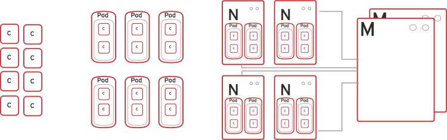

== How OpenShift Enterprise Works

* *Containers*: Run languages/framework, middleware, database, and other
 runtimes
* *Pods*: Define one or more containers co-located on same host
* *Nodes*: Linux container hosts; run pods assigned by master
* *Master*:
** Provides API, service orchestration, scheduling, placement
** Maintains state
** Manages pods and services

ifdef::showscript[]

=== Transcript

Here is a simplified explanation of some of the components of OpenShift
Enterprise 3.

Containers run languages and frameworks, middleware components, databases, and
other runtimes.

Pods run one or more containers as a single unit, to be co-located on the same
host.
Each pod has an IP address and can be assigned persistent storage volumes.

Nodes are Linux container hosts that run pods assigned by the master.

The master provides an API, service orchestration, scheduling, and placement.
It also maintains state and manages pods and services.

endif::showscript[]
:noaudio:
