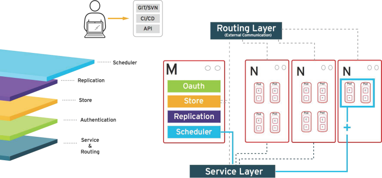

== How OpenShift Container Platform Works

.Scheduler Layer
* Determines where to create new pods
* Can configure priorities and rules for scheduler logic

+

ifdef::showscript[]

=== Transcript

Whenever a user decides to create a pod, the master determines where to do
this. This is called _scheduling_.

You can configure the priorities and rules for the scheduler logic.

endif::showscript[]
