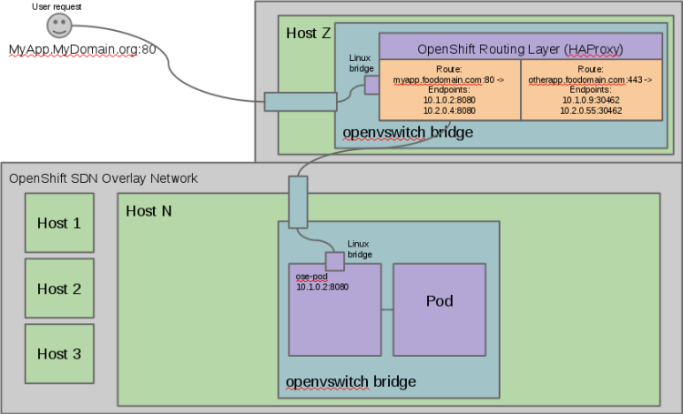

== Networking Workflow
:number:

.Scenario: Client Points Browser to `http://myApp.MyDomain.org:80`

. DNS resolves to the FQDN as the `node` running the `Default Router` container
. The request on port 80/443 goes reaches the `Default Router`
. `Default Router` checks available `endpoints` (IPs) according to the FQDN
. The `Default Router` proxies request to internal pod `IP:port` (`10.1.0.2:8080`)
+

ifdef::showscript[]

=== Transcript

Consider the following scenario:
A user requests a page by pointing his or her browser to
http://Myapp.MyDomain. DNS resolves that request to the IP address of one of
the nodes that hosts the `Default Router`.

You would usually create a wildcard Cname record in your DNS server and point
it to the node or nodes that host the router container.

The `Default Router` then selects the a pod from the list of pods listed by the
 application service and acts as a proxy for the pod.

endif::showscript[]
