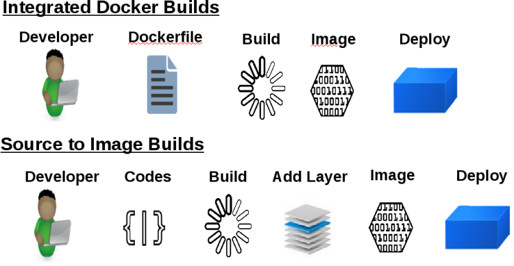

== What Is an S2I Build

[.noredheader,cols="<2,^3"]
|======
a|* Integrated Docker registry and automated image builds
* Source code deployments leverage _source-to-image (S2I)_ build automation
* Binary deployments integrate with existing build and CI infrastructure
* Configurable deployment patterns (rolling, etc.)
|
|======

ifdef::showscript[]

=== Transcript

In the S2I build process, a developer points to a code
repository in any supported framework and selects a builder image that
contains the operating system and framework to support the code.

OpenShift Container Platform then creates an image based on the builder image containing
the selected code.

endif::showscript[]
