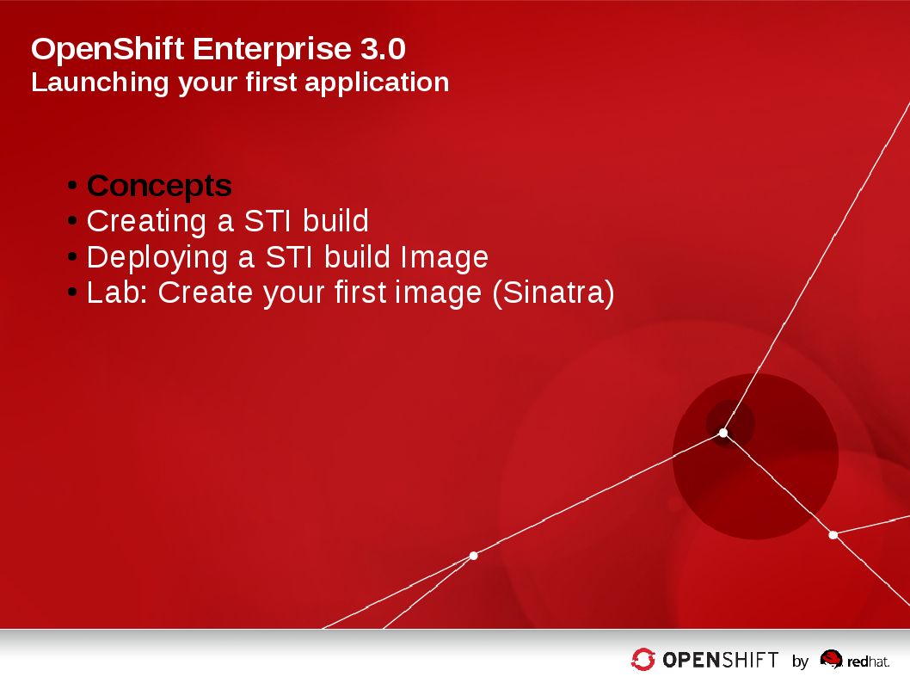
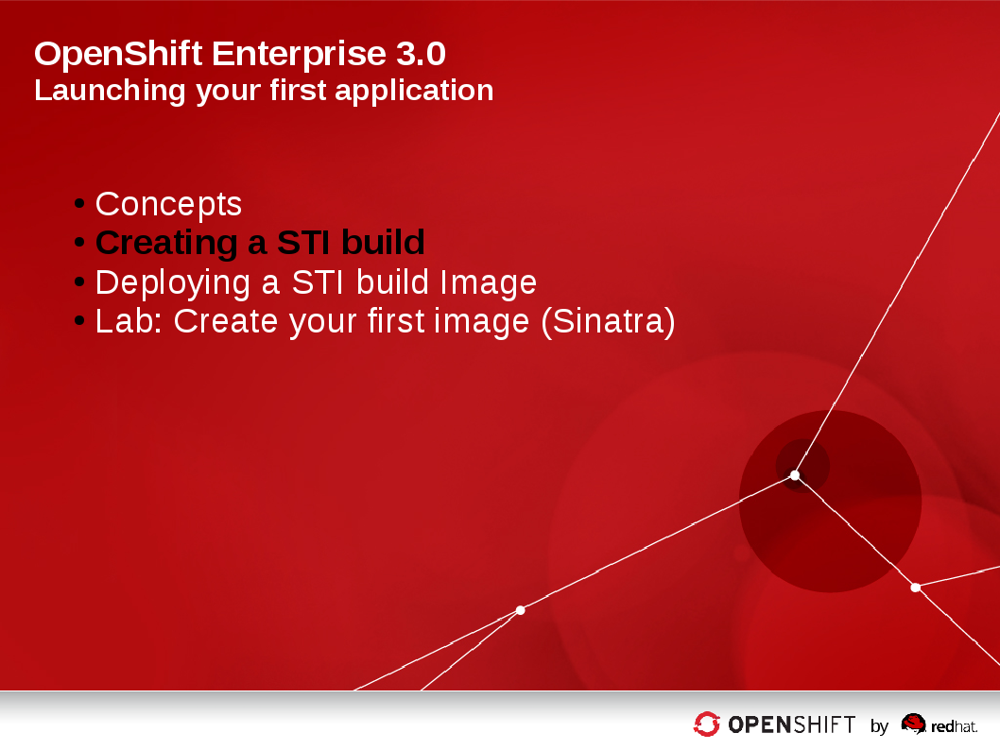
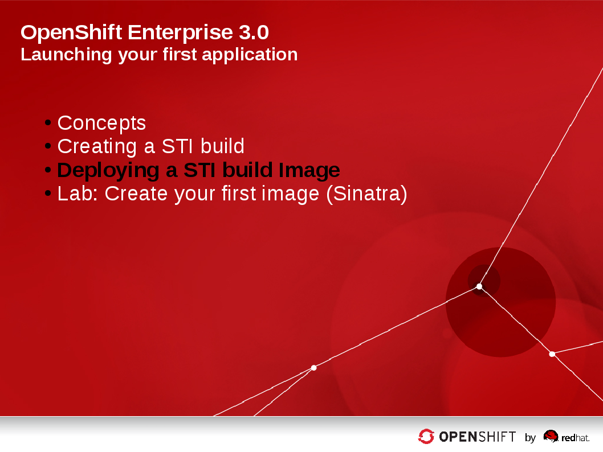

:data-uri:
:numbered!:

= Launching your first application

== Introduction

image::images/Chapter05_Title.png[width=852,height=672]

ifdef::showScript[]

=== Transcript

Welcome to Module 5 of OpenShift Fastrax Training by Red Hat's Global Enablement Team.

endif::showScript[]

== Module Agenda

* Concepts
* Creating a STI build
* Deploying a STI build Image
* Lab: Create your first image (Sinatra)	

ifdef::showScript[]

=== Transcript

* In this Module we will cover the following topics
** Concepts
** Creating a STI build
** Deploying a STI build Image
** Lab: Create your first image (Sinatra)	

endif::showScript[]

== Module Progress

== Concepts

=== Build & Deployment Automation

// ISSUE: Concepts, Slide: Build & Deployment Automation Need to add an explanation for STI

* Integrated Docker registry and automated image builds
* Source code deployments leveraging source-to-image build automation
* Binary deployments integrated with your existing build and CI infrastructure
* Configurable deployment patterns (rolling, etc.)

ifdef::showScript[]

=== Transcript

* STI Build process is a process in which a developer points to a code repository in any of the supported frameworks and selects a "builder" image that would contain the Operating system and framework to support the code.
** OpenShift will then create an image, based on the builder image that contains the selected code

endif::showScript[]

== Concepts

=== Concepts - STI - What Is It?

* STI stands for source-to-image
* It is the process OpenShift uses to build a Docker Image from a base image and your application source code.
** You would need to have:
*** a code repository
*** a base image (i.e ruby-20-rhel7 or php-51-centos7)

NOTE: These base images are available "built-in" and you don't have to create them yourself.

* Have a look at the diagram and review the difference between a "Docker Build" and a "Source-to-Image Build": 

image::images/DockerVsSTIBuilds.png[width=426*1.5,height=336*1.5]

ifdef::showScript[]

=== Transcript

* To start a STI Build you will need you code to reside in a supported code repository and a "base" or "builder image" to start building on top of.

endif::showScript[]

== Concepts

===  The Build Process

* A build is a process of transforming input parameters, typically source code, into a resulting object, typically a run-able image.
* The resulting object depends on which builder is used to create the image.

ifdef::showScript[]

=== Transcript

* A build is a process of transforming input parameters, typically source code, into a resulting object, typically a run-able image, the resulting object depends on which builder is used to create the image.

endif::showScript[]

== Concepts

=== BuildConfig

* The BuildConfig object is the definition of the entire build process. It consists of the following elements:
** triggers: Define policies used for automatically invoking builds.
*** GitHub webhooks: GitHub specific webhooks that specify which repository changes, such as a new 	commit, should invoke a new build. This trigger is specific to the GitHub API.
*** generic webhooks: Similar to GitHub webhooks in that they invoke a new build whenever it gets a notification. The difference is its payload is slightly different than GitHub’s.
*** image change: Defines a trigger which is invoked upon availability of a new image in the specified ImageRepository.
** parameters
*** source: Describes the SCM used to locate the sources. Currently only supports Git.
*** strategy: Describes which build type is invoked along with build type specific details.
*** output: Describes the resulting image name, tag, and registry to which the image should be pushed.

ifdef::showScript[]

=== Transcript

* The BuildConfig object is the definition of the entire build process. It consists of the following elements: the triggers who define policies used for automatically invoking builds and the parameters who will point OpenShift to your source code and builder image.

endif::showScript[]

== Concepts

=== Build Strategies

* The OpenShift build system provides extensible support for build strategies based on selectable types specified in the build API. By default, two strategies are supported:
** Docker builds
*** Docker builds invoke the plain *docker build* command, and therefore expect a repository with a *Dockerfile* and all required directories for a docker build process.
*** This method is suitable to deploy a "pre-baked" docker container, note that someone, developer, provider or ops team would need to create the docker image and inject the code into it.
** Source-to-Image builds.
*** Source-to-image (sti) is a tool for building reproducible Docker images.
*** It produces ready-to-run images by injecting a user source into a docker image and assembling a new Docker image.
*** The created image incorporates the base image and built source, and is ready to use with docker run.
*** STI supports incremental builds which re-use previously downloaded dependencies, previously built artifacts, etc.

image::images/DockerVsSTIBuilds.png[width=426*1.5,height=336*1.5]

ifdef::showScript[]

=== Transcript

* In OpenShift we have two main "Build Strategies" the Docker build uses a Dockerfile to build a Docker image and STI build which we will be focusing on in this module.

endif::showScript[]

== Concepts

=== Build Strategies - STI Build

* STI builds are a replacement for the OpenShift v2-like developer experience.
** The developer specifies:
*** The repository where their project is located
*** A builder image, which defines the language and framework used for writing their application.
** STI then assembles a new image which runs the application defined by the source using the framework defined by the builder image.

 

ifdef::showScript[]

=== Transcript

* STI builds are a replacement for the OpenShift v2-like developer experience, The developer just needs to provide their code repository and OpenShift will do the rest.
* The Assembly process can be customized to fit different approaches 

endif::showScript[]

== Module Progress

== Creating a STI build

=== Creating a STI build

Creating a STI build - The Build File

* In the module we will follow the process of creating a STI build.
** Using Ruby and Sinatra as the application framework.
*** link:https://github.com/openshift/simple-openshift-sinatra-sti[https://github.com/openshift/simple-openshift-sinatra-sti]
** Using STI build with a “ruby-20-rhel7” image.
* Run the new image in a pod
** Create a service for the pod
** Create a route for external access

ifdef::showScript[]

=== Transcript

In this Module we will follow the of creating a Source to Image build, we will use Ruby's Sinatra gem to build a simple "Hello World" application.

endif::showScript[]

== Creating a STI build

=== creating the build file

* To create the instructions/config for our image we use the *psc new-app*  command:

----

$ osc new-app https://github.com/openshift/simple-openshift-sinatra-sti.git -o json | tee ~/simple-sinatra.json

----

* *psc new-app* is a tool that will examine a directory tree, a remote repo, or other sources and attempt to generate an appropriate JSON configuration so that, when created, OpenShift can build the resulting image to run.
** this will also create a service and a route to our pods, but not it *will not* start the build yet.

ifdef::showScript[]

=== Transcript

* the *osc new-app* command is used to create a JSON file that defines our build, this file can be edited before we create our build.

endif::showScript[]

== Creating a STI build
=== The Build File

// ISSUE: Creating a STI build, Slide: The Build File - Elaborate on resources and possibly break this up a bit.
a
* Lets take a look at the JSON that was generated.
** You will see some familiar items at this point, and some new ones
*** BuildConfig,
*** ImageRepository
* You can have a look at the entire file here, we will cover each section if it on the next slides.

[source,json]
----
{
    "kind": "List",
    "creationTimestamp": null,
    "apiVersion": "v1beta1",
    "items": [
        {
            "kind": "Service",
            "id": "simple-openshift-sinatra",
            "creationTimestamp": null,
            "apiVersion": "v1beta1",
            "port": 8080,
            "portName": "simple-openshift-sinatra-sti-tcp-8080",
            "protocol": "TCP",
            "containerPort": 8080,
            "selector": {
                "deploymentconfig": "simple-openshift-sinatra-sti"
            },
            "ports": [
                {
                    "name": "simple-openshift-sinatra-sti-tcp-8080",
                    "protocol": "TCP",
                    "port": 8080,
                    "containerPort": 8080
                }
            ]
        },
        {
            "kind": "ImageStream",
            "apiVersion": "v1beta1",
            "metadata": {
                "name": "simple-openshift-sinatra-sti",
                "creationTimestamp": null
            },
            "spec": {},
            "status": {
                "dockerImageRepository": ""
            }
        },
        {
            "kind": "BuildConfig",
            "apiVersion": "v1beta1",
            "metadata": {
                "name": "simple-openshift-sinatra-sti",
                "creationTimestamp": null
            },
            "triggers": [
                {
                    "type": "github",
                    "github": {
                        "secret": "XZEOkRzImL-R0KxqcLEN"
                    }
                },
                {
                    "type": "generic",
                    "generic": {
                        "secret": "4a3d9dqocP2ajk0zYW7q"
                    }
                }
            ],
            "parameters": {
                "source": {
                    "type": "Git",
                    "git": {
                        "uri": "https://github.com/openshift/simple-openshift-sinatra-sti.git"
                    }
                },
                "strategy": {
                    "type": "STI",
                    "stiStrategy": {
                        "builderImage": "registry.access.redhat.com/openshift3_beta/ruby-20-rhel7",
                        "image": "registry.access.redhat.com/openshift3_beta/ruby-20-rhel7",
                        "clean": true
                    }
                },
                "output": {
                    "to": {
                        "name": "simple-openshift-sinatra-sti"
                    }
                }
            }
        },
        {
            "kind": "DeploymentConfig",
            "apiVersion": "v1beta1",
            "metadata": {
                "name": "simple-openshift-sinatra-sti",
                "creationTimestamp": null
            },
            "triggers": [
                {
                    "type": "ConfigChange"
                },
                {
                    "type": "ImageChange",
                    "imageChangeParams": {
                        "automatic": true,
                        "containerNames": [
                            "simple-openshift-sinatra-sti"
                        ],
                        "from": {
                            "name": "simple-openshift-sinatra-sti"
                        },
                        "tag": "latest",
                        "lastTriggeredImage": ""
                    }
                }
            ],
            "template": {
                "strategy": {
                    "type": "Recreate"
                },
                "controllerTemplate": {
                    "replicas": 1,
                    "replicaSelector": {
                        "deploymentconfig": "simple-openshift-sinatra-sti"
                    },
                    "podTemplate": {
                        "desiredState": {
                            "manifest": {
                                "version": "v1beta2",
                                "id": "",
                                "volumes": null,
                                "containers": [
                                    {
                                        "name": "simple-openshift-sinatra-sti",
                                        "image": "library/simple-openshift-sinatra-sti:latest",
                                        "ports": [
                                            {
                                                "name": "simple-openshift-sinatra-sti-tcp-8080",
                                                "containerPort": 8080,
                                                "protocol": "TCP"
                                            }
                                        ],
                                        "resources": {},
                                        "imagePullPolicy": "",
                                        "capabilities": {}
                                    }
                                ],
                                "restartPolicy": {}
                            }
                        },
                        "labels": {
                            "deploymentconfig": "simple-openshift-sinatra-sti"
                        }
                    }
                }
            }
        }
    ]
}

----

ifdef::showScript[]

=== Transcript

* Have a brief look at the generated JSON file, in the next few slides we will focus on different sections of this file.

endif::showScript[]

== Creating a STI build

=== The Build File : Service

// ISSUE: Creating a STI build Slides: The Build File : .* - Need to add some words in these slide

[source,json]
----
 "items": [
        {
            "kind": "Service",
            "id": "simple-openshift-sinatra",
            "creationTimestamp": null,
            "apiVersion": "v1beta1",
            "port": 8080,
            "portName": "simple-openshift-sinatra-sti-tcp-8080",
            "protocol": "TCP",
            "containerPort": 8080,
            "selector": {
                "deploymentconfig": "simple-openshift-sinatra-sti"
            },
            "ports": [
                {
                    "name": "simple-openshift-sinatra-sti-tcp-8080",
                    "protocol": "TCP",
                    "port": 8080,
                    "containerPort": 8080
                }
            ]
        },

----

ifdef::showScript[]

=== Transcript

* the "service" section describes the service to be created to support out built application.

endif::showScript[]

== Creating a STI build

=== The Build File : ImageStream

// ISSUE: Creating a STI build Slides: The Build File : .* - Need to add some words in these slide

[source,json]
----

  {
            "kind": "ImageStream",
            "apiVersion": "v1beta1",
            "metadata": {
                "name": "simple-openshift-sinatra-sti",
                "creationTimestamp": null
            },
            "spec": {},
            "status": {
                "dockerImageRepository": ""
            }
        },

----

ifdef::showScript[]

=== Transcript

* the "ImageStream" section describes the ImageStream resource to be created to support out built application, Using ImageStreams allows our build to "listen" or "poll" for changes in the image, like security patches, and rebuild when a change like this happens.

endif::showScript[]

== Creating a STI build

=== The Build File : BuildConfig

// ISSUE: Creating a STI build Slides: The Build File : .* - Need to add some words in these slide

[source,json]
----
{
            "kind": "BuildConfig",
            "apiVersion": "v1beta1",
            "metadata": {
                "name": "simple-openshift-sinatra-sti",
                "creationTimestamp": null
            },
            "triggers": [
                {
                    "type": "github",
                    "github": {
                        "secret": "XZEOkRzImL-R0KxqcLEN"
                    }
                },
                {
                    "type": "generic",
                    "generic": {
                        "secret": "4a3d9dqocP2ajk0zYW7q"
                    }
                }
            ],
            "parameters": {
                "source": {
                    "type": "Git",
                    "git": {
                        "uri": "https://github.com/openshift/simple-openshift-sinatra-sti.git"
                    }
                },
                "strategy": {
                    "type": "STI",
                    "stiStrategy": {
                        "builderImage": "registry.access.redhat.com/openshift3_beta/ruby-20-rhel7",
                        "image": "registry.access.redhat.com/openshift3_beta/ruby-20-rhel7",
                        "clean": true
                    }
                },
                "output": {
                    "to": {
                        "name": "simple-openshift-sinatra-sti"
                    }
                }
            }
        },

----

ifdef::showScript[]

=== Transcript

* In this section we define the triggers we can use to start a rebuild of our application and the parameters who define the repository and the builder image used by the build process.

endif::showScript[]

== Creating a STI build

=== The Build File : DeploymentConfig

// ISSUE: Creating a STI build Slides: The Build File : .* - Need to add some words in these slide

[source,json]
----

"kind": "DeploymentConfig",
            "apiVersion": "v1beta1",
            "metadata": {
                "name": "simple-openshift-sinatra-sti",
                "creationTimestamp": null
            },
            "triggers": [
                {
                    "type": "ConfigChange"
                },
                {
                    "type": "ImageChange",
                    "imageChangeParams": {
                        "automatic": true,
                        "containerNames": [
                            "simple-openshift-sinatra-sti"
                        ],
                        "from": {
                            "name": "simple-openshift-sinatra-sti"
                        },
                        "tag": "latest",
                        "lastTriggeredImage": ""
                    }
                }

----

ifdef::showScript[]

=== Transcript

In the "DeploymentConfig" section we define the triggers who will start a rebuild of our image.

endif::showScript[]

== Creating a STI build

=== The Build File : Template

// ISSUE: Creating a STI build Slides: The Build File : .* - Need to add some words in these slide

[source,json]
----

      "template": {
                "strategy": {
                    "type": "Recreate"
                },
                "controllerTemplate": {
                    "replicas": 1,
                    "replicaSelector": {
                        "deploymentconfig": "simple-openshift-sinatra-sti"
                    },
                    "podTemplate": {
                        "desiredState": {
                            "manifest": {
                                "version": "v1beta2",
                                "id": "",
                                "volumes": null,
                                "containers": [
                                    {
                                        "name": "simple-openshift-sinatra-sti",
                                        "image": "library/simple-openshift-sinatra-sti:latest",
                                        "ports": [
                                            {
                                                "name": "simple-openshift-sinatra-sti-tcp-8080",
                                                "containerPort": 8080,
                                                "protocol": "TCP"
                                            }
                                        ],
                                        "resources": {},
                                        "imagePullPolicy": "",
                                        "capabilities": {}
                                    }
                                ],
                                "restartPolicy": {}
                            }
                        },
                        "labels": {
                            "deploymentconfig": "simple-openshift-sinatra-sti"
                        }
                    }
----

ifdef::showScript[]

=== Transcript

The "template" section defines different aspects of our application, for example, how many replicas to create for our application. 

endif::showScript[]

== Module Progress

== Deploying a STI build Image

=== Overview

* Essentially, the STI process is as follows:
** OpenShift sets up various components such that it can build source code into a Docker image.
** OpenShift will then (on command) build the Docker image with the source code.
** OpenShift will then deploy the Docker image as a Pod with an associated Service.

ifdef::showScript[]

=== Transcript

* Essentially, the STI process is as follows:
** OpenShift sets up various components such that it can build source code into a Docker image.
** OpenShift will then (on command) build the Docker image with the source code.
** OpenShift will then deploy the Docker image as a Pod with an associated Service.

endif::showScript[]

== Deploying a STI build Image

=== Overview

* To create the environment for our build we use the create command on the file we created earlier.
----
$ osc create -f ~/simple-sinatra.json
----

* Using this command we created:
** An ImageRepository entry
** A BuildConfig
** A DeploymentConfig
** A Service
* We could review what  happened, by running this command:

----
$ for i in imagerepository buildconfig deploymentconfig service; do \
> echo $i; osc get $i; echo -e "\n\n"; done
imagerepository
NAME                           DOCKER REPO                                               TAGS
simple-openshift-sinatra-sti   172.30.17.153:5000/sinatra/simple-openshift-sinatra-sti   

buildconfig
NAME                           TYPE      SOURCE
simple-openshift-sinatra-sti   STI       https://github.com/openshift/simple-openshift-sinatra-sti.git

deploymentconfig
NAME                           TRIGGERS                    LATEST VERSION
simple-openshift-sinatra-sti   ConfigChange, ImageChange   0

service
NAME                       LABELS    SELECTOR                                        IP              PORT(S)
simple-openshift-sinatra   <none>    deploymentconfig=simple-openshift-sinatra-sti   172.30.17.225   8080/TCP

----

ifdef::showScript[]

=== Transcript

* You can use the *osc create* command to create the build environment and resources, This doesn't start the build process for our image but creates the requires resources we discussed in the previous slides.

endif::showScript[]

== Deploying a STI build Image

=== Starting the build

* To start the build process  we use the osc start-build command with our build name

----
$ osc start-build simple-openshift-sinatra-sti
simple-openshift-sinatra-sti-1

----

* Using the osc get builds command we can see the builds and their status:
----
$ osc get builds
NAME                             TYPE      STATUS    POD
simple-openshift-sinatra-sti-1   STI       Running   simple-openshift-sinatra-sti-1

----

* We can follow the build process with the osc build-logs command

----
osc build-logs sin-simple-openshift-sinatra-sti-1
----

ifdef::showScript[]

=== Transcript

The *osc start-build* command starts the build, you can follow the log created for our build with the *osc build-logs* command.

endif::showScript[]

== Deploying a STI build Image

=== Using the Web Console to create a STI Build

* Select your project and press the "Create" Button

image::images/GuiSTLDemo01.png[width=852,height=672]

ifdef::showScript[]

=== Transcript

* Select your project and press the "Create" Button

endif::showScript[]

== Deploying a STI build Image

=== Using the Web Console to create a STI Build

* Select your project and press the "Create" Button.

image::images/GuiSTLDemo01.png[width=852,height=672]

ifdef::showScript[]

=== Transcript

* Select your project and press the "Create" Button.

endif::showScript[]

== Deploying a STI build Image

=== Using the Web Console to create a STI Build

* Enter the Git repository for your build.

image::images/GuiSTLDemo02.png[width=852,height=672]

ifdef::showScript[]

=== Transcript

* Enter the Git repository for your build.

endif::showScript[]

== Deploying a STI build Image

=== Using the Web Console to create a STI Build

* Select the base image for your build.

image::images/GuiSTLDemo03.png[width=852,height=672]
image::images/GuiSTLDemo04.png[width=852,height=672]

ifdef::showScript[]

=== Transcript

* Select the base image for your build.

endif::showScript[]

== Deploying a STI build Image

=== Using the Web Console to create a STI Build

* Edit your options and create the build.

image::images/GuiSTLDemo05a.png[width=852,height=672]
image::images/GuiSTLDemo05b.png[width=852,height=672]

ifdef::showScript[]

=== Transcript

* Edit your options and create the build.

endif::showScript[]

