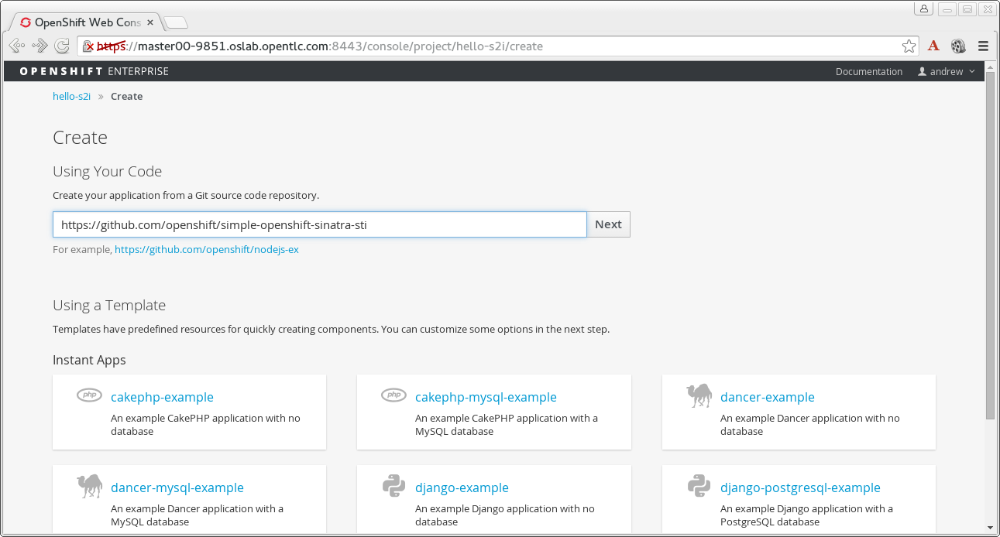
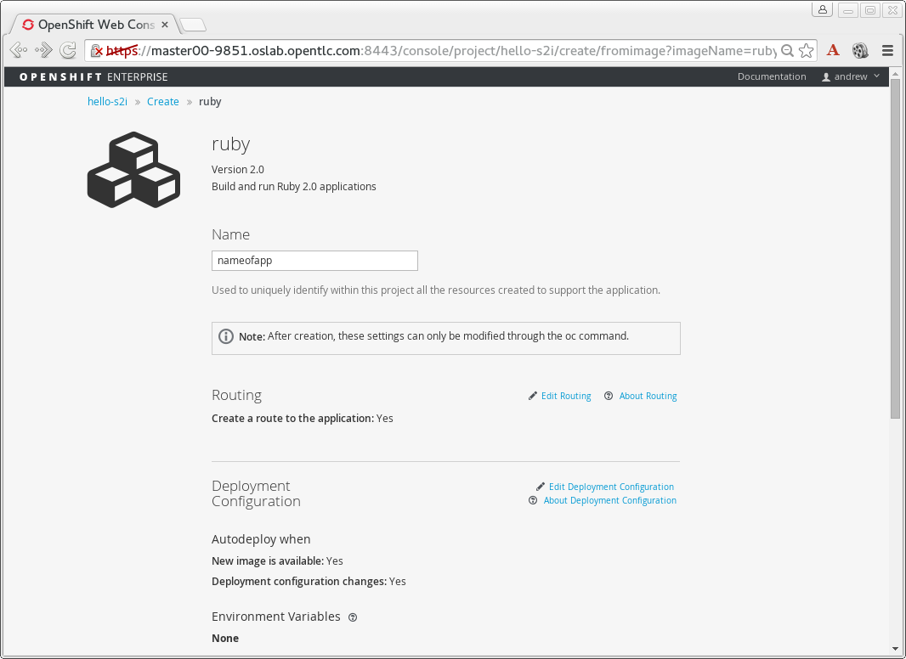

:noaudio:

ifdef::revealjs_slideshow[] 

[#cover,data-background-image="image/1156524-bg_redhat.png" data-background-color="#cc0000"] 
== &nbsp;

[#cover-h1] 
Red Hat OpenShift Enterprise Implementation

[#cover-h2] 
Creating and Deploying Your First Image

[#cover-logo] 
image::{revealjs_cover_image}[] 

endif::[]

== Module Topics

* Concepts
* Creating an S2I build
* Deploying an S2I build image
* Lab: Arbitrary Docker Image (WordPress)
* Lab: Deploying an S2I build image
* Lab:  Install the client on your workstation

ifdef::showscript[]

=== Transcript

Welcome to module 5 of the OpenShift Enterprise Implementation course.

This module covers the following topics:

* Concepts such as build and deployment automation; the definition of Source-to-Image, or S2I; the build process; the `BuildConfig` object; and build strategies
* Creating an S2I build, including creating the build file and understanding the various sections of the build file.
* Deploying an S2I build image, including creating the build environment, starting the build, and using the web console to create an S2I build

endif::showscript[]

== Build and Deployment Automation

* Integrated Docker registry and automated image builds
* Source code deployments leveraging S2I build automation
* Binary deployments integrated with existing build and CI infrastructure
* Configurable deployment patterns--rolling, etc.

ifdef::showscript[]

=== Transcript

The S2I, Source to Image  build is a process in which a developer points to a code repository in any of the supported frameworks and selects a "builder" image that will contain the operating system and framework to support the code.

OpenShift Enterprise then creates an image based on the builder image that contains the selected code.

OpenShift Enterprise offers an integrated Docker registry and automated image builds, enabling both source code deployments leveraging S2I build automation 
and binary deployments integrated with your existing build and CI infrastructure.

OpenShift Enterprise also offers configurable deployment patterns, which would be covered in future courses.

endif::showscript[]

 
:noaudio:

== Why S2I?
* *Image flexibility* - S2I scripts can be written to layer application code onto almost any existing Docker image, taking advantage of the existing ecosystem. Note that, currently, S2I relies on tar to inject application source, so the image needs to be able to process tarred content.
* *Speed* - With S2I, the assemble process can perform a large number of complex operations without creating a new layer at each step, resulting in a fast process. In addition, S2I scripts can be written to re-use artifacts stored in a previous version of the application image, rather than having to download or build them, each time the build is run.
* *Patchability* - S2I allows you to rebuild the application consistently if an underlying image needs a patch due to a security issue.
* *Operational efficiency* - By restricting build operations instead of allowing arbitrary actions, such as in a Dockerfile, the PaaS operator can avoid accidental or intentional abuses of the build system.
* *Operational security* - Building an arbitrary Dockerfile exposes the host system to root privilege escalation. This can be exploited by a malicious user because the entire docker build process is run as a user with docker privileges. S2I restricts the operations performed as a root user, and can run the scripts as a non-root user.
* *User efficiency* - S2I prevents developers from performing arbitrary yum install type operations during their application build, which results in slow development iteration.
* *Ecosystem* - S2I encourages a shared ecosystem of images where you can leverage best practices for your applications. 

ifdef::showscript[]

=== Transcript

* *Image flexibility* - S2I scripts can be written to layer application code onto almost any existing Docker image, taking advantage of the existing ecosystem. Note that, currently, S2I relies on tar to inject application source, so the image needs to be able to process tarred content.
* *Speed* - With S2I, the assemble process can perform a large number of complex operations without creating a new layer at each step, resulting in a fast process. In addition, S2I scripts can be written to re-use artifacts stored in a previous version of the application image, rather than having to download or build them, each time the build is run.
* *Patchability* - S2I allows you to rebuild the application consistently if an underlying image needs a patch due to a security issue.
* *Operational efficiency* - By restricting build operations instead of allowing arbitrary actions, such as in a Dockerfile, the PaaS operator can avoid accidental or intentional abuses of the build system.
* *Operational security* - Building an arbitrary Dockerfile exposes the host system to root privilege escalation. This can be exploited by a malicious user because the entire docker build process is run as a user with docker privileges. S2I restricts the operations performed as a root user, and can run the scripts as a non-root user.
* *User efficiency* - S2I prevents developers from performing arbitrary yum install type operations during their application build, which results in slow development iteration.
* *Ecosystem* - S2I encourages a shared ecosystem of images where you can leverage best practices for your applications. 

endif::showscript[]

 
 

== What Is S2I?

* Source-to-Image (S2I) is a tool for building reproducible Docker images. It produces ready-to-run images by injecting a user source into a docker image and assembling a new docker image. 
** The new image incorporates the base image (the builder) and built source, and is ready to use with the docker run command. 
** S2I supports incremental builds, which re-use previously downloaded dependencies, previously built artifacts, etc. 
* Process OpenShift Enterprise uses to build Docker image from base image and application source code
* Requirements:
** Code repository
** Base image (i.e `ruby-20-rhel7` or `php-51-centos7`)
*** Base images are built in--no need to create

* Docker build vs. S2I build: 
+
image::images/DockerVsS2IBuilds.png[]

ifdef::showscript[]

=== Transcript

*S2I* stands for Source-to-Image. It is the process OpenShift uses to build a Container image from a base image and your application source code.  

To start an S2I build, your code must reside in a supported code repository and you need a base or builder image, for example `ruby-20-rhel7`, on top of which to start building. These base images are available built in  to OpenShift Enterprise--you do not need to create them yourself.

This illustration shows the key differences between a Docker build and an S2I build. 

endif::showscript[]

== The Build Process

* *Build* - A build is a process of creating runnable images to be used on OpenShift. There are three build strategies: 
** Docker - Invoke docker build, expect a repository with a Dockerfile and directories required for a Docker build process
** S2I - Covered later in this training  
** Custom - A user defined build process, possibly integrating with an existing CI/CD deployment.

ifdef::showscript[]

=== Transcript

A *build* is a process of transforming input parameters, typically transforming source code into a resulting object, which is typically a run-able image. 
The resulting object depends on the builder used to create the image.

endif::showscript[]

== `BuildConfig`

* A *buildConfig* describes a single build definition and a set of triggers for when a new build should be created.
* A *buildConfig* is a REST object, which can be used in a POST to the API server to create a new instance. The following example buildConfig results in a new build every time a Docker image tag or the source code changes: 
* *`BuildConfig` object* - Definition of the entire build process consisting of:
** *triggers* - Define policies for invoking builds
*** *GitHub webhooks* - Specify which repository changes invoke a new build; specific to the GitHub API
*** *generic webhooks* - Invoke a new build when notified; payload slightly different from GitHub
*** *image change* - Invoked when new image is available in specified `ImageRepository`
** *parameters*
*** `source` - Describes SCM used to locate the sources; supports Git only
*** `strategy` - Describes invoked build type and build type details
*** `output` - Describes resulting image name, tag, and registry to which OpenShift Enterprise should push image

ifdef::showscript[]

=== Transcript

The `BuildConfig` object is the definition of the entire build process. 
It consists of the following elements: the triggers that define policies used to automatically invoke builds and the parameters that point OpenShift Enterprise to your source code and builder image.

The three trigger types include:

* GitHub-specific webhooks, which specify the repository changes, such as a new commit, that invokes a new build. This trigger is specific to the GitHub API.
* The second trigger type is generic webhooks. This trigger is similar to GitHub webhooks in that it invokes a new build whenever it receives a notification. 
* And lastly, image change is a trigger that is invoked when a new image is available in the specified `ImageRepository` or 'ImageStream'

The three parameter types include:

* `source`, which describes the SCM used to locate the source code. The source parameter currently supports Git only.
* `strategy`, which describes the build type being invoked, along with build type-specific details.
* And `output`, which describes the resulting image name, tag, and registry to which OpenShift Enterprise should push the image.

endif::showscript[]

== Build Strategies

* OpenShift Enterprise build system supports build strategies based on types specified in build API
* Two strategies supported by default:
** Docker builds
*** Invoke `docker build`, expect a repository with a `Dockerfile` and directories required for a Docker build process
*** Suitable for deploying prebuilt Docker container
*** Developer, provider, or ops team needs to create Docker image and inject code into it
** S2I builds
*** S2I - Tool for building reproducible Docker images
*** Produces ready-to-run images by injecting user source into Docker image and assembling new Docker image
*** Created image incorporates base image and built source, ready to use with Docker run
*** Supports incremental builds that reuse downloaded dependencies, built artifacts, etc.

image::images/DockerVsS2IBuilds.png[]

ifdef::showscript[]

=== Transcript

The OpenShift build system provides extensible support for build strategies based on selectable types specified in the build API. By default, OpenShift Enterprise supports two strategies: Docker builds and S2I builds.

Docker builds invoke the plain `docker build` command, and therefore expect a repository with a `Dockerfile` and all required directories for a Docker build process. This method is suitable for deploying a prebuilt Docker container. With this approach, a developer, provider, or ops team needs to create the Docker image and inject the code into it.

As mentioned earlier, Source-to-Image, or S2I, is a tool for building reproducible Docker images. S2I produces ready-to-run images by injecting a user's source code into an image and assembling a new Docker image. 
The created image incorporates the base image and built source. S2I supports incremental builds that reuse previously downloaded dependencies, previously built artifacts, and so on.

This module focuses on the S2I build strategy.

endif::showscript[]

== Build Strategies

.S2I Build
* S2I builds replace OpenShift Enterprise 2.x-like developer experience
** Developer specifies:
*** Repository where project is located
*** Builder image that defines language and framework for writing application
** S2I assembles new image that runs application defined by source using framework defined by builder image

ifdef::showscript[]

=== Transcript

S2I builds are a replacement for the OpenShift Enterprise Version 2-like developer experience. The developer needs to provide only the repository where the project is located and a builder image, which defines the language and framework used for writing the application. 

S2I then assembles a new image that runs the application defined by the source using the framework defined by the builder image. You can customize the assembly process to fit different approaches. 

endif::showscript[]

== Creating an S2I Build Example

* In this example we will create an image using the S2I process, We will use: 
** Uses Ruby Sinatra gem as application framework
+
link:https://github.com/openshift/simple-openshift-sinatra-sti[https://github.com/openshift/simple-openshift-sinatra-sti]
** We will use the `ruby-20-rhel7` builder image

* We will also:
** Run new image in a pod
** Create service for the pod
** Create route for external access

ifdef::showscript[]

=== Transcript

This module describes the process of creating an S2I build. It uses Ruby's Sinatra gem, found at the URL shown here, as the application framework to build a simple "Hello World" application. 
It shows how to create an S2I build with a `ruby-20-rhel7` image.

The module also shows the process of running the new image in a pod, including creating a service for the pod and creating a route for external access.

endif::showscript[]

== Creating the Build File

* To create the instructions/config, use `oc new-app`:
+
----

$ oc new-app https://github.com/openshift/simple-openshift-sinatra-sti.git -o json | tee ~/simple-sinatra.json

----

* `oc new-app`:
** Examines directory tree, remote repo, or other sources
** Attempts to generate JSON configuration so that OpenShift Enterprise can build image to run
** defines a service object for the application

ifdef::showscript[]

=== Transcript

As shown in the code sample, you use the `oc new-app` command to generate a JSON file that defines your build. 
`oc new-app` is a tool that examines a directory tree, a remote repo, or other sources and attempts to generate an appropriate JSON configuration so that, 
after it creates the file, OpenShift can build the resulting image to run.

This also defines a service for the pods, but it does not start the build yet.

You can edit the JSON file before you create the build.

endif::showscript[]

== The Build File

* Contains some familiar items, some new ones:
** `BuildConfig`
** `ImageRepository`
+
.Generated JSON file
[source,json]
----
{
    "kind": "List",
    "apiVersion": "v1",
    "metadata": {},
    "items": [
        {
            "kind": "ImageStream",
            "apiVersion": "v1",
            "metadata": {
                "name": "simple-openshift-sinatra-sti",
                "creationTimestamp": null
            },
            "spec": {
                "tags": [
                    {
                        "name": "latest",
                        "from": {
                            "kind": "DockerImage",
                            "name": "simple-openshift-sinatra-sti:latest"
                        }
                    }
                ]
            },
            "status": {
                "dockerImageRepository": ""
            }
        },
        {
            "kind": "BuildConfig",
            "apiVersion": "v1",
            "metadata": {
                "name": "simple-openshift-sinatra-sti",
                "creationTimestamp": null
            },
            "spec": {
                "triggers": [
                    {
                        "type": "GitHub",
                        "github": {
                            "secret": "egsfGzfgMcKPPCfL88oz"
                        }
                    },
                    {
                        "type": "Generic",
                        "generic": {
                            "secret": "8fcmnyr0RbkzLPCPY9Sv"
                        }
                    },
                    {
                        "type": "ImageChange",
                        "imageChange": {}
                    }
                ],
                "source": {
                    "type": "Git",
                    "git": {
                        "uri": "https://github.com/openshift/simple-openshift-sinatra-sti.git"
                    }
                },
                "strategy": {
                    "type": "Source",
                    "sourceStrategy": {
                        "from": {
                            "kind": "ImageStreamTag",
                            "namespace": "openshift",
                            "name": "ruby:latest"
                        }
                    }
                },
                "output": {
                    "to": {
                        "kind": "ImageStreamTag",
                        "name": "simple-openshift-sinatra-sti:latest"
                    }
                },
                "resources": {}
            },
            "status": {
                "lastVersion": 0
            }
        },
        {
            "kind": "DeploymentConfig",
            "apiVersion": "v1",
            "metadata": {
                "name": "simple-openshift-sinatra-sti",
                "creationTimestamp": null
            },
            "spec": {
                "strategy": {
                    "type": "Recreate",
                    "resources": {}
                },
                "triggers": [
                    {
                        "type": "ConfigChange"
                    },
                    {
                        "type": "ImageChange",
                        "imageChangeParams": {
                            "automatic": true,
                            "containerNames": [
                                "simple-openshift-sinatra-sti"
                            ],
                            "from": {
                                "kind": "ImageStreamTag",
                                "name": "simple-openshift-sinatra-sti:latest"
                            }
                        }
                    }
                ],
                "replicas": 1,
                "selector": {
                    "deploymentconfig": "simple-openshift-sinatra-sti"
                },
                "template": {
                    "metadata": {
                        "creationTimestamp": null,
                        "labels": {
                            "deploymentconfig": "simple-openshift-sinatra-sti"
                        }
                    },
                    "spec": {
                        "containers": [
                            {
                                "name": "simple-openshift-sinatra-sti",
                                "image": "simple-openshift-sinatra-sti:latest",
                                "ports": [
                                    {
                                        "name": "simple-openshift-sinatra-sti-tcp-8080",
                                        "containerPort": 8080,
                                        "protocol": "TCP"
                                    }
                                ],
                                "resources": {}
                            }
                        ]
                    }
                }
            },
            "status": {}
        },
        {
            "kind": "Service",
            "apiVersion": "v1",
            "metadata": {
                "name": "simple-openshift-sinatra",
                "creationTimestamp": null
            },
            "spec": {
                "ports": [
                    {
                        "name": "simple-openshift-sinatra-sti-tcp-8080",
                        "protocol": "TCP",
                        "port": 8080,
                        "targetPort": 8080,
                        "nodePort": 0
                    }
                ],
                "selector": {
                    "deploymentconfig": "simple-openshift-sinatra-sti"
                },
                "portalIP": ""
            },
            "status": {
                "loadBalancer": {}
            }
        }
    ]
}
----

ifdef::showscript[]

=== Transcript

Here you can see the generated JSON file. At this point, it contains some familiar items, and some new ones--specifically, `BuildConfig` and `ImageRepository`. 
Upcoming slides cover each section of the file.

endif::showscript[]

== The Build File

.`Service`
* Describes service to be created to support built application 
* Notice the `ContainerPort` and `Selector` lines 

[source,json]
----
 {
            "kind": "Service",
            "apiVersion": "v1",
            "metadata": {
                "name": "simple-openshift-sinatra",
                "creationTimestamp": null
            },
            "spec": {
                "ports": [
                    {
                        "name": "simple-openshift-sinatra-sti-tcp-8080",
                        "protocol": "TCP",
                        "port": 8080,
                        "targetPort": 8080,
                        "nodePort": 0
                    }
                ],
                "selector": {
                    "deploymentconfig": "simple-openshift-sinatra-sti"
                },
                "portalIP": ""
            },
            "status": {
                "loadBalancer": {}
            }
        }
----

ifdef::showscript[]

=== Transcript

The `Service` section describes the service to be created to support your built application. 
Notice the "ContainerPort" and "Selector" lines. 

endif::showscript[]

== The Build File

.`ImageStream`

* Describes `ImageStream` resource to be created to support your built application
* Lets OpenShift "listen" or "poll" for changes in image, such as security patches
** OpenShift rebuilds when a change like this occurs
+
[source,json]
----
        {
            "kind": "ImageStream",
            "apiVersion": "v1",
            "metadata": {
                "name": "simple-openshift-sinatra-sti",
                "creationTimestamp": null
            },
            "spec": {
                "tags": [
                    {
                        "name": "latest",
                        "from": {
                            "kind": "DockerImage",
                            "name": "simple-openshift-sinatra-sti:latest"
                        }
                    }
                ]
            },
            "status": {
                "dockerImageRepository": ""
            }
        },

----

ifdef::showscript[]

=== Transcript

The `ImageStream` section describes the `ImageStream` resource to be created to support your built application.

Using `ImageStreams` lets your OpenShift "listen" or "poll" for changes in the image, such as security patches, and rebuild when a change like this occurs.

endif::showscript[]

== The Build File

.`BuildConfig`

* Defines the following:
** Triggers that start a rebuild of your application
** Parameters that define the repository and builder image for the build process
+
[source,json]
----
 {
            "kind": "BuildConfig",
            "apiVersion": "v1",
            "metadata": {
                "name": "simple-openshift-sinatra-sti",
                "creationTimestamp": null
            },
            "spec": {
                "triggers": [
                    {
                        "type": "GitHub",
                        "github": {
                            "secret": "egsfGzfgMcKPPCfL88oz"
                        }
                    },
                    {
                        "type": "Generic",
                        "generic": {
                            "secret": "8fcmnyr0RbkzLPCPY9Sv"
                        }
                    },
                    {
                        "type": "ImageChange",
                        "imageChange": {}
                    }
                ],
                "source": {
                    "type": "Git",
                    "git": {
                        "uri": "https://github.com/openshift/simple-openshift-sinatra-sti.git"
                    }
                },
                "strategy": {
                    "type": "Source",
                    "sourceStrategy": {
                        "from": {
                            "kind": "ImageStreamTag",
                            "namespace": "openshift",
                            "name": "ruby:latest"
                        }
                    }
                },
                "output": {
                    "to": {
                        "kind": "ImageStreamTag",
                        "name": "simple-openshift-sinatra-sti:latest"
                    }
                },
                "resources": {}
            },
            "status": {
                "lastVersion": 0
            }
        },
----

ifdef::showscript[]

=== Transcript

In the `BuildConfig` section, you define both the triggers you can use to start a "rebuild" of your application and the parameters that define the repository and the builder image that the build process uses.

endif::showscript[]

== The Build File

.`DeploymentConfig`

* Defines more triggers that can start a rebuild of your image
* Defines How many replica's your application will have.

+
[source,json]
----
{
            "kind": "DeploymentConfig",
            "apiVersion": "v1",
            "metadata": {
                "name": "simple-openshift-sinatra-sti",
                "creationTimestamp": null
            },
            "spec": {
                "strategy": {
                    "type": "Recreate",
                    "resources": {}
                },
                "triggers": [
                    {
                        "type": "ConfigChange"
                    },
                    {
                        "type": "ImageChange",
                        "imageChangeParams": {
                            "automatic": true,
                            "containerNames": [
                                "simple-openshift-sinatra-sti"
                            ],
                            "from": {
                                "kind": "ImageStreamTag",
                                "name": "simple-openshift-sinatra-sti:latest"
                            }
                        }
                    }
                ],
                "replicas": 1,
                "selector": {
                    "deploymentconfig": "simple-openshift-sinatra-sti"
                },
----

ifdef::showscript[]

=== Transcript

In the `DeploymentConfig` section, you define more triggers that can start a "rebuild" of your image.

endif::showscript[]

== The Build File

.`template`

* Defines the container deployment template

+
[source,json]
----

    },
                "template": {
                    "metadata": {
                        "creationTimestamp": null,
                        "labels": {
                            "deploymentconfig": "simple-openshift-sinatra-sti"
                        }
                    },
                    "spec": {
                        "containers": [
                            {
                                "name": "simple-openshift-sinatra-sti",
                                "image": "simple-openshift-sinatra-sti:latest",
                                "ports": [
                                    {
                                        "name": "simple-openshift-sinatra-sti-tcp-8080",
                                        "containerPort": 8080,
                                        "protocol": "TCP"
                                    }
                                ],
                                "resources": {}
                            }
                        ]
                    }
                }
----

ifdef::showscript[]

=== Transcript

The `template` section defines different aspects of your application--for example, how many replicas to create for your application. 

endif::showscript[]

== Deploying an S2I Build Image

* In basic S2I process, OpenShift Enterprise:
** Sets up components to build source code into Docker image
** On command, builds Docker image with source code
** Deploys Docker image as pod with associated service

ifdef::showscript[]

=== Transcript

Essentially, the S2I process is as follows: 
OpenShift Enterprise sets up various components such that it can build source code into a Docker image. OpenShift Enterprise then, on command, builds the Docker image with the source code. And finally, OpenShift Enterprise deploys the Docker image as a pod with an associated service.

endif::showscript[]

== Creating the Build Environment

* To create build environment and *start the build*, use `oc create` on the .json file created earlier:
+
----
$ oc create -f ~/simple-sinatra.json
----

* This creates:
** `ImageRepository` entry
** `BuildConfig`
** `DeploymentConfig`
** `Service`

* To review what happened:
+
----
$ for i in imagerepository buildconfig deploymentconfig service; do \
> echo $i; oc get $i; echo -e "\n\n"; done
imagerepository
NAME                           DOCKER REPO                                               TAGS
simple-openshift-sinatra-sti   172.30.17.153:5000/sinatra/simple-openshift-sinatra-sti   

buildconfig
NAME                           TYPE      SOURCE
simple-openshift-sinatra-sti   S2I       https://github.com/openshift/simple-openshift-sinatra-sti.git

deploymentconfig
NAME                           TRIGGERS                    LATEST VERSION
simple-openshift-sinatra-sti   ConfigChange, ImageChange   0

service
NAME                       LABELS    SELECTOR                                        IP              PORT(S)
simple-openshift-sinatra   <none>    deploymentconfig=simple-openshift-sinatra-sti   172.30.17.225   8080/TCP

----

ifdef::showscript[]

=== Transcript

As shown in the first code sample, you use the `oc create` command to create the build environment and resources. 
This does not start the build process for your image but creates the required resources discussed previously. 
These include an `ImageRepository` entry, a `BuildConfig`, a `DeploymentConfig`, and a `Service`.

To review what happened, run the command shown in the second code sample.

endif::showscript[]

== Watching the Build

* To see builds and their status, use `oc get builds`:
+
----
$ oc get builds
NAME                             TYPE      STATUS    POD
simple-openshift-sinatra-sti-1   S2I       Running   simple-openshift-sinatra-sti-1

----

* To follow the build process, use `oc build-logs`:
+
----
oc build-logs sin-simple-openshift-sinatra-sti-1
----

ifdef::showscript[]

=== Transcript

To see the builds and their status, use the `oc get builds` command, as shown in the second code sample. 

Finally, to follow the build process by checking the log created for your build, use the `oc build-logs` command, as shown in the third code sample.

endif::showscript[]

== Create an S2I Build in Web Console

* Select project and click *Create*.

image::images/GuiSTLDemo01.png[]

ifdef::showscript[]

=== Transcript

To create an S2I build in the web console, first select your project and click *Create*.

endif::showscript[]

== Create an S2I Build in Web Console

.Enter repository

* Enter build Git repository

ifdef::showscript[]

=== Transcript

Next, enter the Git repository for your build.

endif::showscript[]

== Create an S2I Build in Web Console

.Select image

* Select build base image

image::images/GuiSTLDemo04.png[]

ifdef::showscript[]

=== Transcript

* Select the base image for your build.

endif::showscript[]

== Create an S2I Build in Web Console

.Edit and create

* Edit options and create build

ifdef::showscript[]

=== Transcript

Finally, edit your options and click *Create* to create the build.

endif::showscript[]

== Summary

* Concepts
* Creating an S2I build
* Deploying an S2I build image	

ifdef::showscript[]

=== Transcript

This module covered the following topics:

* Concepts such as build and deployment automation; the definition of Source-to-Image, or S2I; the build process; the `BuildConfig` object; and build strategies.
* Creating an S2I build, including creating the build file and understanding the various sections of the build file: `Service,`, `ImageStreams`, `BuildConfig`, `DeploymentConfig`, and `templates`
* Deploying an S2I build image, including creating the build environment, starting the build, and using the web console to create an S2I build.

endif::showscript[]

