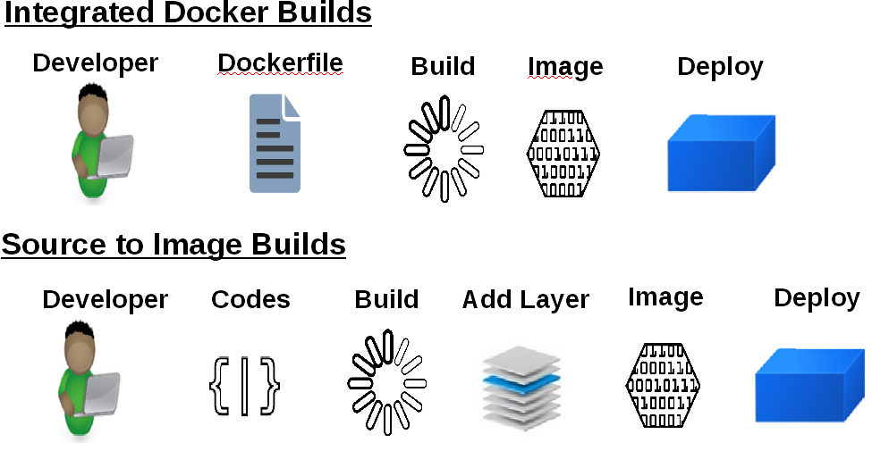

:noaudio:
:scrollbar:
:data-uri:
== Concepts

=== Concepts - STI - What Is It?

* STI stands for source-to-image
* It is the process OpenShift uses to build a Docker Image from a base image and your application source code.
** You would need to have:
*** a code repository
*** a base image (i.e ruby-20-rhel7 or php-51-centos7)

NOTE: These base images are available "built-in" and you don't have to create them yourself.

* Have a look at the diagram and review the difference between a "Docker Build" and a "Source-to-Image Build": 

ifdef::showScript[]

=== Transcript

* To start a STI Build you will need you code to reside in a supported code repository and a "base" or "builder image" to start building on top of.

endif::showScript[]

