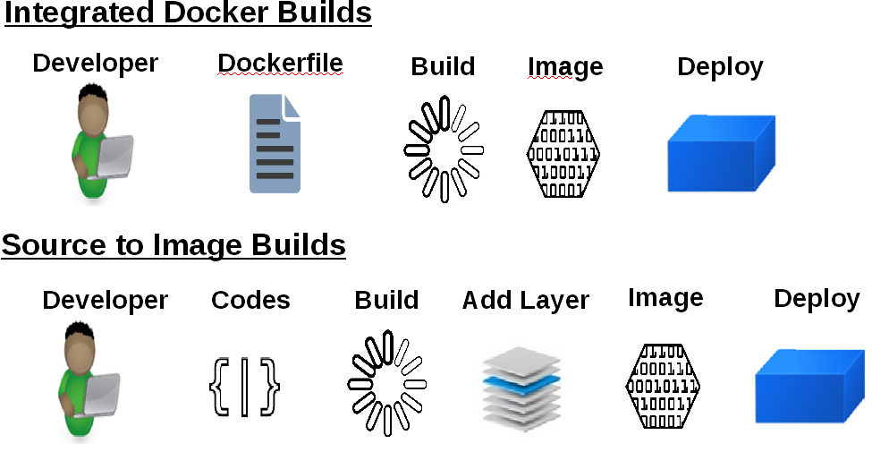

:scrollbar:
:data-uri:
== Concepts

=== Build Strategies

* The OpenShift build system provides extensible support for build strategies based on selectable types specified in the build API. By default, two strategies are supported:
** Docker builds
*** Docker builds invoke the plain *docker build* command, and therefore expect a repository with a *Dockerfile* and all required directories for a docker build process.
*** This method is suitable to deploy a "pre-baked" docker container, note that someone, developer, provider or ops team would need to create the docker image and inject the code into it.
** Source-to-Image builds.
*** Source-to-image (sti) is a tool for building reproducible Docker images.
*** It produces ready-to-run images by injecting a user source into a docker image and assembling a new Docker image.
*** The created image incorporates the base image and built source, and is ready to use with docker run.
*** STI supports incremental builds which re-use previously downloaded dependencies, previously built artifacts, etc.

ifdef::showScript[]

=== Transcript

* In OpenShift we have two main "Build Strategies" the Docker build uses a Dockerfile to build a Docker image and STI build which we will be focusing on in this module.

endif::showScript[]

