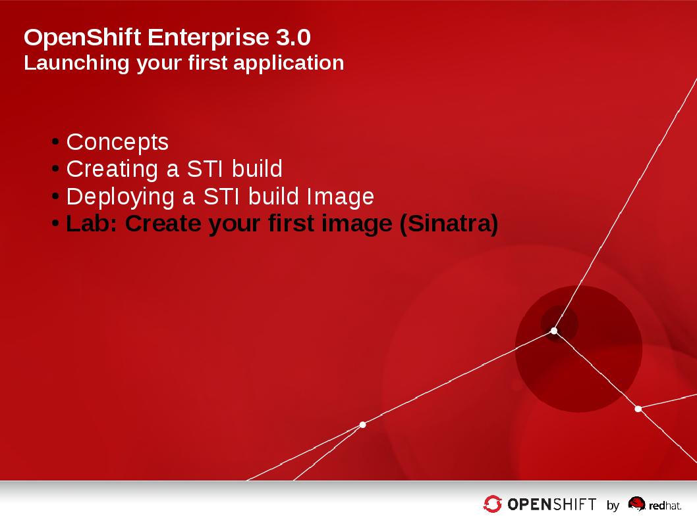

== Chapter Progress         

== Lab -  Create your first STI Build

=== Prepare your environment

* *If you haven't done so in previous labs yet:*
** Before starting this lab please follow these steps:
*** Connect to your broker with the root user
*** Run the post deployment script
----
[sborenst@desktop01 ~]$ ssh -i ~/.ssh/sborenstkey.pub shacharb-redhat.com@oselab-GUID.oslab.opentlc.com

[bash-4.2$ ~] ssh root@192.168.0.100
root@192.168.0.100's password: ******** (r3dh4t1!) 

[root@broker00-GUID ~]# sh Post_Deployment_Script.sh

----
** This process might take a while
** Use that time to read the lab and get a good understanding of the scenario.

ifdef::showScript[]

=== Transcript

endif::showScript[]

== Lab -  Create your first STI Build

=== Create a project for your environment 

* As the root user, we will create a new project for this lab.
Run the following command to create the new project:

----

[root@broker00~]$ osadm new-project sinatra --display-name="Sinatra Example" \
--description="This is your first build on OpenShift 3" \
--admin=joe

----

ifdef::showScript[]

=== Transcript

endif::showScript[]

== Lab -  Create your first STI Build

=== Scenario

* Scenario - In this lab you will create a simple STI build.
** You will create a BuildConfig and build an Image using the STI build process.
** You will create the *pod*, *service* and *route* for your STI built image. 

ifdef::showScript[]

=== Transcript

endif::showScript[]

== Lab -  Create your first STI Build

=== Authenticate to OpenShift and choose your project 

* *If you haven't done so in previous labs yet.*
** Authenticate to OpenShift with user "Joe" 
----

[root@broker00~]# su - joe
[joe@broker00~]$ export GUID=`hostname|cut -f2 -d-|cut -f1 -d.`
[joe@broker00~]$ osc login -u joe \
--certificate-authority=/var/lib/openshift/openshift.local.certificates/ca/cert.crt \
--server=https://broker00-${GUID}.oslab.opentlc.com:8443 --namespace=demo

----

* Change *context* to the "sinatra" project 

---- 

[root@broker00]# su - joe
[joe@broker00~]$ osc project sinatra
Now using project "sinatra" on server "https://broker00-c142.oslab.opentlc.com:8443".

----

* To check your current context 
** View the *~/.config/.openshift/.config*  file to review the information
** Run the following command for a quick test

----

[joe@broker00~]$ grep current ~/.config/openshift/.config
current-context: sinatra

----

ifdef::showScript[]

=== Transcript

endif::showScript[]

== Lab -  Create your first STI Build

=== Create your BuildConfig 

* We'll be using a pre-build/configured code repository. This repository is an extremely simple "Hello World" type application For this example.
* we will be using the following application's source code:
** link:https://github.com/openshift/simple-openshift-sinatra-sti[https://github.com/openshift/simple-openshift-sinatra-sti]

* Take a minute to review the repository.

* To create the instructions/config for our image we use the *osc new-app* command:
** To use the default image suggested by the builder use (Currently Centos) : 
----

[joe@broker00~]$ osc new-app https://github.com/openshift/simple-openshift-sinatra-sti.git -o json | tee ~/simple-sinatraCENT.json
[joe@broker00~]$ cat ~/simple-sinatraCENT.json

----
** To select a specific image, use can use:

----

[joe@broker00~]$ osc new-app openshift/ruby-20-rhel7~https://github.com/openshift/simple-openshift-sinatra-sti.git -o json  | tee ~/simple-sinatraRHEL.json
[joe@broker00~]$ cat ~/simple-sinatraRHEL.json

----

** The Syntax for this command is likely to change slightly at some point after the official release.

ifdef::showScript[]

=== Transcript

endif::showScript[]

== Lab -  Create your first STI Build

=== Start your Build - Part 1

* Take a look at the JSON that was generated. 
* Create the Build components using the *ose create* command on the BuildConfig file:

----

[joe@broker00~]$ osc create -f ~/simple-sinatraRHEL.json

----

* Note that the we didn't start the build yet, only the surrounding resources.
** To see what the last command produced, run the following command:
----
 
[joe@broker00~]$ for i in imagerepository buildconfig deploymentconfig service; do \
echo $i; osc get $i; echo -e "\n\n"; done
imagerepository
NAME                           DOCKER REPO                                               TAGS
simple-openshift-sinatra-sti   172.30.17.116:5000/sinatra/simple-openshift-sinatra-sti   

buildconfig
NAME                           TYPE      SOURCE
simple-openshift-sinatra-sti   STI       https://github.com/openshift/simple-openshift-sinatra-sti.git

deploymentconfig
NAME                           TRIGGERS                    LATEST VERSION
simple-openshift-sinatra-sti   ConfigChange, ImageChange   0

service
NAME                       LABELS    SELECTOR                                        IP             PORT(S)
simple-openshift-sinatra   <none>    deploymentconfig=simple-openshift-sinatra-sti   172.30.17.80   8080/TCP

[joe@broker00~]$ osc get pods
<Nothing>

----

*** The reason we get nothing in the *osc get pods* command is because we didn't start the build yet, we just created its configuration and environment

ifdef::showScript[]

=== Transcript

endif::showScript[]

== Lab -  Create your first STI Build

=== Start your Build - Part 2

* To start our build, execute the following command :

----

[joe@broker00~]$ osc start-build simple-openshift-sinatra-sti
sin-fcae9c05-bd31-11e4-8e35-525400b33d1d

----

* You can view the current build status and build logs using the following commands:

----

[joe@broker00~]$ osc get builds
NAME                                       TYPE STATUS  POD
sin-fcae9c05-bd31-11e4-8e35-525400b33d1d   STI  Pending build-sin-fcae9c05-bd31-11e4-...

[joe@broker00~]$ osc build-logs sin-fcae9c05-bd31-11e4-8e35-525400b33d1d

----

* Make sure to check the progress on the web console.
** Note: Once the build is finished, build-logs no longer shows you the logs. You'll have to figure out which Docker container was used for the build and then use docker logs. This is a known issue.

 

ifdef::showScript[]

=== Transcript

endif::showScript[]

== Lab -  Create your first STI Build

=== Create your first image (Sinatra)

Once the build is complete we can verify our pod and service using this command: 
---- 

[joe@broker00~]$ curl `osc get services | grep sin | awk '{print $4":"$5}' | awk -F'/' '{print $1}'`
Hello, Sinatra!

----

The last step will be to add a route to make it publicly accessible.
Use the following commands: 

----

[joe@broker00~]$ export GUID=`hostname|cut -f2 -d-|cut -f1 -d.`
[joe@broker00~]$ cat <<EOF > sinatra-route.json
{
  "kind": "Route",
  "apiVersion": "v1beta1",
  "metadata": {
    "name": "sinatra-openshift-route"
  },
  "id": "hello-openshift-route",
  "host": "mysinatra.cloudapps-$GUID.oslab.opentlc.com",
  "serviceName": "simple-openshift-sinatra"
}
EOF

[joe@broker00~]$ osc create -f sinatra-route.json 
sinatra-openshift-route

[joe@broker00~]$ osc get routes 

curl http://mysinatra.cloudapps-$GUID.oslab.opentlc.com

----

ifdef::showScript[]

=== Transcript

endif::showScript[]

== Lab - Using the Web Console for STI Builds

=== Create your application 

* Using what you learned in this chapter:
** Create an application using the git repository:
*** https://github.com/openshift/simple-openshift-sinatra-sti
** Use the RHEL7 Based base image.
** Start your build from the command line and create a route for your application.

 
