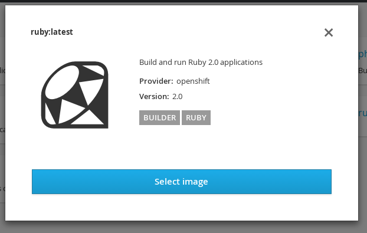

:noaudio:

ifdef::revealjs_slideshow[]

[#cover,data-background-image="image/1156524-bg_redhat.png" data-background-color="#cc0000"]

== &nbsp;
:noaudio:

ifdef::revealjs_slideshow[]

[#cover-h1]
Red Hat OpenShift Enterprise Implementation

[#cover-h2]
Creating New Applications

[#cover-logo]
image::{revealjs_cover_image}[]

endif::[]
== Module Topics

* Overview
* Source-to-Image
* Source-to-Image Builds
* Application Creation
* New App From Source Code
* New App From Image
* New App From Template
* Application Environment
* Advanced Application Creation
* Web Console

ifdef::showscript[]

=== Transcript

Welcome to module six of the OpenShift Enterprise Implementation course.

This module covers the following topics:

* Concepts such as build and deployment automation; the definition of
 Source-to-Image, or S2I; the build process; the `BuildConfig` object; and build
  strategies.

* Creating an S2I build, including creating the build file and understanding the
 various sections of the build file: `Service,`, `ImageStream`, `BuildConfig`,
  `DeploymentConfig`, and `Templates`.

* Deploying an image created by the an S2I build process, including creating the
 build environment, starting the build, and using the web console.

* How to deploy applications from source or image using the `oc new-app` CLI
 tool or the web console, and information about templates and advanced
  application creation.

endif::showscript[]
== Overview

* Users can create new OpenShift Enterprise application using web console or
 `oc new-app` command
** Users can specify application creation from _source code_, _image_, or
 _template_
* Application is set of deployed objects such as `DeploymentConfig`,
 `BuildConfig`, `ReplicationController`, `pod`, `service`, and others

* `oc new-app` uses S2I (Source-to-Image) build process

NOTE: You start by learning the manual way of creating objects and then the much
 simpler `oc new-app` method.

ifdef::showscript[]

=== Transcript

You can create a new OpenShift Enterprise application using the web console or
 by running the `oc new-app` command from the CLI.

In this context, an application is set of objects, such as `DeploymentConfig`,
 `BuildConfig`, `ReplicationController`, `pod`, `service`, and others that make
  up a _deployment_.

The `oc new-app` command uses the S2I build process underneath the cover.

In this module you start by learning the manual way of creating each of these
 objects, and then the much simpler `oc new-app` method.

endif::showscript[]
== Source-to-Image

.What Is S2I?

* Tool for building reproducible Docker images

* Produces ready-to-run images by injecting user source into Docker image and
 assembling new Docker image

** New image incorporates base image (_builder image_) and built source
*** Ready to use within OpenShift Enterprise or other platforms (e.g., Atomic
   Host)

ifdef::showscript[]

=== Transcript

A Source-to-Image, or S2I, build is a process in which a developer points to a
 code repository in a supported framework and selects a _builder_ image that
  contains the operating system and framework to support the code.

To start an S2I build, your code must reside in a supported code repository, and
 you need a base, or builder, image--for example, `ruby-20-rhel7`--on top of
  which to start building. These base images are available in OpenShift
   Enterprise--you do not need to create them yourself.

endif::showscript[]
// ISSUE: Waiting for Erik to answer regarding  3.1
//   * Supports incremental builds
//   ** Reuses previous dependencies, built artifacts, etc.
//S2I supports incremental builds and reuses previous dependencies, built artifacts, and so on.
// https://docs.openshift.com/enterprise/3.1/architecture/core_concepts/builds_and_image_streams.html
== Source-to-Image

image::images/DockerVsS2IBuilds.png[]

ifdef::showscript[]

=== Transcript

This illustration shows the key difference between a Docker build and an S2I
 build.

endif::showscript[]
== Source-to-Image

.Build and Deployment Automation

* Integrated Docker registry and automated _image builds_
* Source code deployments leveraging S2I build automation
* Configurable deployment patterns--rolling, etc.

ifdef::showscript[]

=== Transcript

OpenShift Enterprise offers an integrated Docker registry and automated image
 builds, enabling both source code deployments that leverage S2I build
  automation and binary deployments that are integrated with your existing build
   and CI infrastructure.

endif::showscript[]
== Source-to-Image

.Build Process

* *Build*: Process of creating runnable OpenShift Enterprise _image_
* Three build strategies:
** *Docker*: Invoke Docker build, expect repository with Dockerfile and
 directories required for Docker build process
** *S2I*: Build reproducible Docker images from _source code_ and _builder image_
** *Custom*: Build with user-defined process, possibly integrated with existing
 CI/CD deployment (e.g., Jenkins)

ifdef::showscript[]

=== Transcript

A build is the process of transforming input parameters--typically source
 code--into an object, which is usually a runnable image. The object depends on
  the builder used to create the image.

Three build strategies are available: Docker, S2I, and Custom. With the Docker
 strategy, you invoke a Docker build. The process expects a repository with the
  Dockerfile and the directories required for the Docker build process.

In the S2I strategy, you build reproducible Docker images from the _source code_
 and the _builder image_.

The custom strategy lets you build with a user-defined process, possibly
 integrated with an existing CI/CD deployment (for example, Jenkins).

endif::showscript[]
== Source-to-Image

.`BuildConfig` Object

* Defines single build and set of triggers that start the build
** REST object
** Can be used in `POST` to API server to create new instance
* Consists of:
** Triggers
** Parameters

ifdef::showscript[]

=== Transcript

The `BuildConfig` object is the definition of the entire build process. It
 consists of triggers that define policies used to automatically invoke builds,
  and parameters that point OpenShift Enterprise to the source code and builder
   image.

endif::showscript[]
== Source-to-Image

.`BuildConfig` Triggers

* Three trigger types:
- *GitHub webhook*: Specifies which repository changes invoke a new build;
 specific to GitHub API
- *Generic webhook*: Invokes new build when notified; payload slightly different
 from GitHub
- *Image change*: Invoked when new image is available in specified image
 repository

ifdef::showscript[]

=== Transcript

There are three types of triggers.

* GitHub-specific webhooks specify the repository changes, such as a new commit,
 that invoke a new build. This trigger is specific to the GitHub API.

* The second type is a generic webhook. This trigger is similar to a GitHub
 webhook in that it invokes a new build whenever it receives a notification.

* And an image change trigger is invoked when a new image is available in the
 specified image repository or image stream.

endif::showscript[]
== Source-to-Image

.`BuildConfig` Parameters

* Three parameter types:
- *_Source_*: Describes SCM used to locate the sources; supports Git
- *Strategy*: Describes invoked build type and build type details
- *Output*: Describes resulting image name, tag, and registry to which OpenShift
 Enterprise should push image

ifdef::showscript[]

=== Transcript

There are three parameter types.

* The source parameter describes the source code repository. The
 source parameter currently supports only the Git SCM.

* Strategy describes the build type being invoked, along with the build's
 specific details.

* And output describes the resulting image name, tag, and registry to which
 OpenShift Enterprise should push the image.

endif::showscript[]
== Source-to-Image

.Build Strategies

* OpenShift Enterprise build system provides extensible support for build
 strategies based on selectable types specified in build API
* Docker build
** Invokes `docker build`, expects repository with Dockerfile and required
 directories
** Suitable for prebuilt Docker container
** Need to create Docker image and inject code into it
* S2I build
** Builds reproducible Docker images
** Produces ready-to-run images by injecting user source into Docker image and
 assembling new Docker image
*** New ready-to-use image incorporates base image and built source

ifdef::showscript[]

=== Transcript

The OpenShift Enterprise build system provides extensible support for build
 strategies based on selectable types specified in the build API.

Docker builds invoke the plain `docker build` command, and therefore expect a
 repository with a Dockerfile and all required directories for a Docker build
  process. This method is suitable for deploying a prebuilt Docker container.

With this approach, a developer, provider, or ops team needs to create the
 Docker image and inject the code into it.

S2I is a tool for building reproducible Docker images.
 S2I produces ready-to-run images by injecting a user's source code into an
  image and assembling a new Docker image. The created image incorporates the
   base image and built source.

endif::showscript[]
== Source-to-Image Builds

.S2I Build
* S2I builds replace the developer experience and build process of OpenShift
 Enterprise 2
* Developer now specifies:
** Repository where project is located
** _Builder image_ that defines language and framework for writing application
* S2I assembles new image that runs application defined by _source_ using
 framework defined by _builder image_

ifdef::showscript[]

=== Transcript

S2I builds are a replacement for the build process of OpenShift Enterprise
 Version 2. The developer now needs to provide only the repository where the
  project is located and a builder image, which defines the language and
   framework used for writing the application.

endif::showscript[]
== Source-to-Image Builds

.S2I Build Example

* Example in this section creates image using S2I process
** Uses Ruby Sinatra gem as application framework
+
https://github.com/openshift/simple-openshift-sinatra-sti
** Uses `ruby-20-rhel7` builder image

* Processes shown:
** Running image in pod
** Creating service for pod
** Creating route for external access

ifdef::showscript[]

=== Transcript

This section describes the process of creating an S2I build. The example uses
 Ruby's Sinatra gem, found at the URL shown, as the application framework to
  build a simple "Hello World" application.

The example creates an S2I build with a `ruby-20-rhel7` image.

The section also shows the process of running the new image in a pod, including
 creating a service for the pod and creating a route for external access.

endif::showscript[]
== Source-to-Image Builds

.Creating the Build File

* `oc new-app`:
- Examines directory tree, remote repo, or other sources
- Attempts to generate JSON configuration so OpenShift Enterprise can build image
- Defines _service_ object for application

* To create application definition, use `oc new-app` to generate definition file:
+
----

$ oc new-app https://github.com/openshift/simple-openshift-sinatra-sti.git -o json | tee ~/simple-sinatra.json

----
NOTE: Adding `-o json` or `-o yaml` to this command (and others) creates an
 output of the requested action in the desired format rather than actually
  requesting the action (more on this later).

ifdef::showscript[]

=== Transcript

As shown in the code sample, you use the `oc new-app` command to generate a
 JSON file that defines your build. `oc new-app` is a tool that examines a
  directory tree, a remote repo, or other source and attempts to generate an
   appropriate JSON configuration so that OpenShift Enterprise can build the
    resulting image to run.

You can edit the JSON file before you create the build.

endif::showscript[]
== Source-to-Image Builds

.JSON Build File

----
{
    "kind": "List",
    "apiVersion": "v1",
    "metadata": {},
    "items": [
        {
            "kind": "ImageStream",
            "apiVersion": "v1",
            "metadata": {
                "name": "simple-openshift-sinatra-sti",
                "creationTimestamp": null,
                "labels": {
                    "app": "simple-openshift-sinatra-sti"
                },
                "annotations": {
                    "openshift.io/generated-by": "OpenShiftNewApp"
                }
            },
            "spec": {},
            "status": {
                "dockerImageRepository": ""
            }
        },
        {
            "kind": "BuildConfig",
            "apiVersion": "v1",
            "metadata": {
                "name": "simple-openshift-sinatra-sti",
                "creationTimestamp": null,
                "labels": {
                    "app": "simple-openshift-sinatra-sti"
                },
                "annotations": {
                    "openshift.io/generated-by": "OpenShiftNewApp"
                }
            },
            "spec": {
                "triggers": [
                    {
                        "type": "GitHub",
                        "github": {
                            "secret": "9PATsUhFWasUl91pzW1B"
                        }
                    },
                    {
                        "type": "Generic",
                        "generic": {
                            "secret": "lVS9l8FY8WAgq4rRhaez"
                        }
                    },
                    {
                        "type": "ConfigChange"
                    },
                    {
                        "type": "ImageChange",
                        "imageChange": {}
                    }
                ],
                "source": {
                    "type": "Git",
                    "git": {
                        "uri": "https://github.com/openshift/simple-openshift-sinatra-sti.git"
                    }
                },
                "strategy": {
                    "type": "Source",
                    "sourceStrategy": {
                        "from": {
                            "kind": "ImageStreamTag",
                            "namespace": "openshift",
                            "name": "ruby:latest"
                        }
                    }
                },
                "output": {
                    "to": {
                        "kind": "ImageStreamTag",
                        "name": "simple-openshift-sinatra-sti:latest"
                    }
                },
                "resources": {}
            },
            "status": {
                "lastVersion": 0
            }
        },
        {
            "kind": "DeploymentConfig",
            "apiVersion": "v1",
            "metadata": {
                "name": "simple-openshift-sinatra-sti",
                "creationTimestamp": null,
                "labels": {
                    "app": "simple-openshift-sinatra-sti"
                },
                "annotations": {
                    "openshift.io/generated-by": "OpenShiftNewApp"
                }
            },
            "spec": {
                "strategy": {
                    "resources": {}
                },
                "triggers": [
                    {
                        "type": "ConfigChange"
                    },
                    {
                        "type": "ImageChange",
                        "imageChangeParams": {
                            "automatic": true,
                            "containerNames": [
                                "simple-openshift-sinatra-sti"
                            ],
                            "from": {
                                "kind": "ImageStreamTag",
                                "name": "simple-openshift-sinatra-sti:latest"
                            }
                        }
                    }
                ],
                "replicas": 1,
                "selector": {
                    "app": "simple-openshift-sinatra-sti",
                    "deploymentconfig": "simple-openshift-sinatra-sti"
                },
                "template": {
                    "metadata": {
                        "creationTimestamp": null,
                        "labels": {
                            "app": "simple-openshift-sinatra-sti",
                            "deploymentconfig": "simple-openshift-sinatra-sti"
                        },
                        "annotations": {
                            "openshift.io/generated-by": "OpenShiftNewApp"
                        }
                    },
                    "spec": {
                        "volumes": [
                            {
                                "name": "simple-openshift-sinatra-sti-volume-1",
                                "emptyDir": {}
                            }
                        ],
                        "containers": [
                            {
                                "name": "simple-openshift-sinatra-sti",
                                "image": "library/simple-openshift-sinatra-sti:latest",
                                "ports": [
                                    {
                                        "containerPort": 8080,
                                        "protocol": "TCP"
                                    }
                                ],
                                "resources": {},
                                "volumeMounts": [
                                    {
                                        "name": "simple-openshift-sinatra-sti-volume-1",
                                        "mountPath": "/run"
                                    }
                                ]
                            }
                        ]
                    }
                }
            },
            "status": {}
        },
        {
            "kind": "Service",
            "apiVersion": "v1",
            "metadata": {
                "name": "simple-openshift-sinatra",
                "creationTimestamp": null,
                "labels": {
                    "app": "simple-openshift-sinatra-sti"
                },
                "annotations": {
                    "openshift.io/generated-by": "OpenShiftNewApp"
                }
            },
            "spec": {
                "ports": [
                    {
                        "name": "8080-tcp",
                        "protocol": "TCP",
                        "port": 8080,
                        "targetPort": 8080
                    }
                ],
                "selector": {
                    "app": "simple-openshift-sinatra-sti",
                    "deploymentconfig": "simple-openshift-sinatra-sti"
                }
            },
            "status": {
                "loadBalancer": {}
            }
        }
    ]
}

----

ifdef::showscript[]

=== Transcript

This is a generated JSON build file. It contains some familiar items and some
 new ones--specifically, `BuildConfig` and `ImageRepository`. Upcoming slides
  cover each section of the file.

endif::showscript[]
== Source-to-Image Builds

.JSON Build File - `Service`

* Describes _service_ to be created to support application
* Note the `selector` line
+
[subs="verbatim,macros"]
----
 {
            "kind": "Service",
            "apiVersion": "v1",
            "metadata": {
                "name": "simple-openshift-sinatra",
                "creationTimestamp": null
            },
            "spec": {
                "ports": [
                    {
                        "name": "simple-openshift-sinatra-sti-tcp-8080",
                        "protocol": "TCP",
                        "port": 8080,
                        "targetPort": 8080,
                    }
                ],
                pass:quotes[*"selector": {*]
                    "deploymentconfig": "simple-openshift-sinatra-sti"
                },
                "portalIP": ""
            },
            "status": {
                "loadBalancer": {}
            }
        }
----

ifdef::showscript[]

=== Transcript

The `Service` section describes the service to be created to support the built
 application. Note the `selector` line.

endif::showscript[]
== Source-to-Image Builds

.JSON Build File - `ImageStream`

* Describes `ImageStream` resource to be created to support application
* OpenShift components such as builds and deployments can watch an image stream
 to receive notifications when new images are added and react by performing a
  build or a deployment.
** OpenShift Enterprise _rebuilds_ when a change like this occurs
+
[subs="verbatim,macros"]
----
        {
            pass:quotes[*"kind": "ImageStream",*]
            "apiVersion": "v1",
            "metadata": {
                "name": "simple-openshift-sinatra-sti",
                "creationTimestamp": null
            },
            "spec": {
                "tags": [
                    {
                        "name": "latest",
                        "from": {
                            "kind": "DockerImage",
                            "name": "simple-openshift-sinatra-sti:latest"
                        }
                    }
                ]
            },
            "status": {
                "dockerImageRepository": ""
            }
        },

----

ifdef::showscript[]

=== Transcript

The `ImageStream` section describes the `ImageStream` resource to be created to
 support the built application.

 OpenShift components such as builds and deployments can watch an image stream
  to receive notifications when new images are added and react by performing a
   build or a deployment. OpenShift Enterprise _rebuilds_ when a
  change like this occurs.

endif::showscript[]
== Source-to-Image Builds

.JSON Build File - `BuildConfig`

* Defines:
** Triggers that start _rebuild_ of application
** Parameters that define repository and _builder image_ for build process
+
[subs="verbatim,macros"]
----
 {
            pass:quotes[*"kind": "BuildConfig",*]
            "apiVersion": "v1",
            "metadata": {
                "name": "simple-openshift-sinatra-sti",
                "creationTimestamp": null
            },
            "spec": {
                "triggers": [
                    {
                        "type": "GitHub",
                        "github": {
                            "secret": "egsfGzfgMcKPPCfL88oz"
                        }
                    },
                    {
                        "type": "Generic",
                        "generic": {
                            "secret": "8fcmnyr0RbkzLPCPY9Sv"
                        }
                    },
                    {
                        "type": "ImageChange",
                        "imageChange": {}
                    }
                ],
                "source": {
                    "type": "Git",
                    "git": {
                        "uri": "https://github.com/openshift/simple-openshift-sinatra-sti.git"
                    }
                },
                "strategy": {
                    "type": "Source",
                    "sourceStrategy": {
                        "from": {
                            "kind": "ImageStreamTag",
                            "namespace": "openshift",
                            "name": "ruby:latest"
                        }
                    }
                },
                "output": {
                    "to": {
                        "kind": "ImageStreamTag",
                        "name": "simple-openshift-sinatra-sti:latest"
                    }
                },
                "resources": {}
            },
            "status": {
                "lastVersion": 0
            }
        },
----

ifdef::showscript[]

=== Transcript

The `BuildConfig` section defines the triggers that start a rebuild of your
 application and the parameters that define the repository and the builder image
  that the build process uses.

endif::showscript[]
== Source-to-Image Builds

.JSON Build File - `DeploymentConfig`

* Defines:
** Additional _image rebuild_
** Number of replicas application will have

+
[subs="verbatim,macros"]
----
{
            pass:quotes[*"kind": "DeploymentConfig",*]
            "apiVersion": "v1",
            "metadata": {
                "name": "simple-openshift-sinatra-sti",
                "creationTimestamp": null
            },
            "spec": {
                "strategy": {
                    "type": "Recreate",
                    "resources": {}
                },
                pass:quotes[*"triggers": [*]
                    {
                        "type": "ConfigChange"
                    },
                    {
                        "type": "ImageChange",
                        "imageChangeParams": {
                            "automatic": true,
                            "containerNames": [
                                "simple-openshift-sinatra-sti"
                            ],
                            "from": {
                                "kind": "ImageStreamTag",
                                "name": "simple-openshift-sinatra-sti:latest"
                            }
                        }
                    }
                ],
                pass:quotes[*"replicas": 1,*]
                "selector": {
                    "deploymentconfig": "simple-openshift-sinatra-sti"
                },
----

ifdef::showscript[]

=== Transcript

In the `DeploymentConfig` section, you define more triggers that can start a
 rebuild of your image and how many replicas your application will have.

endif::showscript[]
== Source-to-Image Builds

.JSON Build File - `Template`

* Defines container _deployment template_
+
[subs="verbatim,macros"]
----
    },
                pass:quotes[*"template": {*]
                    "metadata": {
                        "creationTimestamp": null,
                        "labels": {
                            "deploymentconfig": "simple-openshift-sinatra-sti"
                        }
                    },
                    "spec": {
                        pass:quotes[*"containers": [
                            {
                                "name": "simple-openshift-sinatra-sti",
                                "image": "simple-openshift-sinatra-sti:latest",
                                "ports": [
                                    {
                                        "name": "simple-openshift-sinatra-sti-tcp-8080",
                                        "containerPort": 8080,
                                        "protocol": "TCP"*]
                                    }
                                ],
                                "resources": {}
                            }
                        ]
                    }
                }
----

ifdef::showscript[]

=== Transcript

The `template` section defines different aspects of your application--for
 example, container name, image, and ports.

endif::showscript[]
== Source-to-Image Builds

.Deploying an S2I Build Image

* In basic S2I process, OpenShift Enterprise:
- Sets up components to build _source code_ into Docker _image_
- On command, builds Docker image
- Deploys Docker image as pod with associated _service_

ifdef::showscript[]

=== Transcript

Essentially, the S2I process is as follows: OpenShift Enterprise sets up various
 components so that it can build source code into a Docker image. Then OpenShift
  Enterprise builds the Docker image with the source code.
   And finally, OpenShift Enterprise deploys the Docker image as a pod with an
    associated service.

endif::showscript[]
== Source-to-Image Builds

.Creating the Build Environment

* To create build environment and start the build, use `oc create` on `.json`
 file:
+
----
$ oc create -f ~/simple-sinatra.json
----

* Creates entries for:
** `ImageRepository`
** `BuildConfig`
** `DeploymentConfig`
** `Service`

ifdef::showscript[]

=== Transcript

As shown in the code sample, the `oc create` command creates the build
 environment and resources. These include entries for `ImageRepository`,
  `BuildConfig`, `DeploymentConfig`, and `Service`.

To review what happens, run the command shown in the code sample.

Most of the time Red Hat recommends using `oc new-app`. This `oc create` method
 is described for rare cases and educational purposes.

endif::showscript[]
== Source-to-Image Builds

.Watching the S2I Build

* To see builds and their status:
+
----
$ oc get builds
NAME                             TYPE      STATUS    POD
simple-openshift-sinatra-sti-1   S2I       Running   simple-openshift-sinatra-sti-1

----

* To follow build process:
+
----
oc logs build/sin-simple-openshift-sinatra-sti-1
----

ifdef::showscript[]

=== Transcript

To see the builds and their status, use the `oc get builds` command.

To follow the build process by checking the log created for your build, use the
 `oc build-logs` command.

endif::showscript[]
== Application Creation

.Overview

* Create new OpenShift Enterprise application using web console or `oc new-app`

* OpenShift Enterprise creates application by specifying _source code_, _image_, or _template_
* `new-app` looks for images on local Docker installation (if available), in
 Docker registry, or OpenShift Enterprise image stream

* If you specify source code, `new-app` constructs:
** _Build configuration_ that builds source into new _application image_
** _Deployment configuration_ that deploys _image_
** _Service_ to provide load-balanced access to _deployment_ running _image_

ifdef::showscript[]

=== Transcript

You can create a new OpenShift Enterprise application using the web console or
 by running the `oc new-app` command from the CLI. OpenShift Enterprise creates
  a new application by specifying source code, images, or templates. The
   `new-app` command looks for images on the local Docker installation
    (if available), in a Docker registry, or an OpenShift Enterprise image
     stream.

endif::showscript[]
== New App From Source Code

.Specifying Source Code

* `new-app` can use _source code_ from local or remote Git repository
* If only source repository is specified, `new-app` tries to determine build
 strategy (`docker` or `source`)
** For `source` builds, also tries to determine _builder image_

* To tell `new-app` to use subdirectory of source code repository, use
 `--context-dir` flag

* When specifying remote URL, can specify Git reference to use by appending
 `#[reference]` to end of URL

NOTE: If you are using a local Git repository, the repository must have an
 _origin_ remote that points to a URL accessible by the OpenShift Enterprise cluster.

ifdef::showscript[]

=== Transcript
The `new-app` command allows you to create applications using source code from a
 local or remote Git repository. If only a source repository is specified,
  `new-app` tries to automatically determine the type of build strategy to use
   (`docker` or `source`), and for `source` builds, an appropriate language
    builder image.

endif::showscript[]
== New App From Source Code

.Specifying Source Code - Examples

* To create application using Git repository at current directory:
+
----
$ oc new-app
----

* To create application using remote Git repository and context subdirectory:
+
----
$ oc new-app https://github.com/openshift/sti-ruby.git \
    --context-dir=2.0/test/puma-test-app
----

* To create application using remote Git repository with specific branch
 reference:
+
----
$ oc new-app https://github.com/openshift/ruby-hello-world.git#beta4
----

ifdef::showscript[]

=== Transcript

These examples show how to create an application based on a local or remote Git
 repository. The S2I process takes care of selecting the appropriate builder
  image for the application.

endif::showscript[]
== New App From Source Code

.Build Strategy Detection

* If `new-app` finds a _Dockerfile_ in the repository, it uses `docker` build
 strategy

** Otherwise, `new-app` uses `source` strategy
* To specify strategy, set `--strategy` flag to `source` or `docker`

** Example: To force `new-app` to use `docker` strategy for local source
 repository:
+
----
$ oc new-app /home/user/code/myapp --strategy=docker
----

ifdef::showscript[]

=== Transcript
If `new-app` finds a _Dockerfile_ in the repository, it generates a `Docker`
 build strategy. Otherwise, `new-app` generates a `source` strategy.

To use a specific strategy, set the `--strategy` flag to either `source` or
 `docker`.

endif::showscript[]
== New App From Source Code

.Language Detection

* If creating `source` build, `new-app` tries to determine language to use based
 on files present in the repository root

* Languages detected by `new-app`:

[cols="1,4"]
|===
|Language | Files
a|Ruby
a|`Rakefile`, `Gemfile`, `config.ru`
a|JEE
a|`pom.xml`
a|Node.js
a|`app.json`, `package.json`
a|PHP
a|`index.php`, `composer.json`
a|Python
a|`requirements.txt`, `config.py`
a|Perl
a|`index.pl`, `cpanfile`
|===

ifdef::showscript[]

=== Transcript
When creating a `source` build, `new-app` tries to determine the language
 to use based on the presence of certain files in the root of the
  repository; for example, if a file called `Gemfile` is present in the
   repository, `new-app` determines that the language is Ruby.

Shown here is a list of languages `new-app` can detect and the files associated
 with them.
endif::showscript[]
== New App From Source Code

.Language Detection

* After language is detected, `new-app` searches OpenShift Enterprise server
 for:
** Image stream tags with `supports` annotation that matches language
** Image stream that matches name of detected language
* If no match found, `new-app` searches Docker Hub registry
 ( https://registry.hub.docker.com) for image that matches name of detected
  language

ifdef::showscript[]

=== Transcript
After a language is detected, `new-app` searches the OpenShift Enterprise server
 for image stream tags that have a `supports` annotation matching the detected
  language, or an image stream that matches the name of the detected language.

If no match is found, `new-app` searches the Docker Hub registry for an image
 that matches the name of the detected language.

endif::showscript[]
== New App From Source Code

.Language Detection

* To override image that `new-app` uses as builder for source repository,
 specify image and repository using `~` (tilde) as separator

* To use image stream `myproject/my-ruby` to build the source at remote GitHub
 repository:
+
----
$ oc new-app myproject/my-ruby~https://github.com/openshift/ruby-hello-world.git
----

* To use Docker image `openshift/ruby-20-centos7:latest` to build source in
 local repository:
+
----
$ oc new-app openshift/ruby-20-centos7:latest~/home/user/code/my-ruby-app
----

ifdef::showscript[]

=== Transcript
To override the image that `new-app` uses as the builder for a particular source
 repository, you can specify the image--either an image stream or Docker
  specification along with the repository by using a `~` (tilde) as a separator.

endif::showscript[]
== New App From Image

.Specifying an Image

* `new-app` generates artifacts to deploy existing image as application

* Images can come from:
**  OpenShift Enterprise server
** Specific registry
** Docker Hub
** Local Docker server

* `new-app` attempts to determine type of image from arguments passed to it

* Can explicitly tell `new-app` what image is:
** For Docker image, use `--docker-image` argument
** For image stream, use `-i|--image` argument

NOTE: If you specify an image from your local Docker repository, you must ensure
 that the same image is available to the OpenShift Enterprise cluster nodes.

ifdef::showscript[]

=== Transcript
The `new-app` command generates the necessary artifacts to deploy an existing
image as an application. Images can come from image streams in the OpenShift
 Enterprise server, a specific registry, Docker Hub, or a local Docker server.

The `new-app` command attempts to determine the type of image specified in the
 arguments passed to it. However, you can explicitly tell `new-app` that the
  image is a Docker image by using the `--docker-image` argument, or an image
   stream by using the `-i|--image` argument.

If you specify an image from your local Docker repository, you must ensure that
 the same image is available to the OpenShift Enterprise cluster nodes.

endif::showscript[]
== New App From Image

.Specifying an Image - Examples

* To create application using image in a private registry, use full Docker image
 specification

* To create application from MySQL image in Docker Hub:
+
----
$ oc new-app mysql
----

* To create application from local registry:
----
$ oc new-app myregistry:5000/example/myimage
----

NOTE: If the registry that the image comes from is not secured with SSL, cluster
 administrators must ensure that the Docker daemon on the OpenShift Enterprise
  nodes is run with the `--insecure-registry` flag pointing to that registry.
   You must also use the `--insecure-registry=true` flag to tell `new-app` that
    the image comes from an insecure registry.

ifdef::showscript[]

=== Transcript

To create an application using an image in a private registry, use the full
 Docker image specification.

The first example shows creating an application from a MySQL image in Docker Hub.

The second example shows creating an application from a local registry.

endif::showscript[]
== New App From Image

* To create application from existing image stream, specify:
** Namespace (optional)
** Name
** Tag (optional)

* To create application from existing image stream with specific tag:
+
----
$ oc new-app my-stream:v1
----

ifdef::showscript[]

=== Transcript
To create an application from an existing image stream, specify the namespace
 (optional), name, and tag (optional) for the image stream.

The example shows creating an application from an image stream with a specific
 tag.

endif::showscript[]
== New App From Template

.Specifying a Template

* `new-app` can instantiate template from stored template or template file

* To instantiate stored template, specify template name as argument

* To create application from stored template:
+
----
$ oc create -f examples/sample-app/application-template-stibuild.json
$ oc new-app ruby-helloworld-sample
----

.Reference
* For detailed information about storing a template and using it to create an
 application, see:
  https://github.com/openshift/origin/tree/master/examples/sample-app

ifdef::showscript[]

=== Transcript
The `new-app` command can instantiate a template from a stored template or from
 a template file. To instantiate a stored template, specify the name of the
  template as an argument.

The example shows creating an application from a template.

endif::showscript[]
== New App From Template

* To use template in file system directly, without first storing it in OpenShift
 Enterprise:
** Use `-f|--file` argument
** Specify file name as argument to `new-app`

* To create application from template in file:
+
----
$ oc new-app -f examples/sample-app/application-template-stibuild.json
----

ifdef::showscript[]

=== Transcript
To use a template in the file system directly, without first storing it in
 OpenShift Enterprise, use the `-f|--file` flag and specify the file
  name as the argument.

endif::showscript[]
== New App From Template

.Template Parameters

* When creating application based on _template_, use `-p|--param` argument to
 set parameter values defined by template
* To specify template parameters with template:
+
----
$ oc new-app ruby-helloworld-sample \
    -p ADMIN_USERNAME=admin,ADMIN_PASSWORD=mypassword
----

NOTE: This topic is covered in depth in the next module.

ifdef::showscript[]

=== Transcript
When creating an application based on a _template_, use the `-p|--param`
 flag to set parameter values defined by the template.

This topic is covered in depth in the next module.

endif::showscript[]
== Application Environment

.Specifying Environment Variables

* When generating applications from _source_ or _image_, use `-e|--env` argument
 to specify environment to be passed to application container at runtime
* To set environment variables when creating application for database image:
+
----
$ oc new-app openshift/postgresql-92-centos7 \
    -e POSTGRESQL_USER=user \
    -e POSTGRESQL_DATABASE=db \
    -e POSTGRESQL_PASSWORD=password
----

ifdef::showscript[]

=== Transcript
When generating applications from _source_ or  _image_, you can use the
 `-e|--env` flag to specify environment variables to be passed to the
  application container at runtime.

The example shows setting environment variables when creating an application for
 a database image.

endif::showscript[]
== Application Environment

.Specifying Labels

* When generating applications from _source_, _images_, and _templates_, use
 `-l|--label` flag to add labels to objects created by `new-app`

* Recommended because labels make it easy to collectively select, manipulate,
 and delete objects associated with application

* To use label flag to label objects created by `new-app`:
+
----
$ oc new-app https://github.com/openshift/ruby-hello-world -l name=hello-world
----

ifdef::showscript[]

=== Transcript

When generating applications from source, images, and templates, you can use the
 `-l|--label` flag to add labels to objects created by `new-app`.

This is recommended, because labels make it easy to collectively select,
 manipulate, and delete objects associated with the application.

The example shows using the label flag to label objects created by
 `new-app`.

endif::showscript[]
== Application Environment

.Command Output

* `new-app` generates OpenShift Enterprise resources that _build_, _deploy_, and
 _run_ applications

* Resources created in current project use names derived from input source
 repositories or images

** Can change this behavior

.Output Without Creation

* To preview resources `new-app` will create, use `-o|--output` flag with value
 of `yaml` or `json`

** Shows resources that will be created, but does not create them
** Review resources, or redirect output to file to edit

** Then use `oc create` to create OpenShift Enterprise resources

* To output `new-app` artifacts to file, edit them, then create them using
 `oc create`:
+
----
$ oc new-app https://github.com/openshift/ruby-hello-world -o json > myapp.json
$ vi myapp.json
$ oc create -f myapp.json
----

ifdef::showscript[]

=== Transcript
The `new-app` command generates OpenShift Enterprise resources that build,
 deploy, and run the application being created. Normally, these resources are
  created in the current project using names derived from the input source
   repositories or input images. However, `new-app` allows you to modify this
    behavior.

To see a dry run of what `new-app` will create, use the `-o|--output` flag with
 a value of either `yaml` or `json`. Then use the output to preview the
  resources that will be created, or redirect the output to a file that you can
   edit and then use with `oc create` to create the OpenShift Enterprise
    resources, as shown in the example.

endif::showscript[]
== Application Environment

.Object Names

* `new-app` objects normally named after source repository or image
* Can set name of the application produced by adding `--name` flag

* To create `new-app` artifacts with different name:
+
----
$ oc new-app https://github.com/openshift/ruby-hello-world --name=myapp
----

.Object Project or Namespace

* `new-app` creates objects in current project

* To tell `new-app` to create objects in different project, use `-n|--namespace`
 flag

* To create `new-app` artifacts in different project:
+
----
$ oc new-app https://github.com/openshift/ruby-hello-world -n myproject
----

ifdef::showscript[]

=== Transcript
Objects created by `new-app` are normally named after the source repository or
 the image used to generate them.

You can set the name of the objects produced by adding the `--name` flag to the
 command.

Normally `new-app` creates objects in the current project. To tell it to create
 objects in a different project that you have access to, use the
  `-n|--namespace` flag.

endif::showscript[]
== Application Environment

.Objects Created

* Artifacts/objects created by `new-app` depend on artifacts passed as input:
 _source repository_, _image_, or _template_

[cols="2,8"]
|===
|Artifact |Description
a|`BuildConfig`
a|`BuildConfig` entry is created for each source repository specified on the
 command line. `BuildConfig` specifies the strategy to use, the source location,
  and the build output location.
a|`ImageStream`
a|For `BuildConfig`, two `ImageStream` entries are usually created: one to
represent the input image and another to represent the output image. The input
 image can be the _builder image_ for source builds or `FROM` image for Docker
  builds. If a Docker image is specified as input to `new-app`, then an image
   stream is also created for that image.
a|`DeploymentConfig`
a|`DeploymentConfig` entry is created to deploy the output of a build or a
 specified image.
a|`Service`
a|The `new-app` command attempts to detect exposed ports in input images. It
 uses the lowest numeric exposed port to generate a service that exposes that
  port. To expose a different port, after `new-app` has completed, use the
   `oc expose` command to generate additional services.
a|Other
 |Other resources can be generated when instantiating templates.

|===

ifdef::showscript[]

=== Transcript
The set of artifacts/objects created by `new-app` depends on the artifacts
 passed as input: source repositories, images, or templates. This table
  describes the various resources that `new-app` can output.

endif::showscript[]
== Advanced Application Creation

.Multiple Components and Grouping

* `new-app` can create multiple applications at same time from _source_,
 _image_, or _template_

* To create multiple applications, specify multiple parameters to `new-app`

** Labels specified on command line apply to all objects created by single
 command call

** Environment variables apply to all components created from source or images

* To create application from source repository and Docker Hub image:
+
----
$ oc new-app https://github.com/openshift/ruby-hello-world mysql
----

NOTE: If a source code repository and a builder image are specified as separate
 arguments, `new-app` uses the _builder image_ as the builder for the source
  code repository. If this is not intended, use the `~` separator to specify a
   specific _builder image_ for the source.

ifdef::showscript[]

=== Transcript
The `new-app` command allows creating multiple applications at once from source,
 images, or templates. To do this, simply specify multiple parameters to the
  `new-app` call. Labels specified on the command line apply to all objects
   created by the single call. Environment variables apply to all components
    created from source or images.

endif::showscript[]
== Advanced Application Creation

.Grouping Images and Source in Single Pod
* `new-app` can deploy multiple images in single _pod_

* To indicate images to group, use `+` separator

* Can also use `--group` argument to specify images to group

* To group image built from source repository with other images, specify its
 _builder image_ in group

* To deploy two images in single pod:
+
----
$ oc new-app nginx+mysql
----

* To deploy together image built from source and external image:
+
----
$ oc new-app \
    ruby~https://github.com/openshift/ruby-hello-world \
    mysql \
    --group=ruby+mysql
----

ifdef::showscript[]

=== Transcript
The `new-app` command allows deploying multiple images together in a single pod.
 To specify which images to group together, use the `+` separator, shown in the
  first example. The `--group` command line argument can also be used to specify
   the images to be grouped together. This is shown in the second example.

To group the image built from a source repository with other images, specify
 its builder image in the group.

endif::showscript[]
== Web Console

* Can also create applications using web console

* While in desired project, click *Create*
+
image::images/console_create.png[]

* Enter repository URL for application to build:
+
image::images/console_enter_source_uri.png[]

ifdef::showscript[]

=== Transcript
You can also create applications using the web console. While in the desired
 project, click *Create* and enter the repository URL for the application to
  build.

endif::showscript[]

// ISSUE: I need to get new screenshots here for 3.1
== Web Console

* Select builder image from list of images in your project or from global
 library
+

ifdef::showscript[]

=== Transcript
Select a builder image from the list of images in your project or from the
 global library.

endif::showscript[]

// ISSUE: I need to get new screenshots here for 3.1
== Web Console

* Modify settings in new application screen to configure resources to support
 application
+
image::images/create_from_image.png[]

ifdef::showscript[]

=== Transcript
Modify settings in the new application screen to configure the resources to
 support your application.

 . Builder image name and description
 . Application name used for generated OpenShift Enterprise resources
 . Routing configuration section for making the application publicly accessible
 . Deployment configuration section for customizing deployment triggers and
  image environment variables
 . Build configuration section for customizing build triggers
 . Replica scaling section for configuring the number of running instances of
  the application
 . Labels to assign to all items generated for the application. Add and edit
  labels for all resources here.

endif::showscript[]
== Summary

* Overview
* Source-to-Image
* Source-to-Image Builds
* Application Creation
* New App From Source Code
* New App From Image
* New App From Template
* Application Environment
* Advanced Application Creation
* Web Console

ifdef::showscript[]

=== Transcript

This module covered the following topics:

* Concepts such as build and deployment automation; the definition of
 Source-to-Image, or S2I; the build process; the `BuildConfig` object; and build
  strategies.

* Creating an S2I build, including creating the build file and understanding the
 various sections of the build file: `Service,`, `ImageStream`, `BuildConfig`,
  `DeploymentConfig`, and `Templates`.

* Deploying an S2I build image, including creating the build environment,
 starting the build, and using the web console to create an S2I build.

* You also learned how to deploy applications from source or image using the
 `oc new-app` CLI tool or the web console, and you learned a little about
  templates and advanced application creation.

endif::showscript[]
