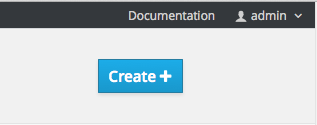
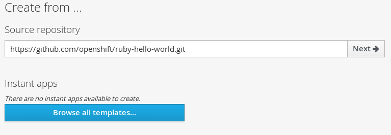

== Web Console
:noaudio:

* Can also create applications using web console

* While in desired project, click *Create*
+

* Enter repository URL for application to build:
+

ifdef::showscript[]

=== Transcript
You can also create applications using the web console. While in the desired project, click *Create* and enter the repository URL for the application to build.

endif::showscript[]

