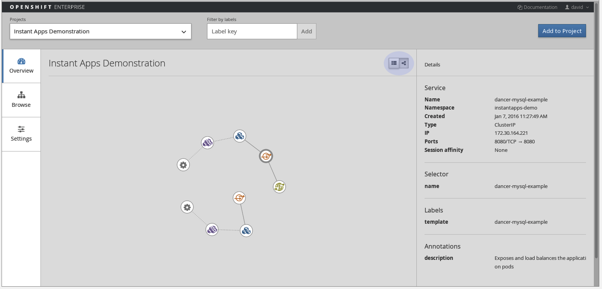

:toc2:
:icons: images/icons

== Creating Applications Lab

=== Overview

In this lab you create and work with applications. This lab includes two sections.

.Deploy Application on Web Console

In this section, you deploy an application from a code repository and follow the build logs on the OpenShift Container Platform web console and command line interface (CLI).

.Customize Build Script

In this section, you create an application from a forked Git repository, inject a custom build script, and start a rebuild from the web console. Then you review your custom script messages in the logs.

:numbered:

== Deploy Application on Web Console

In this exercise you connect to and become familiar with the web console, create a project and an application and scale a deployment.

=== Connect To and Explore Web Console

. Use your browser to go to the OpenShift web console at `https://master1-GUID.oslab.opentlc.com:8443`.
+
* If you have not done so already, accept the untrusted certificate.

. Log in as `andrew` with the password `r3dh4t1!`.

. Take a few minutes to browse your projects.

=== Create New Project

. Click *New Project* in the top right corner.

. Give the new project a name, display name, and description:
* *Name*: `my-ruby-project`
* *Display Name*: `My Ruby Example Project`
* *Description*: An explanation of your choice

. Click *Create*.

* Once the project is in place, the *Select Image or Template* screen is displayed.

=== Create New Application

. In the *Select Image or Template* screen, type `ruby` in the search field to filter the available instant apps, templates, and builder images.

. Select the `ruby:2.0` builder image on the right.

. Specify the name and Git repository URL:
* *Name*: `my-ruby-hello-world`.
* *Git Repository URL*: `https://github.com/openshift/ruby-hello-world`.

. Click *Show advanced build and deployment options* and select the following options:
.. Decide if you want a route for your application.
.. Optionally, define the triggers and environment variables for the deployment.
.. Change the scaling parameter to 3.
.. Create a label called `environment` with the value `dev`.

. Accept and create the application.

. Review the information that is displayed.

. Click *Go to Overview* to go to the application's Overview screen.

. Click *View Logs* to verify that a build is in progress.

. Review the log as the build progresses.

. Wait for the build to complete and use a browser to navigate to the
 application route: `http://my-ruby-hello-world-my-ruby-project.cloudapps-GUID.oslab.opentlc.com`.

* The database for the application is not running, so expect to see a web
 page that says that.

[TIP]
====
* You can also use the command line to create a new application: `oc new-app https://github.com/openshift/ruby-hello-world -l  environment=dev`.

* To change scaling from the command line, use `oc scale`.
====

=== Scale Deployment and Topology View

NOTE: Topology view has been migrated to the Cockpit console that is available on the master on port :9090 You can ignore the instrcutions about the topology view in this lab.

. Click *Overview* to go back to your application's *Overview* screen.

. Observe the circle that shows the current number of pods, which is 1.
+

. Click the *^* next to the circle twice to increase the number of replicas to 3.

. Hover over *Browse* and select *Pods* to take a look at your new pods.

. Click *Overview* to go back to the *Overview* screen.
* The current and default view of the *Overview* screen is the *tile view*.

. Switch to the *topology view* by clicking the icon on the upper right side that looks like the *<* character or a social-media Share button (which it is not).
+

. Click the objects and review their relationships.

== Customize Build Script

OpenShift Container Platform 3 supports customization of both the build and run processes. Generally speaking, this involves modifying the S2I scripts from the builder image. While building your code, OpenShift Container Platform checks the scripts in your repository's `.sti/bin` folder to see if they override or supersede the builder image's scripts. If it finds scripts that do so, it executes those scripts.

For details on the scripts and their execution and customization, go to `https://docs.openshift.com/container-platform/3.3/creating_images/index.html`.

=== Clone Repository and Launch Application from Local Copy

. Log in to OpenShift Container Platform as `marina` by connecting to the master, using the same procedure as before.
. When prompted, type the username and password:
** *Username*: `marina`
** *Password*: `r3dh4t1!`
+
----
[root@master1 ~]# su - marina
[marina@master1 ~]$ oc login -u marina --insecure-skip-tls-verify --server=https://master1-${guid}.oslab.opentlc.com:8443

[marina@master1 ~]$ oc new-project custom-s2i-script --display-name="Custom S2I Build Script" \
    --description="This is the project we use to learn how to create a customized build script"
----

=== Fork Repository

IMPORTANT: This section requires a GitHub account. Create one if you do not have one already. It is free and useful.

. From the GitHub web UI, fork the `https://github.com/openshift/ruby-hello-world` Git repository into your own Git account by clicking *Fork* in the upper right corner.

* This creates a repository in your Git account with a name similar to +https://github.com/<yourname>/ruby-hello-world/+, where `<yourname>` is your Git username.

. Clone this repository so that you can edit it locally and test a Red Hat-customized script with it:
+
----
[marina@master1 ~]$ git clone https://github.com/<yourname>/ruby-hello-world
----
* Remember to replace `<yourname>` with your Git username.
* The output looks similar to this:
+
----
Cloning into 'ruby-hello-world'...
remote: Counting objects: 249, done.
remote: Total 249 (delta 0), reused 0 (delta 0), pack-reused 249
Receiving objects: 100% (249/249), 36.79 KiB | 0 bytes/s, done.
Resolving deltas: 100% (86/86), done.
----

. Create an application by running `oc new-app` in the local repository:
+
----
[marina@master1 ~]$ cd ruby-hello-world/
[marina@master1 ruby-hello-world]$ oc new-app . --docker-image=registry.access.redhat.com/openshift3/ruby-20-rhel7
----

. View the current build status and build logs:
+
----
[marina@master1]$ oc get builds
NAME                 TYPE      FROM         STATUS    STARTED         DURATION
ruby-hello-world-1   Docker    Git@master   Running   9 seconds ago   9s
----

. View the build log:
+
----
[marina@master1 ]$ oc logs -f builds/ruby-hello-world-1
...                 ...
... Omitted Output  ...
...                 ...
Removing intermediate container 049a12eb5ca5
Successfully built 995028e8bee2
I1127 02:41:37.640510       1 docker.go:86] Pushing image 172.30.42.118:5000/custom-s2i-script/ruby-hello-world:latest ...
I1127 02:44:25.867627       1 docker.go:90] Push successful
----

. Verify that your pod deployed:
+
----
[marina@master1 ]$ oc get pods
----
+
----
NAME                       READY     STATUS      RESTARTS   AGE
ruby-hello-world-1-70mlb   1/1       Running     0          12s
ruby-hello-world-1-build   0/1       Completed   0          9m
----

=== Add Script to Repository

. Open a new tab in your browser, go to `http://www.opentlc.com/download/ose_implementation/resources/3.1/assemble`, and copy all of the text there.

. Go to the GitHub repository for your application from the previous section.

. In the GitHub web UI, navigate to the `.sti/bin` folder.

. Click *New File* at the top right (to the right of `bin` in the breadcrumb).

. Name your file `assemble`.

. In the GitHub web UI, paste the copied content into the text area.

. Type a commit message in the text field.

. Click *Commit*.

=== Create Application from Repository with Custom Build Script

. In your browser, go to the OpenShift web console at `https://master1-GUID.oslab.opentlc.com:8443`.
* If prompted, accept the untrusted certificate.

. Log in as `marina` with the password `r3dh4t1!`.

. Click *New Project* in the top right corner.

. Specify the project name, display name, and description:
* *Name*: `my-custom`
* *Display Name*: `My custom assemble script project`
* *Description*: An explanation of your choice

** Once the project is in place, the *Select Image or Template* screen is displayed.

. In the *Select Image or Template* screen, type `ruby` in the search field to filter the available instant apps, templates, and builder images.

. Select the `ruby:2.0` builder image from the right side.

. Specify the name and Git repository URL:
* *Name*: `my-custom-builder-test`
* *Git Repository URL*: +https://github.com/<yourname>/ruby-hello-world+
** Remember to replace `<yourname>` with your Git username.

. Follow the build process logs and watch for this custom assemble script message, which confirms that the custom script ran:
+
----
2015-04-27T22:23:24.110630393Z ---> CUSTOM S2I ASSEMBLE COMPLETE
----
