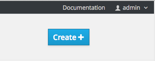

== Using the Web Console
:noaudio:

* You can also create applications using the web console:

* While in the desired project, click *Create*:
+
====

====

*  Enter the repository URL for the application to build:

====
image::images/console_enter_source_uri.png["Enter Source Repository"]
====

ifdef::showscript[]

=== Transcript

endif::showscript[]
