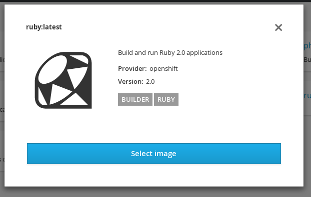

== Using the Web Console
:noaudio:

*  Select either a builder image from the list of images in your project, or
from the global library:
====

====

ifdef::showscript[]

=== Transcript

endif::showscript[]
