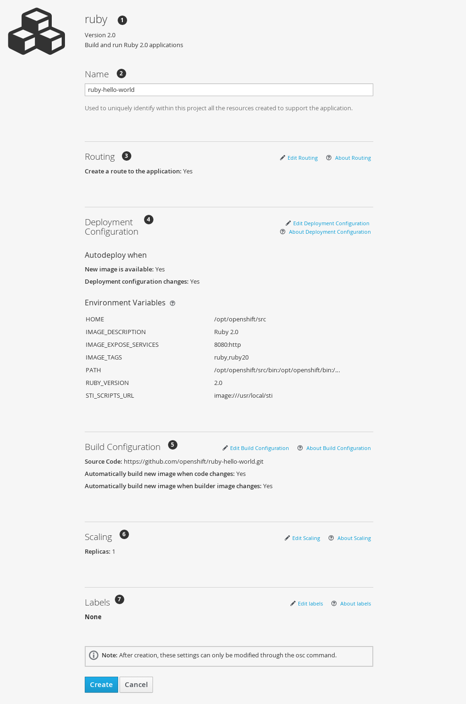

== Using the Web Console
:noaudio:
* Modify the settings in the new application screen to configure the resources
to support your application:
+
====

====

. The builder image name and description.
. The application name used for the generated OpenShift resources.
. Routing configuration section for making this application publicly accessible.
. Deployment configuration section for customizing deployment triggers and image environment variables.
. Build configuration section for customizing build triggers.
. Replica scaling section for configuring the number of running instances of the application.
. The labels to assign to all items generated for the application. You can add and edit labels for all resources here.

